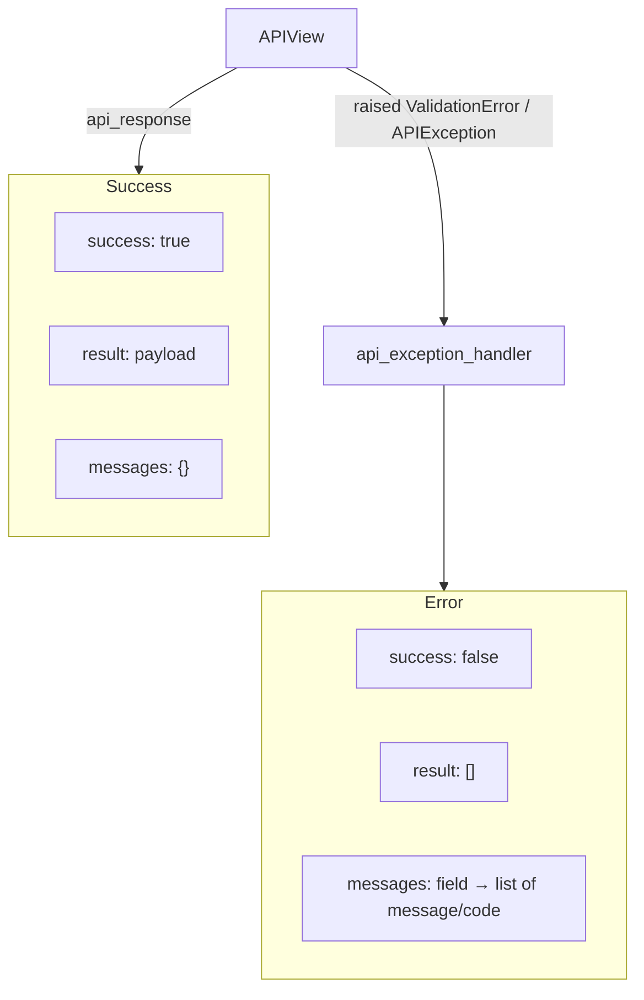
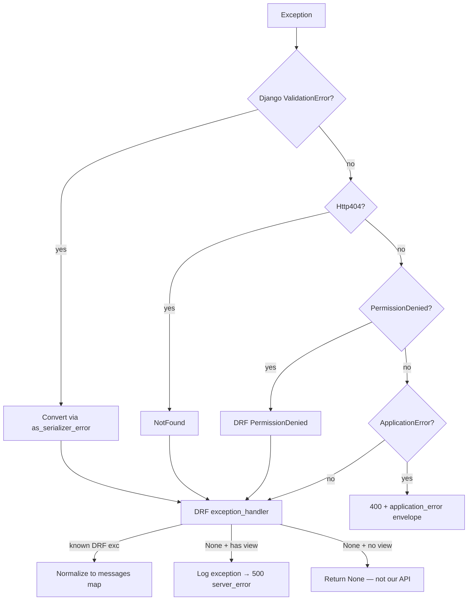

# 📦 API response envelope

> Every JSON API response in this project shares one outer shape — success **and** error.
>
> Clients (and agents) should depend on `success`, `status`, `result`, and `messages` — not on ad-hoc DRF default error bodies.

---

## 🎯 Contract at a glance

```text
{
  "success":  <bool>,      # true → ok path; false → error path
  "status":   <int>,       # same as HTTP status code (duplicated for clients that only read body)
  "result":   <object|array|…>,
  "messages": <object>     # {} on success; field → [{message, code}, …] on error
}
```



| Field | Success | Error |
|-------|---------|-------|
| `success` | `true` | `false` |
| `status` | e.g. `200`, `201` | e.g. `400`, `401`, `403`, `404`, `429`, `500` |
| `result` | Payload (`{}` if `data` was `None`) | Always `[]` |
| `messages` | `{}` | Map of field → list of `{ "message", "code" }` |

---

## 📘 Documenting the envelope in OpenAPI

Use `envelope_serializer` from `common.http.schema` in `@extend_schema(responses=...)`:

```python
from {{cookiecutter.project_slug}}.common.http.schema import envelope_serializer

@extend_schema(
    responses={201: envelope_serializer("UsersRegisterEnvelope", UsersRegisterOutputSerializer)},
)
def post(self, request):
    ...
```

Error shape is also registered as component `ApiErrorEnvelope` in `config/settings/swagger.py`.

---

## ✅ Success — `api_response`

```python
from rest_framework import status

from {{cookiecutter.project_slug}}.common.http import api_response

return api_response(data=payload, http_status=status.HTTP_200_OK)

return api_response(
    data=UsersRegisterOutputSerializer(user, context={"request": request}).data,
    http_status=status.HTTP_201_CREATED,
)
```

### Example body

```json
{
  "success": true,
  "status": 200,
  "result": {
    "email": "a@example.com",
    "bio": null,
    "avatar": "http://localhost:8000/static/users/default_avatar.png"
  },
  "messages": {}
}
```

### Implementation notes

```python
# common/http/response.py
def api_response(*, data=None, http_status=status.HTTP_200_OK, messages=None) -> Response:
    return Response(
        {
            "success": True,
            "status": http_status,
            "result": {} if data is None else data,
            "messages": {} if messages is None else messages,
        },
        status=http_status,
    )
```

| Detail | Behavior |
|--------|----------|
| `data is None` | `result` becomes `{}` (not `null`) |
| HTTP status | Set both on the envelope (`status` key) and on the Django/DRF response |
| Optional `messages` | Rare on success; default `{}` |

### ❌ Do not

```python
# ❌ breaks the contract — clients must special-case this endpoint
return Response(serializer.data)

# ❌ success flag missing / wrong shape
return Response({"data": serializer.data})
```

Paginated lists still use this envelope; `result` holds pagination metadata — see [Pagination](pagination-and-filtering.md).

---

## ❌ Error — `api_exception_handler`

### Example body

```json
{
  "success": false,
  "status": 400,
  "result": [],
  "messages": {
    "email": [
      { "message": "email address already exists.", "code": "unique" }
    ],
    "confirm_password": [
      { "message": "confirm password is not equal to password", "code": "password_mismatch" }
    ]
  }
}
```

Each entry under a field is always a **list** of objects with:

| Key | Meaning |
|-----|---------|
| `message` | Human-readable (translated) string |
| `code` | Stable machine code for clients / i18n keys |

### Code fallbacks

| Situation | `code` value |
|-----------|----------------|
| Raiser omitted `code=` | `"invalid"` (`ErrorCode.INVALID`) |
| Unexpected exception in a DRF view | `"server_error"` — **no traceback / internals in the body** |
| `ApplicationError` | `"application_error"` on `non_field_errors` (+ optional `extra` fields) |
| Integrity unique / not null / FK | `unique` / `not_null` / `invalid_reference` — see [Validation](validation-and-errors.md) |

Non-field problems use the key `non_field_errors` (same as DRF convention).

---

## 🔌 Wiring (single implementation)

Configured in `config/settings/drf.py`:

```python
REST_FRAMEWORK = {
    ...
    "EXCEPTION_HANDLER": (
        "{{cookiecutter.project_slug}}.common.http.exception_handler.api_exception_handler"
    ),
}
```

`{{cookiecutter.project_slug}}/api/exception_handlers.py` only **re-exports** the same handler for legacy aliases:

```python
from {{cookiecutter.project_slug}}.common.http.exception_handler import api_exception_handler

drf_default_with_modifications_exception_handler = api_exception_handler
hacksoft_proposed_exception_handler = api_exception_handler
```

**Do not** add a second exception-handler implementation there.

---

## 🧠 Handler pipeline



### Steps in plain language

1. **Django `ValidationError`** (from services/validators) → convert to DRF validation error  
2. **`Http404` / Django `PermissionDenied`** → DRF equivalents  
3. **`ApplicationError`** → immediate 400 envelope with `application_error`  
4. **DRF handler** runs for auth errors, throttling, NotFound, ValidationError, etc.  
5. Response body is **replaced** with `{ success, status, result: [], messages }`  
6. If still unhandled inside a DRF view → `logger.exception` + generic 500 envelope  

Nested DRF error dicts are flattened with dotted keys when needed (`parent.child`).

---

## 🧪 How errors reach the envelope (examples)

| Origin | Example | Typical `messages` key / code |
|--------|---------|--------------------------------|
| Input serializer field validator | Password missing number | `password` / `password_must_include_number` |
| Input serializer `validate()` | Confirm mismatch | `confirm_password` / `password_mismatch` |
| Service | Wrong current password | `current_password` / `password_incorrect` |
| Integrity mapping | Duplicate email | `email` / `unique` |
| Auth | Missing/invalid credentials | DRF auth error keys / codes |
| Bug | Uncaught exception | `non_field_errors` / `server_error` |

Clients should branch on **`code`**, not on English `message` text (messages are translated and may change).

---

## 📄 Pagination shape (still the same envelope)

```json
{
  "success": true,
  "status": 200,
  "result": {
    "limit": 10,
    "offset": 0,
    "count": 42,
    "next": "http://…?limit=10&offset=10",
    "previous": null,
    "results": [ … ]
  },
  "messages": {}
}
```

Produced by `api.pagination.LimitOffsetPagination.get_paginated_response` → `api_response`. Details: [Pagination & filtering](pagination-and-filtering.md).

---

## ✅ Checklist for new endpoints

| Check | Done? |
|-------|-------|
| Success path uses `api_response` | |
| HTTP status matches envelope `status` (201 on create, etc.) | |
| Domain failures raise Django/DRF validation errors with `code=` | |
| Writes map integrity errors | |
| No raw `Response(serializer.data)` | |
| API test asserts `success` / `messages` shape on failure | |

---

## 🔗 Related docs

| Doc | Why |
|-----|-----|
| [Validation & errors](validation-and-errors.md) | Where codes and validators are defined |
| [APIs](apis.md) | How views call `api_response` |
| [Services](services.md) | Raising `ValidationError` from writes |
| [Pagination & filtering](pagination-and-filtering.md) | List `result` shape |
| [Logging](logging.md) | Unexpected errors are logged in the handler |
