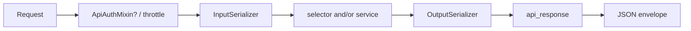

# 🌐 APIs & serializers

> HTTP layer of a domain app: **thin views**, **input/output serializers**, OpenAPI metadata, parsers, and throttling hooks.
>
> Business rules and ORM writes do **not** live here — call [selectors](selectors.md) / [services](services.md) and return the [API envelope](api-envelope.md).

---

## 🎯 Role of the API layer



| Step | Responsibility |
|------|----------------|
| Auth / permissions | `ApiAuthMixin` or explicit permission classes — see [Permissions](permissions.md) |
| Throttle | `ScopedRateThrottle` on public abuse-prone routes — see [Throttling](throttling.md) |
| Input | Shape + field validators + cross-field `validate()` |
| Call | Selector (read) and/or service (write) |
| Output | Serialize public fields only |
| Respond | Always `api_response` (or pagination helpers that wrap it) |

---

## 📂 File layout (feature folders)

Group by **feature**, not by verb and not one mega-`views.py`:

```text
users/apis/
├── auth/
│   ├── auth_jwt_apis.py          # or auth_session_apis.py
│   ├── auth_password_apis.py
│   ├── auth_serializers.py
│   └── tests/
└── users/
    ├── register/
    │   ├── users_register_apis.py
    │   ├── users_register_serializers.py
    │   └── tests/
    └── profile/
        ├── users_profile_apis.py
        ├── users_profile_serializers.py
        └── tests/
```

| File | Contains |
|------|----------|
| `*_apis.py` | `APIView` classes |
| `*_serializers.py` | `*InputSerializer` + `*OutputSerializer` |
| `tests/` | HTTP / auth / payload tests for that feature |

Name with app + feature prefix (`users_profile_…`) so grepping and imports stay obvious.

---

## 🧱 View pattern (`APIView`)

Prefer explicit `APIView` methods over fat generic class-based views that hide business logic in mixins you do not control.

### Authenticated example — profile

```python
# users/apis/users/profile/users_profile_apis.py
from drf_spectacular.utils import extend_schema
from rest_framework import parsers
from rest_framework.views import APIView

from {{cookiecutter.project_slug}}.api.mixins import ApiAuthMixin
from {{cookiecutter.project_slug}}.common.http import api_response
from {{cookiecutter.project_slug}}.users.constants import USERS_TAGS
from {{cookiecutter.project_slug}}.users.selector.users_selectors import get_profile
from {{cookiecutter.project_slug}}.users.services.user_services import profile_update


class UsersProfileApi(ApiAuthMixin, APIView):
    parser_classes = [parsers.MultiPartParser, parsers.FormParser, parsers.JSONParser]

    @extend_schema(
        tags=USERS_TAGS,
        summary="Current user",
        responses=UsersProfileOutputSerializer,
    )
    def get(self, request):
        profile = get_profile(user=request.user)
        return api_response(
            data=UsersProfileOutputSerializer(profile, context={"request": request}).data
        )

    @extend_schema(
        tags=USERS_TAGS,
        summary="Update current user profile",
        request=UsersProfileUpdateInputSerializer,
        responses=UsersProfileOutputSerializer,
    )
    def patch(self, request):
        serializer = UsersProfileUpdateInputSerializer(data=request.data, partial=True)
        serializer.is_valid(raise_exception=True)

        profile = get_profile(user=request.user)
        profile = profile_update(
            profile=profile,
            bio=serializer.validated_data.get("bio"),
            avatar=serializer.validated_data.get("avatar"),
        )
        return api_response(
            data=UsersProfileOutputSerializer(profile, context={"request": request}).data
        )
```

### Public example — register

```python
class UsersRegisterApi(APIView):
    parser_classes = [parsers.MultiPartParser, parsers.FormParser, parsers.JSONParser]
    throttle_classes = [ScopedRateThrottle]
    throttle_scope = "register"

    @extend_schema(
        tags=USERS_TAGS,
        summary="Register a new user",
        request=UsersRegisterInputSerializer,
        responses=UsersRegisterOutputSerializer,
    )
    def post(self, request):
        serializer = UsersRegisterInputSerializer(data=request.data)
        serializer.is_valid(raise_exception=True)
        user = register(
            email=serializer.validated_data.get("email"),
            password=serializer.validated_data.get("password"),
            bio=serializer.validated_data.get("bio"),
            avatar=serializer.validated_data.get("avatar"),
        )
        return api_response(
            data=UsersRegisterOutputSerializer(user, context={"request": request}).data,
            http_status=status.HTTP_201_CREATED,
        )
```

### Non‑negotiable rules

| ✅ Do | ❌ Don’t |
|-------|---------|
| `serializer.is_valid(raise_exception=True)` | Manually building error dicts in the view |
| `return api_response(...)` | `return Response(serializer.data)` |
| Call services/selectors | `Model.objects.create(...)` in the view |
| `@extend_schema(...)` on each handler | Undocumented endpoints in Swagger |
| `ApiAuthMixin` when login is required | Ad‑hoc auth checks buried in `get/post` |

---

## 📥📤 Serializers: always split input vs output

| Type | Direction | Role |
|------|-----------|------|
| `*InputSerializer` | Request → Python | Validate shape; run field/cross-field rules |
| `*OutputSerializer` | Domain → JSON | Expose only what clients may see |

Do **not** reuse one `ModelSerializer` for both directions unless the shapes are truly identical and tiny (rare). Register input has `password` / `confirm_password`; output must never echo passwords.

### Input serializer rules

```python
# users/apis/users/register/users_register_serializers.py
class UsersRegisterInputSerializer(serializers.Serializer):
    email = serializers.EmailField(max_length=255)
    bio = serializers.CharField(max_length=1000, required=False, allow_blank=True, allow_null=True)
    avatar = serializers.ImageField(required=False, allow_null=True)
    password = serializers.CharField(validators=PASSWORD_VALIDATORS)
    confirm_password = serializers.CharField(max_length=255)

    def validate(self, data):
        password = data.get("password")
        confirm_password = data.get("confirm_password")

        if not password or not confirm_password:
            raise serializers.ValidationError(
                {"non_field_errors": [_("please fill password and confirm password")]},
                code=ErrorCode.REQUIRED,
            )

        if password != confirm_password:
            raise serializers.ValidationError(
                {"confirm_password": [_("confirm password is not equal to password")]},
                code=UserErrorCode.PASSWORD_MISMATCH,
            )
        return data
```

| Concern | In input serializer? |
|---------|----------------------|
| Field types / max_length | ✅ |
| Domain `PASSWORD_VALIDATORS` | ✅ |
| Cross-field confirm password | ✅ `validate()` |
| Uniqueness of email | ❌ DB + [integrity](validation-and-errors.md) |
| “Is the user allowed to do this?” | ❌ [Permissions](permissions.md) |
| Create the user | ❌ [Services](services.md) |

Use **field-keyed** errors and platform vs domain codes correctly (`ErrorCode.REQUIRED` vs `UserErrorCode.PASSWORD_MISMATCH`).

### Output serializer rules

```python
class UsersProfileOutputSerializer(serializers.ModelSerializer):
    email = serializers.EmailField(source="user.email", read_only=True)
    avatar = serializers.SerializerMethodField()

    class Meta:
        model = Profile
        fields = ("email", "bio", "avatar")

    @extend_schema_field(serializers.URLField())
    def get_avatar(self, profile: Profile) -> str:
        return get_avatar_url(profile=profile, request=self.context.get("request"))
```

| ✅ Do | Why |
|-------|-----|
| `SerializerMethodField` + selector for derived values | Keeps URL logic out of the view |
| `@extend_schema_field` on method fields | Accurate OpenAPI types |
| `context={"request": request}` | Absolute media/static URLs |
| Read-only sensitive omissions | Never serialize password hashes / internal flags unless required |

---

## 🏷️ Swagger / OpenAPI on views

Tags come from [constants](constants.md):

```python
from {{cookiecutter.project_slug}}.users.constants import USERS_TAGS, AUTH_TAGS

@extend_schema(tags=USERS_TAGS, summary="…", request=…, responses=…)
```

| Argument | Purpose |
|----------|---------|
| `tags` | Groups endpoints in Swagger UI |
| `summary` | Short title |
| `request` | Input serializer / body |
| `responses` | Output serializer / status map |

Full schema settings: [Swagger](swagger.md).

---

## 📎 Parsers (JSON + uploads)

Default JSON is not enough for avatars. Declare parsers explicitly when the endpoint accepts files:

```python
parser_classes = [parsers.MultiPartParser, parsers.FormParser, parsers.JSONParser]
```

Clients then may send `multipart/form-data` (file + fields) or JSON (without file).

---

## 🩺 Tiny system endpoints

`HealthApi` nests a small `OutputSerializer` on the view class — acceptable for `core` system routes. Domain features should keep serializers in their own modules for reuse and testing.

---

## 🧪 Testing APIs

Place tests under the feature folder: `apis/<feature>/tests/`.

| Assert | How |
|--------|-----|
| Auth required | Unauthenticated → 401/403 as configured |
| Validation errors | Envelope `success=false` + `messages.<field>` |
| Happy path | `success=true` + expected `result` keys |
| Throttle (optional) | Scoped rates on register/auth |

Prefer `reverse("users:profile")` over hard-coded paths — see [URLs](urls.md).

---

## ❌ Anti-patterns

| Anti-pattern | Fix |
|--------------|-----|
| Fat view with ORM + business rules | Service + selector |
| One serializer for input and output with password fields | Split Input/Output |
| `return Response(data)` | `api_response` |
| Uniqueness check in serializer | DB constraint + integrity mapping |
| Permission logic in `validate()` | Permission classes / mixin |
| Missing `@extend_schema` | Document every public handler |
| `views.py` at app root | `apis/<feature>/` |

---

## ✅ Checklist: new endpoint

1. Create feature folder under `apis/`  
2. Add Input + Output serializers  
3. Add `APIView` with `@extend_schema` + tags from `constants.py`  
4. Wire auth mixin and/or throttle  
5. Call selector/service only  
6. Return `api_response` (correct HTTP status: 200/201/…)  
7. Register path in `<app>/urls/` + `api/urls.py` if needed  
8. Add API tests  

---

## 🔗 Related docs

| Doc | Why |
|-----|-----|
| [API envelope](api-envelope.md) | Exact JSON contract |
| [Validation & errors](validation-and-errors.md) | Codes & validators used by serializers |
| [Permissions](permissions.md) | `ApiAuthMixin` |
| [Swagger](swagger.md) | Schema / UI |
| [Pagination & filtering](pagination-and-filtering.md) | List endpoints |
| [Throttling](throttling.md) | Auth/register rates |
