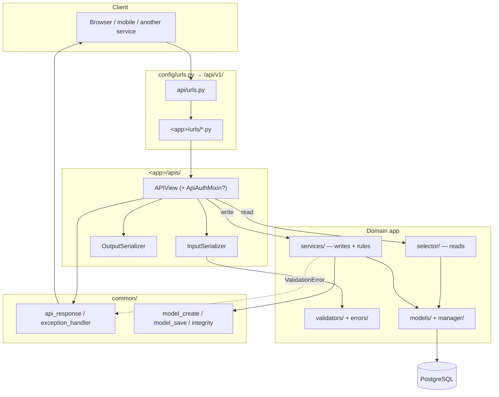
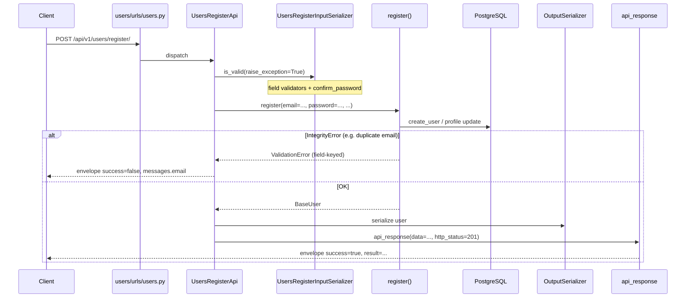
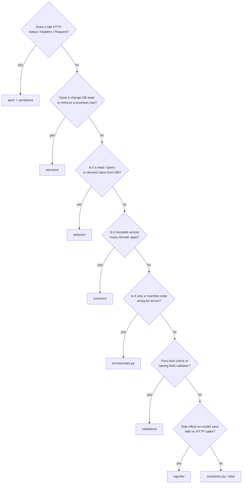

# 🏗️ Architecture

> **Source of truth** for how a request moves through this codebase, which package owns what, and which layer is allowed to do which job.
>
> New code that breaks these boundaries will usually be rejected in review — even if it “works”.

Inspired by the [HackSoft Django Styleguide](https://github.com/HackSoftware/Django-Styleguide): **thin views**, **fat services**, **selectors for reads**.

---

## 🎯 Why this architecture exists

Django’s default “fat models / fat views” style becomes hard to test and reason about once an API grows. This project splits responsibilities so that:

| Goal | How we get it |
|------|----------------|
| Easy unit tests | Business rules live in plain functions (`services` / `selectors`), not in `APIView` methods |
| Stable HTTP contract | Every JSON response goes through one envelope (`api_response` / `api_exception_handler`) |
| Clear ownership | Platform code stays in `common`; product rules stay in domain apps (`users`, `blogs`, …) |
| Safe writes | DB constraints + `map_integrity_error` — validators are UX, not the last line of defense |
| Agent / human consistency | Same folder names and call patterns in every app (`start_domain_app` scaffolds them) |

If you are unsure where a piece of code belongs, ask: **“Is this HTTP, a read, a write, or platform infrastructure?”** — then use the map below.

---

## 🗺️ Big picture



### Same flow as a vertical stack

```text
┌─────────────────────────────────────────────────────────────┐
│  Client                                                     │
│  POST /api/v1/users/register/  + JSON / multipart body      │
└────────────────────────────┬────────────────────────────────┘
                             │
                             ▼
┌─────────────────────────────────────────────────────────────┐
│  URLs                                                       │
│  config/urls.py  →  api/urls.py  →  users/urls/users.py     │
└────────────────────────────┬────────────────────────────────┘
                             │
                             ▼
┌─────────────────────────────────────────────────────────────┐
│  API (glue only)                                            │
│  • optional ApiAuthMixin / throttle                         │
│  • InputSerializer.is_valid(raise_exception=True)           │
│  • call service / selector                                  │
│  • OutputSerializer + api_response(...)                     │
└────────────────────────────┬────────────────────────────────┘
                             │
              ┌──────────────┴──────────────┐
              ▼                             ▼
┌──────────────────────────┐   ┌──────────────────────────────┐
│  selector/  (READ)       │   │  services/  (WRITE)           │
│  get_*, list_*, …        │   │  create_*, update_*, …       │
│  QuerySet / derived vals │   │  rules + model_* / Integrity │
└────────────┬─────────────┘   └──────────────┬───────────────┘
             │                                │
             └──────────────┬─────────────────┘
                            ▼
┌─────────────────────────────────────────────────────────────┐
│  models/ (+ DB constraints)                                 │
└─────────────────────────────────────────────────────────────┘
```

---

## 📦 Platform vs domain vs wiring

Think of three “rings”:

```text
                 ┌──────────────────────────────┐
                 │  config/  (project wiring)   │
                 │  settings, root urls, celery │
                 └──────────────┬───────────────┘
                                │
                 ┌──────────────▼───────────────┐
                 │  common/ + api/ + core/      │
                 │  platform primitives         │
                 └──────────────┬───────────────┘
                                │
                 ┌──────────────▼───────────────┐
                 │  users/ , blogs/ , …         │
                 │  domain rules & HTTP surface │
                 └──────────────────────────────┘
```

| Ring | Package(s) | Owns | Must not own |
|------|------------|------|--------------|
| 🔌 Wiring | `config/` | Env-based settings slices, root URLconf, middleware, Celery app | Business rules, serializers |
| 🧰 Platform | `common/`, `api/`, `core/`, `commands/` | Envelope, integrity mapping, `BaseModel`, pagination helpers, `ApiAuthMixin`, health, management commands | Password policy, “orders” rules, product-specific error codes |
| 🧩 Domain | `users/`, future `blogs/`, … | Models, selectors, services, domain validators, domain error codes, feature APIs | Generic HTTP envelope re-implementation, shared integrity parser copies |

### Concrete examples

| Code | Belongs in | Why |
|------|------------|-----|
| `ErrorCode.UNIQUE` | `common/errors` | Any app can hit a unique violation |
| `UserErrorCode.PASSWORD_MISMATCH` | `users/errors` | Only identity/password domain |
| `api_response(...)` | `common/http` | One success shape for every app |
| `PASSWORD_VALIDATORS` | `users/validators` | Domain password policy |
| `is_slug(...)` (generic) | `common/validators` | Reusable across apps |
| `register(...)` | `users/services` | Product write path |
| `get_paginated_response(...)` | `api/pagination.py` | HTTP helper, not business logic |
| `ApplicationError` | `core/exceptions` | Rare non-field application failures |

### ❌ Hard boundaries (do not cross)

| Don’t | Do instead |
|-------|------------|
| Put password / order rules in `common` | Put them in `<app>/validators` + `<app>/services` |
| Put raising validators inside `errors/` | `errors/` = **codes only** (`StrEnum`) |
| Encode permissions or uniqueness in serializers | Permissions → view mixin / DRF permission classes; uniqueness → DB + integrity |
| Re-implement the exception handler in `api/exception_handlers.py` | That file is a **legacy alias** — real logic is `common.http.exception_handler` |
| Use Django’s default `startapp` tree | Use `python manage.py start_domain_app <name>` |

---

## 📚 Built-in packages (what each one is for)

| Package | Role | Typical contents |
|---------|------|------------------|
| `core` | System / cross-cutting HTTP that is not a product domain | Health check API, `ApplicationError`, Channels routing hooks (if enabled) |
| `common` | Reusable platform primitives | `http/`, `errors/`, `validators/`, `db/integrity/`, `services.py`, `BaseModel` |
| `commands` | Project management commands | `devserver`, `start_domain_app` |
| `users` | Identity domain (always present) | Auth, register, profile, password validators |
| `api` | Versioned API mount point + shared DRF helpers | `urls.py`, `mixins.ApiAuthMixin`, pagination helpers |
| `utils` | Thin shared helpers / test bases | Keep small — prefer domain `utils/` or `common` when something is real platform |

When you add a product feature (blogs, orders, …), it becomes a **new domain app**, not a new top-level package like `common`.

---

## 🔁 End-to-end example: register

This is the canonical “happy path” for a write API in this repo.



### Step-by-step (what each layer does)

1. **URL** — `path("register/", UsersRegisterApi.as_view(), ...)` under `/api/v1/users/`.
2. **API** — sets parsers / throttle; does **not** create the user itself.
3. **Input serializer** — shape + `PASSWORD_VALIDATORS` + confirm match (`UserErrorCode.PASSWORD_MISMATCH`).
4. **Service** — `register(...)` creates the user (maps `IntegrityError`), updates profile fields via `model_save`.
5. **Side effect** — `post_save` on `BaseUser` ensures a `Profile` exists (see [Signals](signals.md)).
6. **Output serializer** — builds public fields (avatar URL, JWT tokens).
7. **Envelope** — `api_response(..., http_status=201)` → `{ success, status, result, messages }`.

### Minimal code sketch (mirrors real files)

```python
# apis/.../users_register_apis.py  — glue only
class UsersRegisterApi(APIView):
    def post(self, request):
        serializer = UsersRegisterInputSerializer(data=request.data)
        serializer.is_valid(raise_exception=True)
        user = register(**serializer.validated_data)  # service
        return api_response(
            data=UsersRegisterOutputSerializer(user, context={"request": request}).data,
            http_status=status.HTTP_201_CREATED,
        )
```

```python
# services/user_services.py  — write + rules
@transaction.atomic
def register(*, email: str, password: str, bio: str | None = None, avatar=None) -> BaseUser:
    user = create_user(email=email, password=password)  # maps IntegrityError
    profile = Profile.objects.get(user=user)
    # ... model_save when bio/avatar present ...
    return user
```

For the read side of the same domain, see `UsersProfileApi` → `get_profile` (selector) → output serializer — no writes in the `GET` path.

---

## 🧭 Decision guide: where do I put this?



| Situation | Put it here |
|-----------|-------------|
| New REST endpoint | `<app>/apis/<feature>/` + `<app>/urls/` + include in `api/urls.py` |
| “List published posts for homepage” | `selector/` |
| “Publish post + notify + validate state machine” | `services/` |
| Shared date range constraint example | `common.models` / DB constraints |
| OpenAPI tag name `"users"` | `<app>/constants.py` — see [Constants](constants.md) |
| Create related row when user is created | `signals/` — see [Signals](signals.md) |

---

## 📜 Layer contracts (non‑negotiable)

These are the style rules that make the codebase look like a large Django service — not product features.

| Layer | May | Must not |
|-------|-----|----------|
| `apis/` | Auth/throttle, Input/Output serializers, call selector/service, `api_response` / pagination helpers, `@extend_schema` | ORM queries, business rules, uniqueness checks, building error envelopes by hand |
| `selector/` | Read ORM, `select_related` / `prefetch`, filters as kwargs, derived values | `.create()` / `.update()` / `.delete()`, calling write services, touching `Request` except optional `request` for absolute URLs |
| `services/` | Writes, rules, `transaction.atomic`, `model_*` + integrity mapping, calling selectors for reads needed by a write | HTTP status codes, serializers, pagination, “list screens” querysets for unrelated UIs |
| `models/` | Fields, constraints, managers, `__str__` | HTTP, workflows, calling external APIs |
| `serializers` | Shape + field/cross-field validation | Creating rows, permission decisions, raw ORM uniqueness as the only guard |
| `common/` | Envelope, integrity helpers, `BaseModel`, shared validators | Domain-specific business rules for one app |

**List endpoints:** selector base QS → optional explicit **`FilterSet`** (only if the endpoint accepts filters) → pagination helper. Default is **no filters**. Never `Model.objects.filter(...)` inside `APIView.get` for the list shape.

**Keyword-only APIs:** `def register(*, email: str, …)` and `def list_posts(*, author_id: int | None = None)` — no positional bags.

---

## ✅ Do / ❌ Don’t (quick checklist)

### ✅ Do

- Keep views under ~20–40 lines of real logic (parse → call → respond)
- Use keyword-only args in services/selectors: `def register(*, email: str, ...)`
- Return `api_response` (or pagination helpers that wrap it)
- Document OpenAPI success bodies with `envelope_serializer(...)`
- Map every write path through `model_create` / `model_save` / `model_update` **or** explicit `map_integrity_error`
- Add domain apps with `start_domain_app`
- Set `AllowAny` only on intentionally public endpoints (default is authenticated)
- Apply list filters with django-filter `FilterSet` when the endpoint accepts filters; otherwise skip FilterSet entirely

### ❌ Don’t

- Call `Model.objects.create` / `.save()` directly from views or serializers
- Put list/filter ORM in services (that is selector territory)
- Return raw `Response({"email": ...})` without the envelope
- Mix read + write in one function (“god” service that also builds querysets for unrelated screens)
- Copy-paste integrity / exception handling into each app
- Assume a new `APIView` is public without `AllowAny`
- Rely on `DEFAULT_FILTER_BACKENDS` / `filter_backends = [...]` on plain `APIView` (they do not auto-run)

---

## 🔗 Related docs

| Next read | Why |
|-----------|-----|
| [Project structure](project-structure.md) | Where folders live on disk |
| [Domain apps](domain-apps.md) | How to scaffold `blogs`, `orders`, … |
| [Services](services.md) | Write-path details |
| [Selectors](selectors.md) | Read-path details |
| [APIs](apis.md) | View + serializer conventions |
| [Security](security.md) | Deny-by-default and hardening |
| [Validation & errors](validation-and-errors.md) | Codes, validators, integrity |
| [API envelope](api-envelope.md) | Exact JSON shapes |
| [Enterprise extensions](enterprise-extensions.md) | Patterns not shipped by default |
