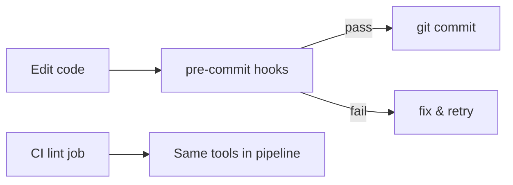

# ✨ Code quality


> This project was generated **with Ruff + pre-commit**. Hooks run before each commit; CI typically re-runs lint as well.

> This project was generated **without** Ruff/pre-commit (`use_code_style=n`). Use flake8 / mypy as configured; the conventions below still describe the intended style if you enable tooling later.


---

## 🎯 Goals

| Goal | How |
|------|-----|
| Consistent Python style | Formatter + linter |
| Catch foot-guns early | Pre-commit (debug leftovers, secrets, YAML, …) |
| Stable i18n msgids | Lowercase gettext lint — see [Translations](translations.md) |
| Readable APIs | Google-style docstrings where pydoclint is enabled |



---


## 🪝 Pre-commit

Install once after `pip install -r requirements_dev.txt`:

```bash
pre-commit install
pre-commit run --all-files   # optional full-tree check
```

Config: `.pre-commit-config.yaml`.  
`docs/`, migrations, and `locale/` are excluded from hooks (see `exclude:`).

### Hook groups (enabled at generation)

Which groups appear depends on cookiecutter choices (`precommit_*` flags). Typical set:

| Group | What it does |
|-------|----------------|
| **File hygiene** (`pre-commit-hooks`) | Trailing whitespace, EOF newlines, JSON/YAML/XML validity, merge conflicts, private keys, Python AST, large files, debug statements |
| **pyupgrade** | Rewrites older syntax toward Python 3.12 (`list[str]` instead of `List[str]`, …) |
| **Ruff** | `ruff check --fix` + `ruff format` |
| **pydoclint** | Google-style docstrings on functions/methods |
| **django-translation-lint** | `_()` / gettext msgids must be **lowercase** |

To disable a group: comment out or remove its `repo:` block, then optionally `pre-commit autoupdate`.

### Run tools directly

```bash
ruff check .
ruff format .
ruff check --fix .
make lint
make format
```

Ruff/project tool config lives in `pyproject.toml` (and related files shipped by the template).


## 🧹 Lint without Ruff

```bash
flake8
mypy .
make lint
```

Consider enabling Ruff + pre-commit later for the same developer experience as the default template.


---

## 📐 Style expectations (humans + agents)

| Topic | Expectation |
|-------|-------------|
| Python version | 3.12+ syntax |
| Imports | Sorted / cleaned by Ruff I-rules when enabled |
| Types | Prefer modern builtins (`list[str]`, `X \| None`) |
| User-facing strings | Lowercase gettext msgids |
| Docstrings | Google style when pydoclint is on; don’t invent a second style mid-file |
| Secrets | Never commit `.env` with real secrets; hooks detect private keys |

Domain/architecture rules (selectors vs services, envelope, …) live in the rest of this style guide — linters do not replace them.

---

## ❌ Anti-patterns

| Anti-pattern | Fix |
|--------------|-----|
| `--no-verify` to skip hooks habitually | Fix the finding; only skip with team agreement |
| Disabling Ruff project-wide for one noisy line | Prefer targeted `# noqa` with a reason |
| Formatting `docs/*.md` with Python formatters | Docs are excluded; write Markdown normally |
| Mixing flake8 and Ruff configs without intent | Pick one stack |

---

## ✅ Checklist before opening a PR

1.  `pre-commit run --all-files` (or rely on commit hooks)  `make lint`   
2.  `pytest` / `make test`  Manual checks / `manage.py check`   
3. `python manage.py check`  
4. No secrets in the diff  
5. New code follows layer docs (apis/services/selectors/…)  

---

## 🔗 Related docs

| Doc | Why |
|-----|-----|
| [Translations](translations.md) | Lowercase msgid rule |
| [Testing](testing.md) | CI test expectations |
| [Commands](commands.md) | `make lint` / `make format` |
| [Settings](settings.md) | Tooling is not Django settings |
