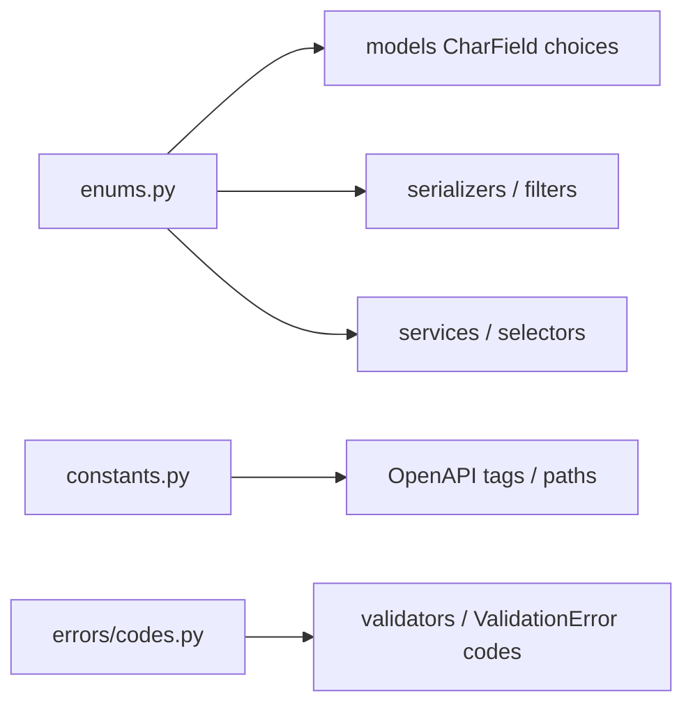

# 🔢 Enums (`TextChoices` / `IntegerChoices`)

> **One module per domain app** for Django field choice enums.
>
> File: `<app>/enums.py` (created by `start_domain_app`, present on `users`).

Field values that the database stores as constrained strings/ints — statuses, kinds, channels — live here. Models, serializers, filters, and services **import** them. Do **not** nest `class Status(models.TextChoices)` inside a model module.

---

## 🎯 Why a dedicated `enums.py`?

```python
# ❌ choices buried on the model — hard to reuse in serializers / FilterSets / services
# blogs/models/post.py
class Post(BaseModel):
    class Status(models.TextChoices):
        DRAFT = "draft", _("draft")
        PUBLISHED = "published", _("published")

    status = models.CharField(max_length=20, choices=Status.choices)
```

```python
# ✅ single app module — import everywhere
# blogs/enums.py
class PostStatus(models.TextChoices):
    DRAFT = "draft", _("draft")
    PUBLISHED = "published", _("published")

# blogs/models/post.py
from blogs.enums import PostStatus

status = models.CharField(
    max_length=20,
    choices=PostStatus.choices,
    default=PostStatus.DRAFT,
    verbose_name=_("status"),
    help_text="Publication state of the post.",
)
```

| Benefit | Detail |
|---------|--------|
| ♻️ Reuse | Same enum in models, InputSerializer `ChoiceField`, FilterSet, services |
| 🔍 Grep | `PostStatus` finds every consumer |
| 🧼 Models stay lean | Shape + constraints only — see [Models](models.md) |
| 🌍 i18n | Labels via `_("draft")` live next to the stored value |

---

## 📂 Location

```text
blogs/
├── enums.py              ← TextChoices / IntegerChoices (this doc)
├── constants.py          ← tags / paths / plain literals
├── errors/codes.py       ← API machine codes (StrEnum) — different concern
└── models/
    └── post.py           ← imports PostStatus from enums
```

`users/enums.py` exists as the reference stub (no product choices yet). Add members when the domain needs them.

---

## ✍️ Style rules

### 1. Class naming

Prefer **specific** names so multiple enums can coexist in one file:

| ✅ Prefer | ❌ Avoid when the app grows |
|----------|----------------------------|
| `PostStatus`, `CommentStatus` | One vague `Status` shared by unrelated models |
| `OrderState`, `PaymentMethod` | Nested `Post.Status` inside `models/post.py` |

For a tiny app with a single status enum, `Status` is acceptable — rename early if a second status appears.

### 2. Member values + labels

```python
from django.db import models
from django.utils.translation import gettext_lazy as _


class PostStatus(models.TextChoices):
    DRAFT = "draft", _("draft")
    PUBLISHED = "published", _("published")
    ARCHIVED = "archived", _("archived")
```

| Piece | Convention |
|-------|------------|
| Member name | `UPPER_SNAKE` (`DRAFT`, `IN_REVIEW`) |
| Stored value | lowercase string (or int for `IntegerChoices`) — stable API/DB contract |
| Label | `_("lowercase words")` — same gettext recommendation as [Translations](../ops/translations.md) |

```python
# ✅
DRAFT = "draft", _("draft")

# ❌
DRAFT = "DRAFT", _("Draft")          # Title Case msgid; uppercase DB value without reason
DRAFT = "draft", "draft"            # missing gettext on the label
```

### 3. Use on the model

```python
# blogs/models/post.py
from django.utils.translation import gettext_lazy as _

from {{cookiecutter.project_slug}}.blogs.enums import PostStatus
from {{cookiecutter.project_slug}}.common.models import BaseModel


class Post(BaseModel):
    """
    Model to declare post
    """

    status = models.CharField(
        max_length=20,
        choices=PostStatus.choices,
        default=PostStatus.DRAFT,
        verbose_name=_("status"),
        help_text="Publication state of the post.",
    )

    class Meta:
        verbose_name = _("post")
        verbose_name_plural = _("posts")
```

### 4. Use outside models

```python
# serializer
status = serializers.ChoiceField(choices=PostStatus.choices)

# service / selector
qs = Post.objects.filter(status=PostStatus.PUBLISHED)
if post.status == PostStatus.DRAFT:
    ...

# FilterSet
status = django_filters.ChoiceFilter(choices=PostStatus.choices)
```

Compare with `.value` only when you must talk to raw strings (`PostStatus.DRAFT.value == "draft"`). Prefer the enum member in Python code.

---

## 🆚 Enums vs constants vs error codes

| Module | Holds | Example |
|--------|-------|---------|
| `enums.py` | DB/API **field choice sets** (`TextChoices`) | `PostStatus.PUBLISHED` |
| `constants.py` | Tags, paths, non-choice literals | `BLOGS_TAGS`, static paths |
| `errors/codes.py` | Envelope **machine codes** (`StrEnum`) | `BlogsErrorCode.…` |



Do **not** put `TextChoices` in `constants.py` or `StrEnum` error codes in `enums.py`.

---

## ❌ Anti-patterns

| Anti-pattern | Fix |
|--------------|-----|
| Nested `class Status(TextChoices)` inside `models/post.py` | Move to `enums.py` and import |
| Duplicate string lists in serializer and model | One enum → `.choices` everywhere |
| Choice labels without `_()` | `_("draft")` (lowercase msgid) |
| Error codes as `TextChoices` in `enums.py` | `errors/codes.py` `StrEnum` |
| Magic `"published"` strings scattered in services | `PostStatus.PUBLISHED` |

---

## ✅ Checklist: adding a choice field

1. Add / extend a class in `<app>/enums.py`  
2. Use `MEMBER = "value", _("label")`  
3. Wire `choices=…`, `default=…` on the model field with **both** `verbose_name` and `help_text`  
4. Reuse the same enum in serializers / FilterSets / services  
5. `makemigrations` if the field or defaults change  

---

## 🔗 Related docs

| Doc | Why |
|-----|-----|
| [Models](models.md) | Fields that use `choices=` |
| [Constants](constants.md) | Non-choice literals |
| [Validation](../domain/validation.md) | `errors/codes.py` StrEnums |
| [Domain apps](../overview/domain-apps.md) | Scaffold includes `enums.py` |
| [Translations](../ops/translations.md) | Lowercase gettext labels |
