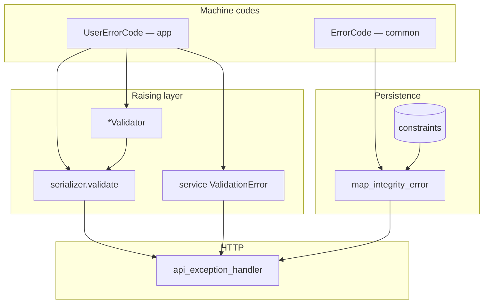
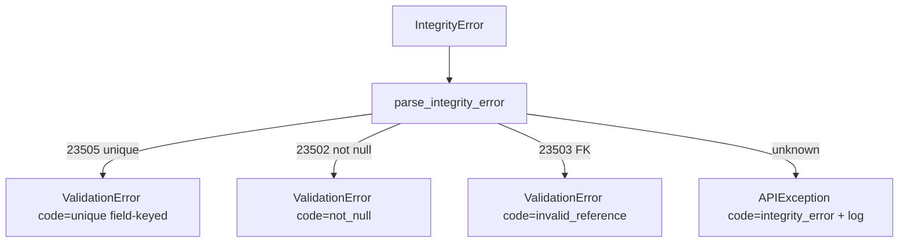

# 🚨 Errors

> Machine codes (`ErrorCode` / domain `*ErrorCode`), integrity mapping, and rare `ApplicationError`.
> Field validators live in [Validation](validation.md).

---

## 🎯 Mental model



| Layer | Location | Responsibility |
|-------|----------|----------------|
| Platform codes | `common/errors/codes.py` → `ErrorCode` | Shared codes (`required`, `unique`, …) |
| Domain codes | `<app>/errors/codes.py` → e.g. `UserErrorCode` | App codes only — **never raise here** |
| Integrity | `common/db/integrity/` | `IntegrityError` → field-keyed errors |
| Envelope | `common/http/` | See [API envelope](../http/api-envelope.md) |

### ❌ Hard boundaries

| Don’t | Do |
|-------|-----|
| Raising validators inside `errors/` | `errors/` = `StrEnum` codes only |
| Uniqueness checks as the only guard in serializers | DB + integrity mapping |
| Pre-format gettext with `%` | Use `params={...}` on `ValidationError` |

---

## 🏷️ Platform error codes (`common`)

```python
# common/errors/codes.py
class ErrorCode(StrEnum):
    INVALID_FORMAT = "invalid_format"
    INVALID = "invalid"                 # fallback when raiser omitted code=
    REQUIRED = "required"               # missing API / serializer input
    NOT_NULL = "not_null"               # DB NOT NULL / pgcode 23502
    UNIQUE = "unique"                   # unique / pgcode 23505
    INVALID_REFERENCE = "invalid_reference"  # FK / pgcode 23503
    UNKNOWN_INTEGRITY = "integrity_error"
    APPLICATION_ERROR = "application_error"
    SERVER_ERROR = "server_error"
```

| Code | Meaning | Typical source |
|------|---------|----------------|
| `required` | Client omitted input | Serializer |
| `not_null` | DB rejected NULL | Integrity map |
| `unique` | Unique violation | Integrity map |
| `invalid` | Fallback | Handler when `code=` missing |
| `server_error` | Unexpected exception | Handler 500 path |

**Keep `REQUIRED` and `NOT_NULL` distinct** — one is HTTP/input, the other is database.

---

## 🏷️ Domain error codes (per app)

```python
# users/errors/codes.py
class UserErrorCode(StrEnum):
    PASSWORD_MISSING_NUMBER = "password_must_include_number"
    PASSWORD_MISSING_LETTER = "password_must_include_letter"
    PASSWORD_MISSING_SPECIAL = "password_must_include_special_char"
    PASSWORD_MISMATCH = "password_mismatch"
    PASSWORD_TOO_SHORT = "password_too_short"
    PASSWORD_INCORRECT = "password_incorrect"
    INVALID_RESET_TOKEN = "invalid_reset_token"
    INVALID_TOKEN = "invalid_token"
```

| Rule | Detail |
|------|--------|
| Enum name | App-prefixed: `BlogsErrorCode`, `OrdersErrorCode` |
| Never name it `ErrorCode` | That name is reserved for platform |
| Values | Stable snake_case strings for clients |
| Package | Codes only — no validator classes |

`start_domain_app` scaffolds an empty enum in `errors/codes.py`.

---

---

## 💾 Services + integrity mapping

Every write path must:

1. use `model_create` / `model_save` / `model_update`, **or**
2. `except IntegrityError: map_integrity_error(...); raise`

```python
from django.db import IntegrityError

from {{cookiecutter.project_slug}}.common.db.integrity import map_integrity_error
from {{cookiecutter.project_slug}}.common.services import model_create

instance = model_create(model_class=MyModel, data={...})

try:
    return MyModel.objects.create(...)
except IntegrityError as error:
    map_integrity_error(error, model=MyModel)
    raise
```

### What `map_integrity_error` does



| Postgres `pgcode` | `ErrorCode` | Client `messages` |
|-------------------|-------------|-------------------|
| `23505` | `unique` | `messages.<column>` when column known |
| `23502` | `not_null` | per-column or generic |
| `23503` | `invalid_reference` | per-column or generic |
| other | `integrity_error` | controlled APIException (logged) |

SQLite (tests) uses message parsing fallback. **DB constraints remain the source of truth**; validators are UX.

Service-level domain errors (wrong current password, bad reset token) raise field-keyed Django `ValidationError` with `UserErrorCode` — see [Services](services.md).

---

## 7️⃣ `ApplicationError` (rare)

```python
# core/exceptions.py
class ApplicationError(Exception):
    def __init__(self, message, extra=None):
        self.message = message
        self.extra = extra or {}
```

Use for controlled **non-field** application failures. The handler maps to `ErrorCode.APPLICATION_ERROR` on `non_field_errors` and merges `extra`. Prefer field-keyed `ValidationError` whenever a field is known.

---

---

## 📁 Example layout

```text
common/
  errors/codes.py           # ErrorCode
  db/integrity/             # parse.py + map.py
  http/exception_handler.py
  services.py               # model_* wrap IntegrityError

users/
  errors/codes.py           # UserErrorCode
  services/                 # raise ValidationError with UserErrorCode
```

---

## 🔗 Related docs

| Doc | Why |
|-----|-----|
| [Validation](validation.md) | `is_*` / `*Validator` |
| [API envelope](../http/api-envelope.md) | How codes appear in JSON |
| [Services](services.md) | Where integrity mapping is called |
| [Models](models.md) | Constraints |
