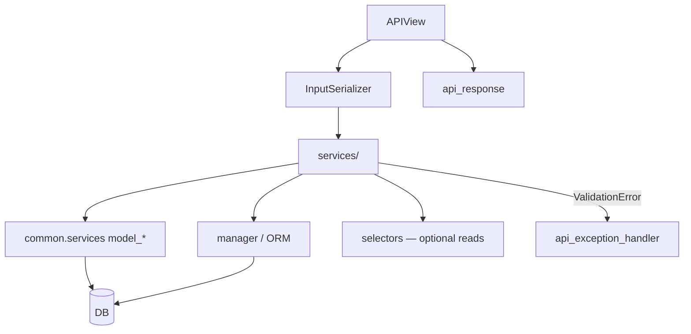
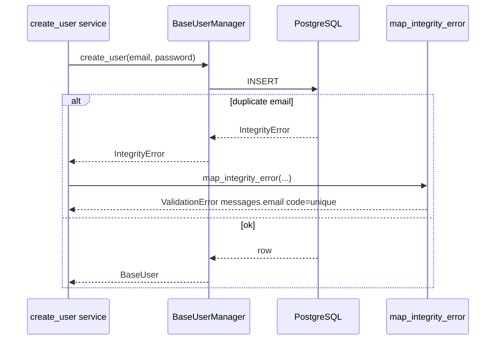

# ⚙️ Services

> **Writes** and **business rules** live here: create/update/delete, transactions, domain validation that is not just “field shape”, and integrity-error mapping.
>
> Views stay thin: parse input → call a service → return `api_response`.

---

## 🎯 Role



| Layer | Owns |
|-------|------|
| Serializer | Types, max_length, field validators, cross-field *input* checks |
| Service | Persist, workflows, domain failures with codes, integrity mapping |
| Selector | Reads the service needs before/after a write |

---

## 📂 Location & naming

```text
users/services/
├── __init__.py              # re-export public functions
├── user_services.py         # always *_services.py (plural)
└── tests/
    └── test_user_services.py
```

| ✅ | ❌ |
|----|----|
| `user_services.py` | `user_service.py` |
| `pos_charge_services.py` | `pos_menu_service.py` |
| `order_services.py` | `services.py` mega-file for many domains |

One domain/concern per `*_services.py` module. Re-export public callables from `services/__init__.py`.

```python
# users/services/__init__.py
from .user_services import change_password, create_user, profile_update, register, ...

__all__ = ["change_password", "create_user", ...]
```

### Function style

- Verb-oriented names: `register`, `create_user`, `profile_update`, `change_password`, `logout`
- **Keyword-only** arguments after `*`
- Return model instances (or `None` when the contract is side-effect-only, e.g. password reset request)
- Raise Django `ValidationError` (field-keyed) for expected domain failures

```python
def register(*, data: RegisterData) -> BaseUser:
    ...


def profile_update(*, profile: Profile, data: ProfileUpdateData) -> Profile:
    ...
```

Write payloads use **TypedDict** annotations — see [Types](types.md). Prefer `data=` for validated bodies; discrete kwargs for non-body inputs (`user=`, `post=`, `refresh_token=`).

---

## 🧱 Persistence helpers (`common.services`)

Ordinary model writes go through these helpers. They:

1. wrap work in `transaction.atomic()`
2. call `full_clean()`
3. catch `IntegrityError` and call `map_integrity_error`

### Which helper?

| You are… | Use | Why |
|----------|-----|-----|
| Creating a new row from field values | `model_create` | Builds, cleans, saves, maps integrity |
| Updating an existing row from TypedDict / `data=` (PATCH or PUT fields) | `model_update` | Applies only keys present in `data`, skips unchanged values, then saves |
| Saving an instance you already mutated yourself | `model_save` | You set attributes (or a manager did); helper only cleans + saves + maps |
| Using a custom manager / `set_password` / bulk ops | Bypass `model_*` | Then wrap with `map_integrity_error` yourself (below) |

```python
from {{cookiecutter.project_slug}}.common.services import model_create, model_save, model_update

# Create — new row from a field dict
post = model_create(
    model_class=Post,
    data={"title": data["title"], "body": data["body"], "author": author},
)

# Update from TypedDict — default for profile_update / update_post / similar
profile, changed = model_update(
    instance=profile,
    fields=["bio", "avatar"],
    data=data,  # ProfileUpdateData / Update*Data; missing keys are left alone
)

# Save after you mutated the instance (conditional logic, computed fields, …)
profile.bio = data["bio"]
model_save(instance=profile, update_fields=["bio"])
```

`model_update` already implements the PATCH rule `"field" in data` and only calls `model_save` when something changed. Do not hand-roll `if "x" in data: instance.x = …; model_save(...)` for ordinary field patches — that is what `model_update` is for. Reference: `users/services/user_services.py` → `profile_update`.

### When you bypass `model_*` (managers, `set_password`, …)

Some paths cannot use `model_create` (e.g. `BaseUser.objects.create_user` hashes passwords). Then **you** must map integrity errors:

```python
from django.db import IntegrityError

from {{cookiecutter.project_slug}}.common.db.integrity import map_integrity_error


def create_user(*, email: str, password: str) -> BaseUser:
    try:
        return BaseUser.objects.create_user(email=email, password=password)
    except IntegrityError as error:
        map_integrity_error(error, model=BaseUser)
        raise  # map_integrity_error never returns; keeps type-checkers happy
```



**Rule:** every persistence path uses `model_create` / `model_save` / `model_update` **or** explicit `except IntegrityError: map_integrity_error(...); raise`. No bare `objects.create()` in services without mapping.

---

## 🔁 Transactions

Multi-step writes need atomicity so you don’t leave half-created state.

```python
@transaction.atomic
def register(*, data: RegisterData) -> BaseUser:
    user = create_user(email=data["email"], password=data["password"])
    profile = Profile.objects.get(user=user)  # created by signal

    update_fields: list[str] = []
    if data.get("bio"):
        profile.bio = data["bio"]
        update_fields.append("bio")
    if data.get("avatar") is not None:
        profile.avatar = data["avatar"]
        update_fields.append("avatar")

    if update_fields:
        model_save(instance=profile, update_fields=update_fields)

    return user
```

| Tool | When |
|------|------|
| `@transaction.atomic` on the service | Several ORM operations that must succeed/fail together |
| Atomic block inside `model_*` | Single-instance create/save already covered |
| Nested atomics | OK — Django uses savepoints; don’t over-nest without reason |

---

## 🚨 Raising domain errors from services

Raise Django’s `ValidationError` (not DRF’s) with **field keys** and **codes**. The [API exception handler](../http/api-envelope.md) normalizes them into `messages`.

```python
from django.core.exceptions import ValidationError
from django.utils.translation import gettext_lazy as _

from {{cookiecutter.project_slug}}.users.errors.codes import UserErrorCode


def change_password(*, user: BaseUser, data: ChangePasswordData) -> None:
    if not user.check_password(data["current_password"]):
        raise ValidationError(
            {
                "current_password": ValidationError(
                    _("current password is incorrect."),
                    code=UserErrorCode.PASSWORD_INCORRECT,
                )
            }
        )
    user.set_password(data["new_password"])
    user.save(update_fields=["password"])
```

| ✅ Do | ❌ Don’t |
|-------|---------|
| Field-keyed dict errors | Bare string-only errors when a field is known |
| Domain `UserErrorCode` / app codes | Random undocumented string codes |
| Lowercase gettext messages (strong recommendation) | Hard-coded untranslated UI strings (see [Translations](../ops/translations.md)) |
| Let unexpected bugs propagate / log | Swallow `IntegrityError` without mapping |

Other real services in this repo:

| Function | Behavior |
|----------|----------|
| `profile_update` | Patches bio/avatar from `ProfileUpdateData` via `model_update` |

| `logout` | Blacklists refresh token; invalid token → `UserErrorCode.INVALID_TOKEN` |

| `request_password_reset` | Always succeeds; emails only if user exists (no email enumeration) |
| `reset_password` | Validates uid/token; sets password |

---

## 🆚 Service vs serializer vs selector vs signal

| Concern | Put it in |
|---------|-----------|
| `EmailField`, `max_length`, `PASSWORD_VALIDATORS` | Input serializer |
| `confirm_password` must match | Input serializer `validate()` |
| Unique email enforcement | DB `unique=True` + service integrity mapping |
| “Current password is wrong” | Service |
| “Fetch profile before patch” | Selector called by API/service |
| “Ensure Profile row exists on user create” | Signal (mechanical) + service for updates |

```python
# ❌ uniqueness check only in serializer
if BaseUser.objects.filter(email=email).exists():
    raise ValidationError(...)

# ✅ DB unique + create_user → map_integrity_error
```

---

## 📞 How APIs call services

Pass `serializer.validated_data` as `data=` annotated with a **TypedDict**. No dataclass DTOs. Details: [Types](types.md).

```python
# users/apis/users/register/users_register_apis.py
def post(self, request):
    serializer = UsersRegisterInputSerializer(data=request.data)
    serializer.is_valid(raise_exception=True)
    user = register(data=serializer.validated_data)
    return api_response(
        data=UsersRegisterOutputSerializer(user, context={"request": request}).data,
        http_status=status.HTTP_201_CREATED,
    )
```

```python
# users/apis/users/profile/users_profile_apis.py
def patch(self, request):
    serializer = UsersProfileUpdateInputSerializer(data=request.data, partial=True)
    serializer.is_valid(raise_exception=True)
    profile = get_profile(user=request.user)
    profile = profile_update(profile=profile, data=serializer.validated_data)
    return api_response(data=UsersProfileOutputSerializer(profile, context={"request": request}).data)
```

```python
# services — PATCH from TypedDict via model_update (None ≠ missing)
def profile_update(*, profile: Profile, data: ProfileUpdateData) -> Profile:
    profile, _changed = model_update(
        instance=profile,
        fields=["bio", "avatar"],
        data=data,
    )
    return profile
```

**APIs never call `Model.objects.create` / `.save()` directly for product writes.** Creates → `model_create`; updates from `data=` → `model_update`. Prefer TypedDict over untyped `dict` / dataclass DTOs.

## 🧪 Testing

Tests live under `services/tests/`. Focus on **business logic** (writes, domain rules, integrity) — not HTTP. See [Testing](../ops/testing.md).

| Cover | Example |
|-------|---------|
| Happy path | `register` returns user with profile fields |
| Domain validation | `change_password` with wrong current password |
| Integrity | Duplicate email → error with `unique` (or mapped field) |
| Side-effect contracts | `request_password_reset` does not leak whether email exists |

Use factories from `users/tests/user_factories.py` (or app factories from `start_domain_app`) instead of hand-building invalid graphs when possible.

---

## ✅ Checklist: adding a service

1. Add `Create*Data` / `Update*Data` TypedDict to `<app>/types.py`  
2. Add `def feature(*, data: …) -> …` in `<app>/services/<domain>_services.py`  
3. Persist with the matching helper: create → `model_create`; update from `data=` → `model_update`; already-mutated instance → `model_save`; else `map_integrity_error`  
4. Wrap multi-step work in `@transaction.atomic`  
5. Raise field-keyed `ValidationError` with domain codes  
6. Re-export from `services/__init__.py`  
7. Call only from APIs / management commands / admin hooks — not from serializers  
8. Add `services/tests/…` with TypedDict literals  

### ❌ Anti-patterns

| Anti-pattern | Fix |
|--------------|-----|
| Fat `APIView.post` with ORM writes | Move to service |
| `objects.create()` without integrity mapping | `model_create` or `map_integrity_error` |
| PATCH with hand-rolled `if "field" in data` + `model_save` | `model_update(instance=…, fields=[…], data=data)` |
| `instance.save()` / bare `.update()` in a service | `model_save` / `model_update` (or map integrity) |
| Business rules only in serializer | Service + DB constraints |
| Service returns `Response` | Return models; API builds envelope |
| Silent `except IntegrityError: pass` | Always map or re-raise |
| Mixing huge read/report queries into write services | Call a selector instead |
| Module named `*_service.py` (singular) | Always `*_services.py` |
| Untyped `dict` / dataclass DTO / field `.get` in the view | TypedDict + `data=validated_data`; PATCH via `model_update` — [Types](types.md) |

---

## 🔗 Related docs

| Doc | Why |
|-----|-----|
| [Selectors](selectors.md) | Reads used before/after writes |
| [Types](types.md) | TypedDict service inputs |
| [Models](models.md) | Constraints the service relies on |
| [Errors](errors.md) | Integrity mapping / codes |
| [Validation](validation.md) | Field validators used before persist |
| [API envelope](../http/api-envelope.md) | How service errors become JSON |
| [APIs](apis.md) | Thin callers |
| [Signals](signals.md) | Mechanical creates vs service updates |
