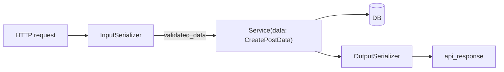

# 🏷️ Service input types (`TypedDict`)

> Make write-service inputs **type-safe** without dataclass DTOs and **without duplicating** the field list as a second “DTO class layer”.
>
> **Serializer** = HTTP contract + validation.  
> **TypedDict** = typing for the same validated payload inside services / tests.

---

## 🎯 Why TypedDict (not dataclass DTO)?

| Approach | Verdict |
|----------|---------|
| Dataclass `CreatePostDTO` / `UpdatePostDTO` | ❌ Rejected — duplicates serializer fields, extra mapping layer |
| Raw `data: dict` on services | ❌ Untyped; easy to pass the wrong shape |
| **`TypedDict` on `data=`** | ✅ Types the validated mapping; no second runtime model |



| Layer | Owns | Does not |
|-------|------|----------|
| InputSerializer | Validation, coercion, DRF errors, OpenAPI request body | Business rules, `serializer.save()`, ORM writes |
| `TypedDict` in `<app>/types.py` | Static types for service `data=` | Runtime validation (already done by serializer) |
| Service | Rules, transactions, integrity; reads keys with `"field" in data` for PATCH | DRF / `request` |

Duplication of field *names* between serializer and TypedDict is intentional typing only — there is no second object to map. Keep the TypedDict keys aligned with `validated_data` after HTTP-only fields are popped (`confirm_password`).

---

## 📂 Location & naming

Prefer a single app module (as in the blogs example):

```text
blogs/
├── types.py              # CreatePostData, UpdatePostData, …
├── enums.py
├── services/
└── apis/
```

| Pattern | Example |
|---------|---------|
| Create / command | `CreatePostData`, `RegisterData`, `ChangePasswordData` |
| Partial update | `UpdatePostData`, `ProfileUpdateData` with `total=False` |

`users` reference: `users/types.py`.

---

## ✍️ Definitions

```python
# blogs/types.py
from typing import NotRequired, TypedDict

from blogs.enums import PostStatus


class CreatePostData(TypedDict):
    title: str
    body: str
    category_id: int
    status: NotRequired[str]  # omit → service default (e.g. DRAFT)


class UpdatePostData(TypedDict, total=False):
    title: str
    body: str
    category_id: int
    status: str
```

- **Create:** required keys without `total=False` (use `NotRequired` for optional ones).
- **Update / PATCH:** `total=False` so every key is optional; **presence** of a key means “client sent it”.

---

## 📞 API → service

```python
serializer = PostCreateInputSerializer(data=request.data)
serializer.is_valid(raise_exception=True)
post = create_post(author=request.user, data=serializer.validated_data)
```

```python
serializer = PostUpdateInputSerializer(data=request.data, partial=True)
serializer.is_valid(raise_exception=True)
post = update_post(post=post, data=serializer.validated_data)
```

No dataclass construction. No per-field `.get(...)` unpacking into kwargs.

```python
def create_post(*, author: BaseUser, data: CreatePostData) -> Post:
    ...


def update_post(*, post: Post, data: UpdatePostData) -> Post:
    if "title" in data:
        post.title = data["title"]
    if "body" in data:
        post.body = data["body"]
    ...
```

| Client JSON | `"bio" in data` | Effect |
|-------------|-----------------|--------|
| `{}` | `False` | leave unchanged |
| `{"bio": null}` | `True` | set / clear |
| `{"bio": "x"}` | `True` | set |

---

## 🧪 Tests

```python
data: CreatePostData = {
    "title": "Hello",
    "body": "Body",
    "category_id": category.id,
}
post = create_post(author=user, data=data)

data: UpdatePostData = {"title": "Hi"}
post = update_post(post=post, data=data)
```

---

## ❌ Anti-patterns

| Anti-pattern | Fix |
|--------------|-----|
| Dataclass DTO + `dto=` | `TypedDict` + `data=` |
| `def create_*(*, data: dict)` | `data: CreatePostData` |
| Field-by-field `.get` in the view | Pass `serializer.validated_data` |
| `serializer.save()` | Validate → service(`data=…`) |
| Business rules in InputSerializer | Service |
| Treating missing like `None` on PATCH | `"field" in data` |

---

## ✅ Checklist

1. Add `Create*Data` / `Update*Data` to `<app>/types.py`  
2. InputSerializer validates; pop HTTP-only keys  
3. View: `service(..., data=serializer.validated_data)`  
4. Service annotated with TypedDict; PATCH uses `"field" in data`  
5. Service tests build TypedDict literals  

---

## 🔗 Related docs

| Doc | Why |
|-----|-----|
| [APIs](apis.md) | Serializers + glue |
| [Services](services.md) | Write path |
| [Architecture](../overview/architecture.md) | Layer contracts |
| [Testing](../ops/testing.md) | Service tests |
