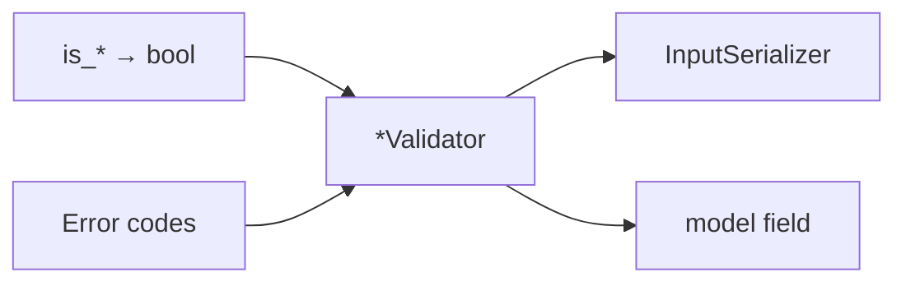

# 🛡️ Validation

> Pure `is_*` checks and raising `*Validator` classes. Machine codes and integrity mapping live in [Errors](errors.md).

`common` holds generic validators; each domain app owns its own (`users`, `blogs`, …).

---

## 🎯 Mental model



| Piece | Location | Responsibility |
|-------|----------|----------------|
| Pure checks | `common/validators/` or `<app>/validators/` | `is_*` → `bool` only |
| Raising validators | `<app>/validators/` | `@deconstructible` + Django `ValidationError` + `code=` |
| Codes used on raise | See [Errors](errors.md) | Platform `ErrorCode` / domain `*ErrorCode` |

### ❌ Hard boundaries

| Don’t | Do |
|-------|-----|
| Domain password rules in `common` | `<app>/validators/` |
| Raising validators inside `errors/` | `errors/` = `StrEnum` codes only |
| Uniqueness / permissions in serializers | DB + integrity; permission classes |
| Pre-format gettext with `%` | Use `params={...}` on `ValidationError` |

---

## 💬 Message conventions

| Rule | Example |
|------|---------|
| `gettext_lazy` / `_()` msgids: prefer **lowercase + spaces** | `_("password must include number")` — strong recommendation; see [Translations](../ops/translations.md) |
| Parameterized messages use `params=` | `params={"limit_value": 10}` |
| Don’t bake values into the msgid | ❌ `_("password must be at least 10 characters")` as the only form when limit may change |

Pre-commit may enforce lowercase gettext when code-style hooks are enabled — see [Translations](../ops/translations.md) / [Code quality](../ops/code-quality.md).

---

## 🧪 Pure validators (`is_*`)

Pure functions are reusable in validators, tests, and (rarely) services — **no exceptions, no gettext**.

### Generic (any app) — `common/validators/`

```python
# common/validators/string.py
def is_non_empty(value: str) -> bool:
    return isinstance(value, str) and bool(value.strip())


def is_slug(value: str) -> bool:
    return isinstance(value, str) and _SLUG_RE.fullmatch(value) is not None
```

### Domain — next to raisers in `<app>/validators/`

```python
# users/validators/password.py
def is_password_with_number(value: str) -> bool:
    return isinstance(value, str) and _HAS_NUMBER_RE.search(value) is not None
```

Naming separates concerns in one file: `is_*` (bool) vs `*Validator` (raises).

---

## 📣 Raising field validators (`*Validator`)

Use **Django’s** `ValidationError` (not DRF’s) so the same class works on model fields and serializer fields.

```python
@deconstructible
class PasswordNumberValidator:
    code = UserErrorCode.PASSWORD_MISSING_NUMBER
    message = _("password must include number")

    def __call__(self, value: str) -> None:
        if not is_password_with_number(value):
            raise ValidationError(self.message, code=self.code)


@deconstructible
class PasswordMinLengthValidator:
    code = UserErrorCode.PASSWORD_TOO_SHORT
    message = _("password must be at least %(limit_value)d characters")
    limit_value = 10

    def __call__(self, value: str) -> None:
        if not isinstance(value, str) or len(value) < self.limit_value:
            raise ValidationError(
                self.message,
                code=self.code,
                params={"limit_value": self.limit_value},
            )
```

### Export instances for DRF

```python
validate_password_number = PasswordNumberValidator()
# ...

PASSWORD_VALIDATORS = [
    validate_password_number,
    validate_password_letter,
    validate_password_special_char,
    validate_password_min_length,
]

# serializer
password = serializers.CharField(validators=PASSWORD_VALIDATORS)
```

`@deconstructible` matters if you attach validators on **model fields** (migrations must serialize them).

### Password policy: API + Django auth stay in sync

| Path | List / setting | Used for |
|------|----------------|----------|
| API / DRF | `users.validators.PASSWORD_VALIDATORS` | Register and password fields |
| Django auth | `AUTH_PASSWORD_VALIDATORS` in `config/settings/auth.py` | Admin / `set_password` |

Domain rules are wired into Django via `Password*DjangoValidator` adapters in the same `password.py` module (same underlying `validate_password_*` callables). **Change policy once; keep both lists aligned.**

---
## 📝 Serializers (shape + object rules only)

- Attach domain `*Validator` lists on fields
- Cross-field rules in `validate()` with field-keyed errors
- Platform vs domain codes as appropriate

```python
raise serializers.ValidationError(
    {"confirm_password": [_("confirm password is not equal to password")]},
    code=UserErrorCode.PASSWORD_MISMATCH,
)
```

Full patterns: [APIs](apis.md).

---

---

## ✅ Checklist: add a new field rule

1. **Pure check** — generic → `common/validators/` as `is_*`; domain → `<app>/validators/`
2. **Code** — see [Errors](errors.md) (platform `ErrorCode` / domain `*ErrorCode`)
3. **Raising validator** — `@deconstructible`, Django `ValidationError` + `code=` + lowercase `_()`
4. **Wire it** — model field if universal; serializer field for API; cross-field only in `validate()`
5. **Persist safely** — DB constraint for unique/FK/null; writes via `model_*` or integrity map (see [Errors](errors.md))
6. **Tests** — validator unit tests + API/service case for the failure message/code

---

## 📁 Example layout

```text
common/
  validators/string.py      # is_non_empty, is_slug

users/
  validators/password.py    # is_password_* + *Validator + PASSWORD_VALIDATORS + Django adapters
  apis/.../register/        # PASSWORD_VALIDATORS on InputSerializer
```

---

## 🔗 Related docs

| Doc | Why |
|-----|-----|
| [Errors](errors.md) | Codes + integrity mapping |
| [API envelope](../http/api-envelope.md) | How failures appear in JSON |
| [APIs](apis.md) | Serializer patterns |
| [Translations](../ops/translations.md) | Prefer lowercase + space-separated msgids |
