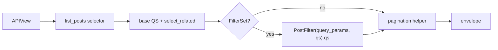

# 🔎 Filtering

> Optional list **query filters** with django-filter. Default lists apply **no** filters.
>
> Pagination is separate — see [Pagination](pagination.md).

---

## 🎯 Project rules

| Rule | Detail |
|------|--------|
| Default | **Nothing is filtered.** List = selector + pagination only |
| When you need filters | Always use a **`django_filters.FilterSet`**, even for 1–2 fields |
| Where it lives | Next to the list API leaf: `apis/<route…>/<entity>_search_filters.py` |
| Applied where | **In the API view** after `list_*()` |
| Selector role | Optimized base QS only (`select_related` / `prefetch` / domain scoping) — **no** `query_params=` |
| Auto backends | **Off.** Plain `APIView` does not run `filter_backends`; we do not set `DEFAULT_FILTER_BACKENDS` |

`django-filter` is in dependencies for this path. Do not invent a parallel QuerySerializer-based filter style for list query params.



### Default — list with no filters

```python
# blogs/selectors/post_selectors.py
def list_posts() -> QuerySet[Post]:
    return (
        Post.objects.filter(status="published")
        .select_related("author", "category")
        .prefetch_related("tags")
        .order_by("-created_at")
    )


# blogs/apis/posts/posts_apis.py
class PostListCreateApiView(ApiAuthMixin, APIView):
    class Pagination(LimitOffsetPagination):
        default_limit = 20

    def get(self, request):
        qs = list_posts()
        return get_paginated_response_context(
            pagination_class=self.Pagination,
            serializer_class=PostOutputSerializer,
            queryset=qs,
            request=request,
            view=self,
        )
```

No FilterSet file. No filter query params. Clients only use `limit` / `offset` (or cursor params).

### With filters — `*_search_filters.py` under `apis/`

```text
blogs/apis/posts/
├── posts_apis.py
├── posts_serializers.py
├── posts_search_filters.py   # PostFilter
└── tests/
```

```python
# blogs/apis/posts/posts_search_filters.py
import django_filters

from blogs.models import Post


class PostFilter(django_filters.FilterSet):
    author_id = django_filters.NumberFilter(field_name="author_id")
    # FK / related table — flat query param, ORM lookup with __
    author_email = django_filters.CharFilter(field_name="author__email")
    category_slug = django_filters.CharFilter(field_name="category__slug")
    tag = django_filters.CharFilter(field_name="tags__slug")
    title = django_filters.CharFilter(field_name="title", lookup_expr="icontains")
    from_date = django_filters.DateFilter(field_name="created_at", lookup_expr="gte")
    to_date = django_filters.DateFilter(field_name="created_at", lookup_expr="lte")

    class Meta:
        model = Post
        fields = [
            "author_id",
            "author_email",
            "category_slug",
            "tag",
            "title",
            "from_date",
            "to_date",
        ]
```

```python
# blogs/selectors/post_selectors.py
def list_posts() -> QuerySet[Post]:
    return (
        Post.objects.filter(status="published")
        .select_related("author", "category")
        .prefetch_related("tags")
        .order_by("-created_at")
    )
```

```python
# blogs/apis/posts/posts_apis.py
from blogs.apis.posts.posts_search_filters import PostFilter
from blogs.selectors.post_selectors import list_posts


class PostListCreateApiView(ApiAuthMixin, APIView):
    class Pagination(LimitOffsetPagination):
        default_limit = 20

    @extend_schema(
        tags=BLOGS_TAGS,
        summary="List published posts",
        parameters=[PostFilter],  # spectacular / OpenAPI for query params
        responses=PostOutputSerializer,
    )
    def get(self, request):
        qs = list_posts()
        qs = PostFilter(request.query_params, queryset=qs).qs
        return get_paginated_response_context(
            pagination_class=self.Pagination,
            serializer_class=PostOutputSerializer,
            queryset=qs,
            request=request,
            view=self,
        )
```

| Piece | Owns |
|-------|------|
| `PostFilter` | Query-param → ORM filter mapping (FK / dates / …) |
| `list_posts()` | Base QS + `select_related` / `prefetch` (+ auth/ownership scoping) |
| API | Apply FilterSet → paginate → serialize; document FilterSet in OpenAPI |

Example request:

```http
GET /api/v1/blogs/posts/?author_email=a@b.com&tag=django&from_date=2026-01-01&limit=10
```

Only params present in the query string are applied; omitted filters do nothing.

### FK / related filters vs `prefetch`

| Need | What to use |
|------|-------------|
| Filter by related field (`author__email`, `tags__slug`) | `field_name="author__email"` on the FilterSet — **works without prefetch** |
| Avoid N+1 when serializer reads related objects | `select_related` / `prefetch_related` on the **selector** base QS |

Filtering uses SQL joins/lookups. Prefetch is for **reading** related data in the response, not for making filters work. See [Selectors](../domain/selectors.md).

### Ordering / search

Add as FilterSet fields (e.g. `OrderingFilter` from django-filter, or a `CharFilter` mapped carefully). Do **not** set DRF `filter_backends = [OrderingFilter, SearchFilter]` on plain `APIView` and expect them to run automatically.

Document filter params in `@extend_schema(parameters=[PostFilter])` — see [Swagger](swagger.md).

### Naming FilterSets

| Item | Convention | Example |
|------|------------|---------|
| Module | `apis/<route…>/<entity>_search_filters.py` | `posts_search_filters.py`, `pos_search_filters.py` |
| Class | `<Entity>Filter` (singular model name) | `PostFilter`, `PosFilter` |

---

## ❌ Anti-patterns

| Anti-pattern | Fix |
|--------------|-----|
| `PostFilter` under `selectors/` + apply inside `list_*` | `*_search_filters.py` under `apis/` + apply in the view |
| `list_posts(*, request=…)` / `query_params=` on selectors | Selector returns base QS; API owns FilterSet |
| Filter logic copied into 3 views | One FilterSet module next to the list leaf |
| `filter_backends = [...]` on plain `APIView` with no manual invoke | Explicit `FilterSet(..., queryset=qs).qs` in the view |
| Raw `request.query_params.get` + `int(...)` in the view | `FilterSet` fields |
| Parallel `*QuerySerializer` style for the same list filters | One style: django-filter only |

---

## ✅ Checklist: filterable list

1. Selector returns optimized base `QuerySet`  
2. `<entity>_search_filters.py` next to the list API + apply in `get`  
3. Then paginate — [Pagination](pagination.md)  
4. `@extend_schema(parameters=[…Filter])`  
5. API test covering filter params  

---

## 🔗 Related docs

| Doc | Why |
|-----|-----|
| [Pagination](pagination.md) | Page envelope helpers |
| [Selectors](../domain/selectors.md) | Base queryset |
| [APIs](../domain/apis.md) | View patterns |
| [Swagger](swagger.md) | Documenting query params |
