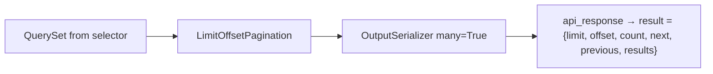

# 📄 Pagination

> How list endpoints return pages inside the [API envelope](api-envelope.md).
>
> Helpers live in `{{cookiecutter.project_slug}}/api/pagination.py`.
>
> Query-string **filters** are separate — see [Filtering](filtering.md).

---

## 🎯 Why custom helpers?

DRF’s default pagination response is a bare object (`count`, `next`, `results`, …). This project wraps **everything** in `{ success, status, result, messages }`, so pagination subclasses `get_paginated_response` to put the page metadata **inside `result`**.



---

## 📦 Paginated success shape

```json
{
  "success": true,
  "status": 200,
  "result": {
    "limit": 10,
    "offset": 0,
    "count": 42,
    "next": "http://localhost:8000/api/v1/blogs/posts/?limit=10&offset=10",
    "previous": null,
    "results": [
      { "id": 1, "title": "…" }
    ]
  },
  "messages": {}
}
```

| Field | Meaning |
|-------|---------|
| `limit` | Page size used for this response |
| `offset` | Starting index |
| `count` | Total rows matching the queryset (before slice) |
| `next` / `previous` | Absolute URLs or `null` |
| `results` | Serialized page items |

Frontends can build their own pager from `limit` / `offset` / `count` without parsing Link headers.

---

## 🧱 `LimitOffsetPagination`

```python
# api/pagination.py
class LimitOffsetPagination(_LimitOffsetPagination):
    default_limit = 10
    max_limit = 50
```

| Setting | Default | Notes |
|---------|---------|-------|
| `default_limit` | `10` | Used when client omits `limit` |
| `max_limit` | `50` | Caps abusive `?limit=100000` |

Query params (DRF limit/offset style):

```http
GET /api/v1/blogs/posts/?limit=20&offset=40
```

### Per-view overrides

```python
class PostListCreateApiView(ApiAuthMixin, APIView):
    class Pagination(LimitOffsetPagination):
        default_limit = 20
        max_limit = 100
```

---

## 📍 `CursorPagination` (large / high-churn lists)

```python
from {{cookiecutter.project_slug}}.api.pagination import CursorPagination, get_paginated_response_context

class PostFeedListApiView(ApiAuthMixin, APIView):
    class Pagination(CursorPagination):
        page_size = 20
        ordering = "-created_at"

    def get(self, request):
        qs = list_posts()
        return get_paginated_response_context(
            pagination_class=self.Pagination,
            serializer_class=PostOutputSerializer,
            queryset=qs,
            request=request,
            view=self,
        )
```

| Prefer limit/offset when | Prefer cursor when |
|--------------------------|--------------------|
| Admin tables, small catalogs, need total `count` | Feeds, event streams, rows inserted while paging |
| Clients build page numbers from `offset` | Clients only follow `next` / `previous` |

Cursor `result` shape (inside the envelope): `{ "next", "previous", "results" }` — no global `count`.

Default ordering uses `-created_at` (works with `BaseModel`). Override `ordering` for your model.

---

## 🛠️ Helper functions

| Helper | Serializer context | When to use |
|--------|-------------------|-------------|
| `get_paginated_response(...)` | none | Items need no `request` (no absolute media URLs) |
| `get_paginated_response_context(...)` | `{"request": request}` | Avatars, absolute links, anything using `request.build_absolute_uri` |

Both:

1. Instantiate your pagination class
2. `paginate_queryset(...)`
3. Serialize the page with `many=True`
4. Return `paginator.get_paginated_response(...)` → envelope

If pagination returns `None` (unusual with these settings), helpers fall back to `api_response(data=serializer.data)` for the full queryset.

### Full example

```python
qs = list_posts()  # optional: apply FilterSet first — see [Filtering](filtering.md)
return get_paginated_response_context(
    pagination_class=self.Pagination,
    serializer_class=PostOutputSerializer,
    queryset=qs,
    request=request,
    view=self,
)
```

**Never** `Model.objects.all()[offset:offset+limit]` in the view. Prefer selector + helper.

---

## ❌ Anti-patterns

| Anti-pattern | Fix |
|--------------|-----|
| `return Response(paginator.get_paginated_response(...).data)` without envelope | Use project `LimitOffsetPagination` / helpers |
| `Model.objects.all()[offset:offset+limit]` in the view | Selector + pagination helper |
| Loading all rows then slicing in Python | DB-level pagination via DRF paginator |
| `max_limit` removed “so mobile can load everything” | Cap limits; offer export endpoints if needed |

---

## ✅ Checklist: paginated list

1. Selector returns optimized base `QuerySet`  
2. Apply filters if needed — [Filtering](filtering.md)  
3. Paginate with project helpers  
4. Output serializer only  
5. API test: `result.results`, `result.count`, `limit`/`offset`  

---

## 🔗 Related docs

| Doc | Why |
|-----|-----|
| [Filtering](filtering.md) | Optional query FilterSets |
| [API envelope](api-envelope.md) | Outer JSON shape |
| [Selectors](../domain/selectors.md) | Where querysets come from |
| [APIs](../domain/apis.md) | View patterns |
