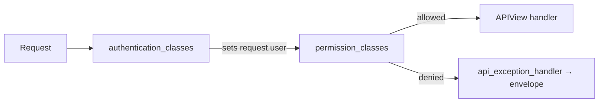

# 🔐 Permissions

> How endpoints decide **who may call them**.
>
> This blueprint is **deny-by-default**: DRF’s default permission is `IsAuthenticated`. Public routes must opt out with `AllowAny`.

---

## 🎯 Mental model



| Concept | Meaning |
|---------|---------|
| Authentication | JWT Bearer or session cookie → `request.user` |
| Permission | Default **IsAuthenticated**; public endpoints set `AllowAny` |
| `ApiAuthMixin` | Explicit auth classes + `IsAuthenticated` (redundant with default, but clear at the view) |

---

## ⚙️ Defaults in settings

`config/settings/drf.py`:

```python
"DEFAULT_PERMISSION_CLASSES": ("rest_framework.permissions.IsAuthenticated",),

"DEFAULT_AUTHENTICATION_CLASSES": ("…JWTAuthentication",),

"DEFAULT_AUTHENTICATION_CLASSES": ("…SessionAuthentication",),

```

| View style | Effect |
|------------|--------|
| Plain `APIView` **without** `AllowAny` | Anonymous → **401/403** |
| `permission_classes = [AllowAny]` | Public (still throttled when configured) |
| `ApiAuthMixin` + `APIView` | Authenticated; documents intent |

---

## 🧩 `ApiAuthMixin`

```python
# api/mixins.py
class ApiAuthMixin:

    authentication_classes = [JWTAuthentication]

    authentication_classes = [SessionAuthentication]

    permission_classes = (IsAuthenticated,)
```

```python
from {{cookiecutter.project_slug}}.api.mixins import ApiAuthMixin

class UsersProfileApi(ApiAuthMixin, APIView):
    ...
```

Put `ApiAuthMixin` **before** `APIView`.

---

## 🌐 Public endpoints (`AllowAny`)

```python
from rest_framework.permissions import AllowAny

class UsersRegisterApi(APIView):
    permission_classes = [AllowAny]
    ...
```

| Endpoint | Why public |
|----------|------------|
| Health | Probes / load balancers |
| Register / login / refresh / verify | Bootstrap auth |
| JWT logout (refresh in body) | Blacklist without access token |
| Password reset request/confirm | Recovery without session |

See [Security](security.md).

---

## 🛠️ Custom permission classes

```python
# blogs/permissions.py
from rest_framework.permissions import BasePermission

class IsPostAuthor(BasePermission):
    def has_object_permission(self, request, view, obj):
        return obj.author_id == request.user.id
```

```python
class PostRetrieveUpdateDestroyApiView(ApiAuthMixin, APIView):
    permission_classes = (*ApiAuthMixin.permission_classes, IsPostAuthor)

    def get(self, request, post_id):
        post = get_post(post_id=post_id)
        self.check_object_permissions(request, post)
        ...
```

With plain `APIView`, call `check_object_permissions` after loading the object. Filter lists in **selectors** so foreign rows never leave the DB.

Full RBAC / multi-tenant policies: [Enterprise extensions](../structure/enterprise-extensions.md).

---

## 🍪 CSRF


JWT Bearer clients are not CSRF-scoped like cookie sessions. If you add cookie session endpoints, require CSRF on unsafe methods.

Browser session clients must send CSRF on `POST`/`PATCH`/`PUT`/`DELETE`.


---

## ❌ Anti-patterns

| Anti-pattern | Fix |
|--------------|-----|
| Assuming new views are public | Default is authenticated — set `AllowAny` only when intentional |
| Permission checks only inside serializers | Permission classes |
| Staff flags implying API access | Explicit `IsAdminUser` / custom class |

---

## 🔗 Related

| Doc | Why |
|-----|-----|
| [Security](security.md) | Baseline |
| [Authentication](authentication.md) | Issuing credentials |
| [APIs](../layers/apis.md) | Where to attach mixin / AllowAny |
| [Throttling](throttling.md) | Public abuse control |
