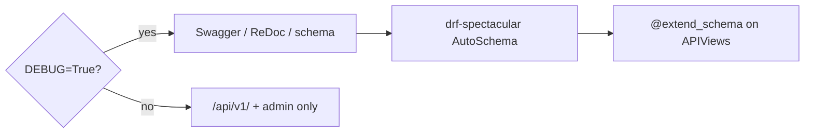

# 📘 Swagger / OpenAPI

> Interactive API docs and machine-readable schema via [drf-spectacular](https://drf-spectacular.readthedocs.io/).
>
> Available **only when `DEBUG=True`** — never expose the full schema UI in production with this template’s default wiring.

---

## 🎯 What you get in development

Mounted in `config/urls.py` when `DEBUG` is on:

| URL | What it is |
|-----|------------|
| http://localhost:8000/ | **Swagger UI** — try requests in the browser |
| http://localhost:8000/redoc/ | **ReDoc** — readable reference |
| http://localhost:8000/schema/ | Raw OpenAPI schema (JSON/YAML depending on client) |



### Why DEBUG-only?

| Risk if public in production | Mitigation |
|------------------------------|------------|
| Full endpoint inventory for attackers | Keep schema views behind `DEBUG` |
| Accidental auth experimentation against prod | No UI mounted |
| Stale docs confusing external partners | Prefer a deliberate public docs portal if you need one later |

---

## ⚙️ Settings

### DRF

```python
# config/settings/drf.py
"DEFAULT_SCHEMA_CLASS": "drf_spectacular.openapi.AutoSchema",
```

### Spectacular

`config/settings/swagger.py` sets title/version, Swagger UI options, shared **`ApiErrorEnvelope`** / **`ApiMessageItem`** components, and (when JWT) `BearerAuth`.

Prefer documenting **success** responses with `envelope_serializer(...)` so the schema matches runtime JSON — see [API envelope](api-envelope.md).

| Setting | Meaning |
|---------|---------|
| `TITLE` / `VERSION` | Shown in Swagger header |
| `SERVE_INCLUDE_SCHEMA` | `False` — schema endpoint does not embed itself recursively |
| `deepLinking` | UI URLs can deep-link to operations |
| `persistAuthorization` | Keeps Authorize values across page reloads in the UI |
| `ApiErrorEnvelope` component | Shared error shape for clients |

| `BearerAuth` security scheme | Enables the Authorize button for JWT |


---

## ✍️ Annotating endpoints (required practice)

Every public handler should declare schema metadata with `@extend_schema`:

```python
from drf_spectacular.utils import extend_schema

from {{cookiecutter.project_slug}}.users.constants import USERS_TAGS


@extend_schema(
    tags=USERS_TAGS,
    summary="Register a new user",
    request=UsersRegisterInputSerializer,
    responses=UsersRegisterOutputSerializer,
)
def post(self, request):
    ...
```

| Argument | Purpose |
|----------|---------|
| `tags` | Sidebar groups in Swagger — from [constants](../domain/constants.md) |
| `summary` | Short human title |
| `request` | Body / input serializer |
| `responses` | Success body serializer (add status map when you need 201 vs 200 explicitly) |
| `description` | Longer prose when needed (see `HealthApi`) |

### Method fields

```python
from drf_spectacular.utils import extend_schema_field

@extend_schema_field(serializers.URLField())
def get_avatar(self, profile: Profile) -> str:
    ...
```

Without `@extend_schema_field`, Spectacular often types method fields as generic/string and the docs lie.

### Tags

```python
# users/constants.py
USERS_TAGS = ["users"]
AUTH_TAGS = ["auth"]
```

```python
@extend_schema(tags=AUTH_TAGS, summary="JWT login")
```

Health uses `tags=["system"]`. Keep tag strings **lowercase and stable** — clients and codegen depend on them.

---


## 🔓 Trying JWT in Swagger UI

1. Open http://localhost:8000/
2. Call **register** or **JWT login**
3. Copy the `access` token from `result` (envelope)
4. Click **Authorize**
5. Enter `Bearer <access>` or just `<access>` depending on UI prompts (scheme is HTTP bearer)
6. Call protected routes like **profile**

Because responses use the [API envelope](api-envelope.md), the token lives under `result.access` (login) or `result.token.access` (register) — not at the JSON root like raw SimpleJWT examples in upstream docs.

`persistAuthorization: True` keeps the token in the UI while you click around locally.

## 🔓 Trying session auth in Swagger UI

1. Open http://localhost:8000/
2. Call **session login** (or register) so the browser stores the session cookie
3. For unsafe methods, ensure CSRF is satisfied (Swagger/browser cookie flows can be fiddly — many teams use the UI mainly for GET, and use httpie/Postman for session CSRF POSTs)
4. Call protected routes like **profile**

If Authorize/CSRF friction blocks you, use `curl`/httpie with session + CSRF headers against the same DEBUG server — the schema is still the contract.


---

## 📦 Envelope vs OpenAPI schema

Runtime JSON always uses the envelope. Spectacular alone would only show the inner serializer — **wrap success responses**:

```python
from {{cookiecutter.project_slug}}.common.http.schema import envelope_serializer

@extend_schema(
    responses=envelope_serializer("UsersProfileEnvelope", UsersProfileOutputSerializer),
)
def get(self, request):
    ...
```

Shared error component: `ApiErrorEnvelope` in `SPECTACULAR_SETTINGS["APPEND_COMPONENTS"]`.

Clients must still treat [API envelope](api-envelope.md) as the transport contract (`messages.*.code`, etc.).

---

## 🧪 Keeping the schema honest

| Practice | Why |
|----------|-----|
| `@extend_schema` on every handler | Avoids “mystery” operations |
| Input/Output serializer split | Request body ≠ response body |
| `@extend_schema_field` on `SerializerMethodField` | Correct types for avatar URLs, tokens, … |
| Stable tags from `constants.py` | No duplicate “Users” / “users” groups |
| Run UI after adding an endpoint | Catch missing auth/body docs early |

```bash
# smoke: schema must generate without errors
python manage.py spectacular --validate --fail-on-warn  # if available in your spectacular version
# or simply open /schema/ under DEBUG
```

---

## ❌ Anti-patterns

| Anti-pattern | Fix |
|--------------|-----|
| Mounting Swagger in production `urls.py` unconditionally | Keep the `if settings.DEBUG` guard |
| Hard-coding `tags=["Users"]` in one view and `["users"]` in another | Shared `USERS_TAGS` |
| Documenting only success serializers and ignoring envelope in client SDKs | Document envelope as the transport contract |
| Skipping `@extend_schema` because “the code is obvious” | Schema is for clients and agents, not just authors |
| Putting secrets in schema descriptions | Never |

---

## ✅ Checklist: new endpoint visible in Swagger

1. Implement view + serializers
2. Add `@extend_schema(tags=…, summary=…, request=…, responses=…)`
3. Annotate method fields
4. Wire URL
5. Restart / refresh Swagger UI under DEBUG
6. Confirm tag group and try-it-out path
7. Point API consumers at [API envelope](api-envelope.md) for error shape

---

## 🔗 Related docs

| Doc | Why |
|-----|-----|
| [APIs](../domain/apis.md) | Where `@extend_schema` is applied |
| [Constants](../domain/constants.md) | Tag lists |
| [Authentication](authentication.md) | Login/register to obtain credentials |
| [Permissions](permissions.md) | Protected routes |
| [API envelope](api-envelope.md) | Real JSON contract |
| [URLs](../domain/urls.md) | Where schema routes are mounted |
