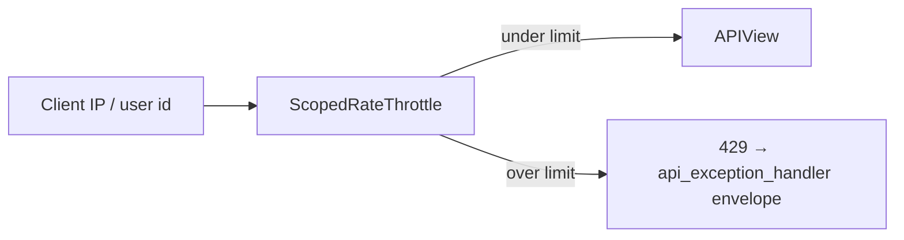

# ⏱️ Throttling

> Rate limits for abuse-prone **public** endpoints (login, register, password reset) using DRF `ScopedRateThrottle`.
>
> Protected business APIs are not globally throttled by default — add scopes when a route can be flooded.

---

## 🎯 Why scoped throttles?



Without throttles, login/register/reset are easy brute-force or email-bomb targets. Scoped rates let each endpoint family have its own budget.

---

## ⚙️ Configured rates

From `config/settings/drf.py`:

```python
"DEFAULT_THROTTLE_RATES": {
    "auth": "20/minute",
    "register": "10/minute",
    "password_reset": "5/minute",
},
```

| Scope | Default | Wired on |
|-------|---------|----------|
| `auth` | `20/minute` | Login, refresh, verify, JWT logout / session login |
| `register` | `10/minute` | `UsersRegisterApi` |
| `password_reset` | `5/minute` | Reset request + reset confirm |

Rates are DRF strings: `number/period` where period is `second`, `minute`, `hour`, or `day`.

There is **no** project-wide `DEFAULT_THROTTLE_CLASSES` — views must opt in.

---

## 🔌 Wiring a view

```python
from rest_framework.throttling import ScopedRateThrottle
from rest_framework.views import APIView


class UsersRegisterApi(APIView):
    throttle_classes = [ScopedRateThrottle]
    throttle_scope = "register"
```

Both attributes are required for scoped throttling:

| Attribute | Role |
|-----------|------|
| `throttle_classes = [ScopedRateThrottle]` | Enable scoped throttling |
| `throttle_scope = "register"` | Must match a key in `DEFAULT_THROTTLE_RATES` |

### Real wiring in this repo

| View | Scope |
|------|-------|
| JWT/session login (and JWT refresh/verify/logout) | `auth` |
| Register | `register` |
| Password reset request / confirm | `password_reset` |
| Profile / password change | none (authenticated; add if abused) |

---

## 🚨 What the client sees

When limited, DRF raises `Throttled`. The [API exception handler](api-envelope.md) normalizes it into the usual envelope with HTTP **429**.

Clients should back off (Respect `Retry-After` if present) rather than hammering.

---

## 🏭 Production: shared counters

DRF’s default cache for throttles is whatever Django `CACHES` points at.

| Setup | Behavior |
|-------|----------|
| LocMem / per-process | Each Gunicorn/Uvicorn worker has **its own** counters → effective limit ≈ rate × workers |
| Redis cache | Counters shared → rate means what you configured |


This project was generated **with Redis**. Prefer Redis-backed `CACHES` in production so throttles are global across workers.

This project was generated **without Redis**. In multi-worker production, either:

1. Regenerate / add Redis and point `CACHES` at it, or
2. Accept weaker per-process limits and put a reverse-proxy rate limit (nginx/traefik) in front


Also consider edge rate limits at the reverse proxy for extra defense — see [Docker & production](../ops/docker-and-production.md).

---

## ➕ Adding a new scope

1. **Define the rate** in `config/settings/drf.py`:

```python
"DEFAULT_THROTTLE_RATES": {
    "auth": "20/minute",
    "register": "10/minute",
    "password_reset": "5/minute",
    "invite": "3/minute",  # new
},
```

2. **Attach on the view**:

```python
class InviteAcceptApi(APIView):
    throttle_classes = [ScopedRateThrottle]
    throttle_scope = "invite"
```

3. **Document** for clients (Swagger `description` or this style guide) if the limit is part of the product contract.
4. **Test** optionally with a low rate in the test settings override — don’t rely on flaky timing in CI unless necessary.

### Choosing a rate

| Endpoint kind | Guidance |
|---------------|----------|
| Credential stuffing targets (login) | Moderate per-minute; pair with lockout/monitoring later if needed |
| Account creation | Stricter than login |
| Email-sending (reset) | Strictest — protects inbox + cost |
| Authenticated write APIs | Often higher or unlimited; throttle if expensive |

---

## ❌ Anti-patterns

| Anti-pattern | Fix |
|--------------|-----|
| Public login with no throttle | `throttle_scope = "auth"` |
| Defining `throttle_scope` without `throttle_classes` | Both required |
| Scope name not in `DEFAULT_THROTTLE_RATES` | DRF errors / misbehaves — keep keys in sync |
| Assuming LocMem limits are cluster-wide | Use Redis or proxy limits |
| Throttling only in nginx and removing app throttles | Defense in depth — keep both when possible |

---

## ✅ Checklist

1. Abuse-prone route identified
2. Scope + rate in `DEFAULT_THROTTLE_RATES`
3. `ScopedRateThrottle` + `throttle_scope` on the view
4. Shared cache in multi-worker prod
5. Envelope 429 understood by clients

---

## 🔗 Related docs

| Doc | Why |
|-----|-----|
| [Authentication](authentication.md) | Which routes are public |
| [APIs](../domain/apis.md) | Where to set throttle attrs |
| [API envelope](api-envelope.md) | 429 body shape |
| [Permissions](permissions.md) | Auth vs public |
| [Docker & production](../ops/docker-and-production.md) | Redis / proxy |
