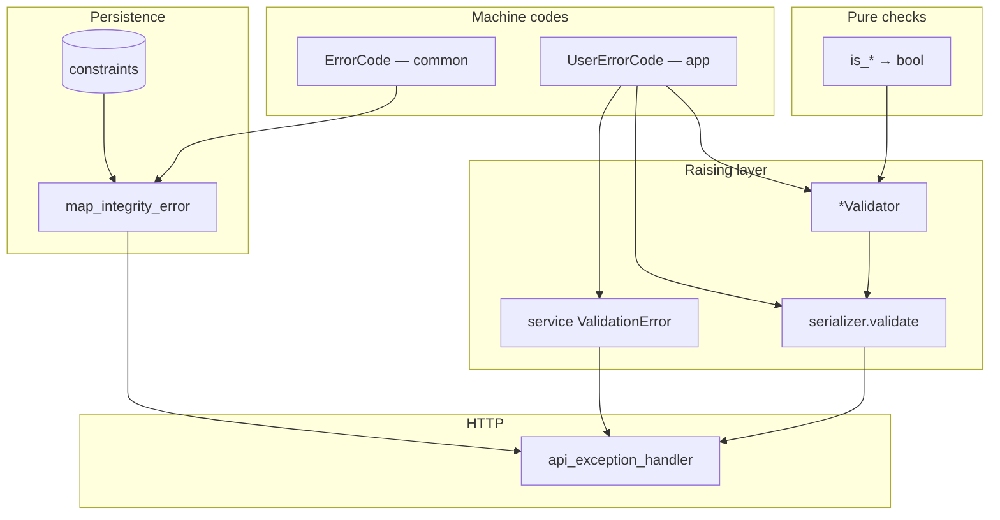
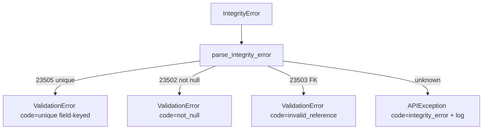

# 🛡️ Validation & errors

> End-to-end rules for **machine codes**, **pure `is_*` checks**, **raising validators**, **serializer/service errors**, and **DB integrity mapping**.
>
> `common` = platform only. Each domain app owns its own codes and validators (`users`, `blogs`, …).

This doc replaces the old root `VALIDATION.md` cheat sheet with the full reference.

---

## 🎯 Mental model



| Layer | Location | Responsibility |
|-------|----------|----------------|
| Pure checks | `common/validators/` or `<app>/validators/` | `is_*` → `bool` only |
| Platform codes | `common/errors/codes.py` → `ErrorCode` | Shared codes (`required`, `unique`, …) |
| Domain codes | `<app>/errors/codes.py` → e.g. `UserErrorCode` | App codes only — **never raise here** |
| Raising validators | `<app>/validators/` | `@deconstructible` + Django `ValidationError` + `code=` |
| Serializers | `<app>/apis/...` | Input shape + cross-field `validate()` |
| Services | `<app>/services/` + `common/services.py` | Business rules + integrity-safe writes |
| Integrity | `common/db/integrity/` | `IntegrityError` → field-keyed errors |
| Envelope | `common/http/` | See [API envelope](api-envelope.md) |

### ❌ Hard boundaries

| Don’t | Do |
|-------|-----|
| Domain password rules in `common` | `<app>/validators/` |
| Raising validators inside `errors/` | `errors/` = `StrEnum` codes only |
| Uniqueness / permissions in serializers | DB + integrity; permission classes |
| Pre-format gettext with `%` | Use `params={...}` on `ValidationError` |

---

## 💬 Message conventions

| Rule | Example |
|------|---------|
| `gettext_lazy` / `_()` msgids are **lowercase** | `_("password must include number")` |
| Parameterized messages use `params=` | `params={"limit_value": 10}` |
| Don’t bake values into the msgid | ❌ `_("password must be at least 10 characters")` as the only form when limit may change |

Pre-commit may enforce lowercase gettext when code-style hooks are enabled — see [Translations](../platform/translations.md) / [Code quality](../platform/code-quality.md).

---

## 1️⃣ Platform error codes (`common`)

```python
# common/errors/codes.py
class ErrorCode(StrEnum):
    INVALID_FORMAT = "invalid_format"
    INVALID = "invalid"                 # fallback when raiser omitted code=
    REQUIRED = "required"               # missing API / serializer input
    NOT_NULL = "not_null"               # DB NOT NULL / pgcode 23502
    UNIQUE = "unique"                   # unique / pgcode 23505
    INVALID_REFERENCE = "invalid_reference"  # FK / pgcode 23503
    UNKNOWN_INTEGRITY = "integrity_error"
    APPLICATION_ERROR = "application_error"
    SERVER_ERROR = "server_error"
```

| Code | Meaning | Typical source |
|------|---------|----------------|
| `required` | Client omitted input | Serializer |
| `not_null` | DB rejected NULL | Integrity map |
| `unique` | Unique violation | Integrity map |
| `invalid` | Fallback | Handler when `code=` missing |
| `server_error` | Unexpected exception | Handler 500 path |

**Keep `REQUIRED` and `NOT_NULL` distinct** — one is HTTP/input, the other is database.

---

## 2️⃣ Domain error codes (per app)

```python
# users/errors/codes.py
class UserErrorCode(StrEnum):
    PASSWORD_MISSING_NUMBER = "password_must_include_number"
    PASSWORD_MISSING_LETTER = "password_must_include_letter"
    PASSWORD_MISSING_SPECIAL = "password_must_include_special_char"
    PASSWORD_MISMATCH = "password_mismatch"
    PASSWORD_TOO_SHORT = "password_too_short"
    PASSWORD_INCORRECT = "password_incorrect"
    INVALID_RESET_TOKEN = "invalid_reset_token"
    INVALID_TOKEN = "invalid_token"
```

| Rule | Detail |
|------|--------|
| Enum name | App-prefixed: `BlogsErrorCode`, `OrdersErrorCode` |
| Never name it `ErrorCode` | That name is reserved for platform |
| Values | Stable snake_case strings for clients |
| Package | Codes only — no validator classes |

`start_domain_app` scaffolds an empty enum in `errors/codes.py`.

---

## 3️⃣ Pure validators (`is_*`)

Pure functions are reusable in validators, tests, and (rarely) services — **no exceptions, no gettext**.

### Generic (any app) — `common/validators/`

```python
# common/validators/string.py
def is_non_empty(value: str) -> bool:
    return isinstance(value, str) and bool(value.strip())


def is_slug(value: str) -> bool:
    return isinstance(value, str) and _SLUG_RE.fullmatch(value) is not None
```

### Domain — next to raisers in `<app>/validators/`

```python
# users/validators/password.py
def is_password_with_number(value: str) -> bool:
    return isinstance(value, str) and _HAS_NUMBER_RE.search(value) is not None
```

Naming separates concerns in one file: `is_*` (bool) vs `*Validator` (raises).

---

## 4️⃣ Raising field validators (`*Validator`)

Use **Django’s** `ValidationError` (not DRF’s) so the same class works on model fields and serializer fields.

```python
@deconstructible
class PasswordNumberValidator:
    code = UserErrorCode.PASSWORD_MISSING_NUMBER
    message = _("password must include number")

    def __call__(self, value: str) -> None:
        if not is_password_with_number(value):
            raise ValidationError(self.message, code=self.code)


@deconstructible
class PasswordMinLengthValidator:
    code = UserErrorCode.PASSWORD_TOO_SHORT
    message = _("password must be at least %(limit_value)d characters")
    limit_value = 10

    def __call__(self, value: str) -> None:
        if not isinstance(value, str) or len(value) < self.limit_value:
            raise ValidationError(
                self.message,
                code=self.code,
                params={"limit_value": self.limit_value},
            )
```

### Export instances for DRF

```python
validate_password_number = PasswordNumberValidator()
# ...

PASSWORD_VALIDATORS = [
    validate_password_number,
    validate_password_letter,
    validate_password_special_char,
    validate_password_min_length,
]

# serializer
password = serializers.CharField(validators=PASSWORD_VALIDATORS)
```

`@deconstructible` matters if you attach validators on **model fields** (migrations must serialize them).

### Password policy: API + Django auth stay in sync

| Path | List / setting | Used for |
|------|----------------|----------|
| API / DRF | `users.validators.PASSWORD_VALIDATORS` | Register and password fields |
| Django auth | `AUTH_PASSWORD_VALIDATORS` in `config/settings/auth.py` | Admin / `set_password` |

Domain rules are wired into Django via `Password*DjangoValidator` adapters in the same `password.py` module (same underlying `validate_password_*` callables). **Change policy once; keep both lists aligned.**

---

## 5️⃣ Serializers (shape + object rules only)

- Attach domain `*Validator` lists on fields
- Cross-field rules in `validate()` with field-keyed errors
- Platform vs domain codes as appropriate

```python
raise serializers.ValidationError(
    {"confirm_password": [_("confirm password is not equal to password")]},
    code=UserErrorCode.PASSWORD_MISMATCH,
)
```

Full patterns: [APIs](../layers/apis.md).

---

## 6️⃣ Services + integrity mapping

Every write path must:

1. use `model_create` / `model_save` / `model_update`, **or**
2. `except IntegrityError: map_integrity_error(...); raise`

```python
from django.db import IntegrityError

from {{cookiecutter.project_slug}}.common.db.integrity import map_integrity_error
from {{cookiecutter.project_slug}}.common.services import model_create

instance = model_create(model_class=MyModel, data={...})

try:
    return MyModel.objects.create(...)
except IntegrityError as error:
    map_integrity_error(error, model=MyModel)
    raise
```

### What `map_integrity_error` does



| Postgres `pgcode` | `ErrorCode` | Client `messages` |
|-------------------|-------------|-------------------|
| `23505` | `unique` | `messages.<column>` when column known |
| `23502` | `not_null` | per-column or generic |
| `23503` | `invalid_reference` | per-column or generic |
| other | `integrity_error` | controlled APIException (logged) |

SQLite (tests) uses message parsing fallback. **DB constraints remain the source of truth**; validators are UX.

Service-level domain errors (wrong current password, bad reset token) raise field-keyed Django `ValidationError` with `UserErrorCode` — see [Services](../layers/services.md).

---

## 7️⃣ `ApplicationError` (rare)

```python
# core/exceptions.py
class ApplicationError(Exception):
    def __init__(self, message, extra=None):
        self.message = message
        self.extra = extra or {}
```

Use for controlled **non-field** application failures. The handler maps to `ErrorCode.APPLICATION_ERROR` on `non_field_errors` and merges `extra`. Prefer field-keyed `ValidationError` whenever a field is known.

---

## ✅ Checklist: add a new field rule

1. **Pure check** — generic → `common/validators/` as `is_*`; domain → `<app>/validators/`
2. **Code** — platform → `ErrorCode`; domain → `<app>/errors/codes.py`
3. **Raising validator** — `@deconstructible`, Django `ValidationError` + `code=` + lowercase `_()`
4. **Wire it** — model field if universal; serializer field for API; cross-field only in `validate()`
5. **Persist safely** — DB constraint for unique/FK/null; writes via `model_*` or `map_integrity_error`
6. **Tests** — validator unit tests + API/service case for the failure message/code

---

## 📁 Example layout

```text
common/
  validators/string.py      # is_non_empty, is_slug
  errors/codes.py           # ErrorCode
  db/integrity/             # parse.py + map.py
  http/exception_handler.py
  services.py               # model_* wrap IntegrityError

users/
  errors/codes.py           # UserErrorCode
  validators/password.py    # is_password_* + *Validator + PASSWORD_VALIDATORS + Django adapters
  services/                 # create_user / register / change_password
  apis/.../register/        # PASSWORD_VALIDATORS + UserErrorCode in serializer
```

---

## 🔗 Related docs

| Doc | Why |
|-----|-----|
| [API envelope](api-envelope.md) | How codes appear in JSON |
| [Services](../layers/services.md) | Where integrity mapping is called |
| [APIs](../layers/apis.md) | Serializer usage |
| [Models](../layers/models.md) | Constraints |
| [Translations](../platform/translations.md) | Lowercase msgids |
