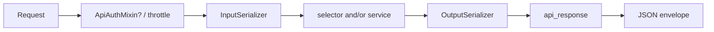

# 🌐 APIs & serializers

> HTTP layer of a domain app: **thin views**, **input/output serializers**, OpenAPI metadata, parsers, and throttling hooks.
>
> Business rules and ORM writes do **not** live here — call [selectors](selectors.md) / [services](services.md) and return the [API envelope](../http/api-envelope.md).

---

## 🎯 Role of the API layer



| Step | Responsibility |
|------|----------------|
| Auth / permissions | `ApiAuthMixin` or explicit permission classes — see [Permissions](../http/permissions.md) |
| Throttle | `ScopedRateThrottle` on public abuse-prone routes — see [Throttling](../http/throttling.md) |
| Input | Shape + field validators + cross-field `validate()` |
| Call | Selector (read) and/or service (write) |
| Output | Serialize public fields only |
| Respond | Always `api_response` (or pagination helpers that wrap it) |

---

## 📂 File layout (folders mirror URL routes)

Under `<app>/apis/`, **folder names follow the real URL path segments** (after the app’s mount in `api/urls.py`). Do **not** invent a parallel “feature nickname” tree that disagrees with the route.

```text
URL:  /api/v1/pos/wallet/charge/init/
Dirs: apis/pos/wallet/charge/init/
```

### Rules

| Rule | Detail |
|------|--------|
| One path segment → one folder | `pos/` → `wallet/` → `balance/` |
| Collection / CRUD at that segment | `*_apis.py` + `*_serializers.py` (+ `tests/`) in **that** folder |
| Nested action | Deeper folder: `…/charge/init/`, `…/id/revoke/` |
| Path param segment | Use a stable folder name such as `id/` for `/…/<id>/…` |
| URL kebab-case | Folder stays snake_case: `/pos-menu/` → `apis/pos_menu/` |
| File prefix | Snake path of the leaf (and parents as needed for uniqueness): `pos_wallet_balance_apis.py` |
| Tests | `tests/` **next to** that leaf’s apis/serializers |

### Shape (POS-style resource)

```text
apis/
├── pos/                                    # /pos/
│   ├── pos_apis.py                         # list/create (or collection handlers)
│   ├── pos_serializers.py
│   ├── tests/
│   ├── heartbeat/                          # /pos/heartbeat/
│   │   ├── pos_heartbeat_apis.py
│   │   ├── pos_heartbeat_serializers.py
│   │   └── tests/
│   ├── config/
│   │   └── sync/                           # /pos/config/sync/
│   │       ├── pos_config_sync_apis.py
│   │       ├── pos_config_sync_serializers.py
│   │       └── tests/
│   ├── id/                                 # /pos/<id>/…
│   │   ├── pos_id_apis.py                  # retrieve/update/destroy for one POS
│   │   ├── pos_id_serializers.py
│   │   ├── tests/
│   │   └── revoke/                         # /pos/<id>/revoke/
│   │       ├── pos_id_revoke_apis.py
│   │       ├── pos_id_revoke_serializers.py
│   │       └── tests/
│   └── wallet/
│       ├── balance/                        # /pos/…/wallet/balance/
│       ├── charge/
│       │   ├── init/
│       │   └── confirm/
│       └── transactions/
│           └── recent/
└── pos_menu/                               # /pos-menu/ (or /pos_menu/)
    ├── pos_menu_apis.py
    ├── pos_menu_serializers.py
    └── tests/
```

### Reference: shipped `users` app

Paths under `/api/v1/` already match the tree:

```text
users/apis/
├── auth/                      # /auth/…  (mounted separately in api/urls.py)
│   ├── auth_jwt_apis.py       # or auth_session_apis.py
│   ├── auth_password_apis.py
│   ├── auth_logout_apis.py
│   ├── auth_serializers.py
│   └── tests/
└── users/                     # /users/…
    ├── register/              # /users/register/
    │   ├── users_register_apis.py
    │   ├── users_register_serializers.py
    │   └── tests/
    └── profile/               # /users/profile/
        ├── users_profile_apis.py
        ├── users_profile_serializers.py
        └── tests/
```

| File | Contains |
|------|----------|
| `*_apis.py` | `APIView` classes |
| `*_serializers.py` | `*InputSerializer` + `*OutputSerializer` |
| `*_search_filters.py` | django-filter `FilterSet` for **that list leaf** (only when needed) |
| `tests/` | HTTP / auth / payload tests for **that URL leaf** |

Do **not** create a root `apis/tests/` package — tests live only under each route leaf.

List FilterSets live next to the list APIs as `*_search_filters.py` (see [Pagination & filtering](../http/pagination-and-filtering.md)).

---

## 🏷️ `APIView` class naming

Still use plain `APIView` (explicit `get` / `post` / …) — these names **mirror DRF’s generic view vocabulary** so scanners and teammates know which HTTP verbs belong on the class. You are **not** required to inherit DRF generics.

### Resource CRUD (default)

| Class name | HTTP methods | Typical URL |
|------------|--------------|-------------|
| `{Entity}ListCreateApiView` | `GET` list + `POST` create | `/posts/` |
| `{Entity}RetrieveUpdateDestroyApiView` | `GET` / `PUT` / `PATCH` / `DELETE` by id | `/posts/<id>/` |

`{Entity}` is **PascalCase singular** (`Post`, `Order`, `Comment`) — not `Posts`, not `pos`.

```python
# blogs/apis/posts/posts_apis.py          → /posts/
# blogs/apis/posts/id/posts_id_apis.py    → /posts/<id>/
class PostListCreateApiView(ApiAuthMixin, APIView):
    def get(self, request):
        ...  # list_posts + pagination

    def post(self, request):
        ...  # create service


class PostRetrieveUpdateDestroyApiView(ApiAuthMixin, APIView):
    def get(self, request, post_id: int):
        ...

    def put(self, request, post_id: int):
        ...

    def patch(self, request, post_id: int):
        ...

    def delete(self, request, post_id: int):
        ...
```

```python
# blogs/urls/blogs_url.py
urlpatterns = [
    path("posts/", PostListCreateApiView.as_view(), name="posts-list-create"),
    path("posts/<int:post_id>/", PostRetrieveUpdateDestroyApiView.as_view(), name="posts-detail"),
]
```

### Split verbs when the surface is not full CRUD

Only expose the methods you implement; name the class after **that** set:

| Class name | Methods |
|------------|---------|
| `{Entity}ListApiView` | `GET` list only |
| `{Entity}CreateApiView` | `POST` create only |
| `{Entity}RetrieveApiView` | `GET` detail only |
| `{Entity}UpdateApiView` | `PUT` / `PATCH` |
| `{Entity}DestroyApiView` | `DELETE` |
| `{Entity}RetrieveUpdateApiView` | `GET` + `PUT` / `PATCH` |
| `{Entity}ListCreateApiView` | list + create (preferred when both exist) |
| `{Entity}RetrieveUpdateDestroyApiView` | detail write/delete combo (preferred when all exist) |

Do **not** invent parallel suffixes like `PostsListApi`, `PostDetailApi`, `PostCRUDView` for the same idea.

### Non-CRUD / action endpoints

Login, register, password reset, health, “me” profile shortcuts, etc. are **actions**, not collection CRUD. Use a descriptive PascalCase name that still ends with **`ApiView`**:

| ✅ | Role |
|----|------|
| `UserRegisterApiView` | Public register |
| `AuthJwtLoginApiView` | Auth action |
| `HealthApiView` | Probe |
| `ProfileRetrieveUpdateApiView` | Current-user profile (no `<id>` in path) |

The shipped `users` app may still use shorter historical `*Api` names (`UsersProfileApi`, …); **new resource endpoints should follow `{Entity}ListCreateApiView` / `{Entity}RetrieveUpdateDestroyApiView`**.

### Rules of thumb

| ✅ Do | ❌ Don’t |
|-------|---------|
| Singular entity: `PostListCreateApiView` | `PostsListCreateApiView` / `PosListCreateApiView` |
| Suffix `ApiView` | Bare `PostList` or `PostViewSet` for these patterns |
| One resource → at most two classes (list-create + detail RUD) unless you intentionally split | One mega-class handling `/` and `/<id>/` |
| Match URL + verbs to the name | `PostListCreateApiView` that only implements `get` |

---

## 🧱 View pattern (`APIView`)

Prefer explicit `APIView` methods over fat generic class-based views that hide business logic in mixins you do not control.

### Authenticated example — profile

```python
# users/apis/users/profile/users_profile_apis.py
from drf_spectacular.utils import extend_schema
from rest_framework import parsers
from rest_framework.views import APIView

from {{cookiecutter.project_slug}}.api.mixins import ApiAuthMixin
from {{cookiecutter.project_slug}}.common.http import api_response
from {{cookiecutter.project_slug}}.common.http.schema import envelope_serializer
from {{cookiecutter.project_slug}}.users.constants import USERS_TAGS
from {{cookiecutter.project_slug}}.users.selectors.users_selectors import get_profile
from {{cookiecutter.project_slug}}.users.services.user_services import profile_update


class UsersProfileApi(ApiAuthMixin, APIView):
    parser_classes = [parsers.MultiPartParser, parsers.FormParser, parsers.JSONParser]

    @extend_schema(
        tags=USERS_TAGS,
        summary="Current user",
        responses=envelope_serializer("UsersProfileEnvelope", UsersProfileOutputSerializer),
    )
    def get(self, request):
        profile = get_profile(user=request.user)
        return api_response(
            data=UsersProfileOutputSerializer(profile, context={"request": request}).data
        )

    @extend_schema(
        tags=USERS_TAGS,
        summary="Update current user profile",
        request=UsersProfileUpdateInputSerializer,
        responses=envelope_serializer("UsersProfileUpdateEnvelope", UsersProfileOutputSerializer),
    )
    def patch(self, request):
        serializer = UsersProfileUpdateInputSerializer(data=request.data, partial=True)
        serializer.is_valid(raise_exception=True)

        profile = get_profile(user=request.user)
        profile = profile_update(
            profile=profile,
            bio=serializer.validated_data.get("bio"),
            avatar=serializer.validated_data.get("avatar"),
        )
        return api_response(
            data=UsersProfileOutputSerializer(profile, context={"request": request}).data
        )
```

### Public example — register

```python
class UsersRegisterApi(APIView):
    permission_classes = [AllowAny]
    parser_classes = [parsers.MultiPartParser, parsers.FormParser, parsers.JSONParser]
    throttle_classes = [ScopedRateThrottle]
    throttle_scope = "register"

    @extend_schema(
        tags=USERS_TAGS,
        summary="Register a new user",
        request=UsersRegisterInputSerializer,
        responses={201: envelope_serializer("UsersRegisterEnvelope", UsersRegisterOutputSerializer)},
    )
    def post(self, request):
        serializer = UsersRegisterInputSerializer(data=request.data)
        serializer.is_valid(raise_exception=True)
        user = register(
            email=serializer.validated_data.get("email"),
            password=serializer.validated_data.get("password"),
            bio=serializer.validated_data.get("bio"),
            avatar=serializer.validated_data.get("avatar"),
        )
        return api_response(
            data=UsersRegisterOutputSerializer(user, context={"request": request}).data,
            http_status=status.HTTP_201_CREATED,
        )
```

### Non‑negotiable rules

| ✅ Do | ❌ Don’t |
|-------|---------|
| `serializer.is_valid(raise_exception=True)` | Manually building error dicts in the view |
| `return api_response(...)` | `return Response(serializer.data)` |
| `envelope_serializer(...)` in `@extend_schema(responses=...)` | Documenting only the inner serializer as the HTTP body |
| Call services/selectors | `Model.objects.create(...)` in the view |
| `@extend_schema(...)` on each handler | Undocumented endpoints in Swagger |
| `ApiAuthMixin` when login is required | Ad‑hoc auth checks buried in `get/post` |
| `permission_classes = [AllowAny]` on public routes | Assuming new views are public (default is authenticated) |
| Explicit `<Entity>Filter` when the list accepts filters | Raw query params / silent `filter_backends` on `APIView` |
| `qs = list_*()` then `FilterSet(request.query_params, queryset=qs).qs` | Hiding FilterSet inside the selector / `query_params=` on `list_*` |

---

## 📥📤 Serializers: always split input vs output

| Type | Direction | Role |
|------|-----------|------|
| `*InputSerializer` | Request body → Python | Validate shape; run field/cross-field rules |
| `*OutputSerializer` | Domain → JSON | Expose only what clients may see |
| `<Entity>Filter` (django-filter) | Query string → filtered QS | Defined under `apis/` as `*_search_filters.py`; applied in the list view — see [Pagination & filtering](../http/pagination-and-filtering.md) |

Do **not** reuse one `ModelSerializer` for both directions unless the shapes are truly identical and tiny (rare). Register input has `password` / `confirm_password`; output must never echo passwords.

### Input serializer rules

```python
# users/apis/users/register/users_register_serializers.py
class UsersRegisterInputSerializer(serializers.Serializer):
    email = serializers.EmailField(max_length=255)
    bio = serializers.CharField(max_length=1000, required=False, allow_blank=True, allow_null=True)
    avatar = serializers.ImageField(required=False, allow_null=True)
    password = serializers.CharField(validators=PASSWORD_VALIDATORS)
    confirm_password = serializers.CharField(max_length=255)

    def validate(self, data):
        password = data.get("password")
        confirm_password = data.get("confirm_password")

        if not password or not confirm_password:
            raise serializers.ValidationError(
                {"non_field_errors": [_("please fill password and confirm password")]},
                code=ErrorCode.REQUIRED,
            )

        if password != confirm_password:
            raise serializers.ValidationError(
                {"confirm_password": [_("confirm password is not equal to password")]},
                code=UserErrorCode.PASSWORD_MISMATCH,
            )
        return data
```

| Concern | In input serializer? |
|---------|----------------------|
| Field types / max_length | ✅ |
| Domain `PASSWORD_VALIDATORS` | ✅ |
| Cross-field confirm password | ✅ `validate()` |
| Uniqueness of email | ❌ DB + [integrity](../http/validation-and-errors.md) |
| “Is the user allowed to do this?” | ❌ [Permissions](../http/permissions.md) |
| Create the user | ❌ [Services](services.md) |

Use **field-keyed** errors and platform vs domain codes correctly (`ErrorCode.REQUIRED` vs `UserErrorCode.PASSWORD_MISMATCH`).

### List filters (django-filter under `apis/`)

Default list endpoints apply **no** filters. When the client may filter, put `<Entity>Filter` in `*_search_filters.py` next to that list leaf and apply it **in the view**:

```python
qs = list_posts()
qs = PostFilter(request.query_params, queryset=qs).qs
```

Do not use a parallel `*QuerySerializer` style for the same list query params. Do not take `request` / `query_params` in the selector. FK / related lookups use `field_name="author__email"` on the FilterSet. Full examples: [Pagination & filtering](../http/pagination-and-filtering.md).

### Output serializer rules

```python
class UsersProfileOutputSerializer(serializers.ModelSerializer):
    email = serializers.EmailField(source="user.email", read_only=True)
    avatar = serializers.SerializerMethodField()

    class Meta:
        model = Profile
        fields = ("email", "bio", "avatar")

    @extend_schema_field(serializers.URLField())
    def get_avatar(self, profile: Profile) -> str:
        return get_avatar_url(profile=profile, request=self.context.get("request"))
```

| ✅ Do | Why |
|-------|-----|
| `SerializerMethodField` + selector for derived values | Keeps URL logic out of the view |
| `@extend_schema_field` on method fields | Accurate OpenAPI types |
| `context={"request": request}` | Absolute media/static URLs |
| Read-only sensitive omissions | Never serialize password hashes / internal flags unless required |

---

## 🏷️ Swagger / OpenAPI on views

Tags come from [constants](constants.md):

```python
from {{cookiecutter.project_slug}}.users.constants import USERS_TAGS, AUTH_TAGS

@extend_schema(tags=USERS_TAGS, summary="…", request=…, responses=…)
```

| Argument | Purpose |
|----------|---------|
| `tags` | Groups endpoints in Swagger UI |
| `summary` | Short title |
| `request` | Input serializer / body |
| `responses` | Output serializer / status map |

Full schema settings: [Swagger](../http/swagger.md).

---

## 📎 Parsers (JSON + uploads)

Default JSON is not enough for avatars. Declare parsers explicitly when the endpoint accepts files:

```python
parser_classes = [parsers.MultiPartParser, parsers.FormParser, parsers.JSONParser]
```

Clients then may send `multipart/form-data` (file + fields) or JSON (without file).

---

## 🩺 Tiny system endpoints

`HealthApi` nests a small `OutputSerializer` on the view class — acceptable for `core` system routes. Domain features should keep serializers in their own modules for reuse and testing.

---

## 🧪 Testing APIs

Place tests under the URL leaf: `apis/<…path…>/tests/`.

| Assert | How |
|--------|-----|
| Auth required | Unauthenticated → 401/403 as configured |
| Validation errors | Envelope `success=false` + `messages.<field>` |
| Happy path | `success=true` + expected `result` keys |
| Throttle (optional) | Scoped rates on register/auth |

Prefer `reverse("users:profile")` over hard-coded paths — see [URLs](urls.md).

---

## ❌ Anti-patterns

| Anti-pattern | Fix |
|--------------|-----|
| Fat view with ORM + business rules | Service + selector |
| One serializer for input and output with password fields | Split Input/Output |
| `return Response(data)` | `api_response` |
| Uniqueness check in serializer | DB constraint + integrity mapping |
| Permission logic in `validate()` | Permission classes / mixin |
| Missing `@extend_schema` | Document every public handler |
| `views.py` at app root | `apis/` tree that mirrors URL segments |
| Flat `apis/posts/` only while URLs are `/posts/…/wallet/…` | Nest folders to match the route |
| List filters only inside `get` with raw query params | `*_search_filters.py` under `apis/` + apply FilterSet in the view |
| `PostsListApi` / `PostDetailApi` for standard CRUD | `PostListCreateApiView` / `PostRetrieveUpdateDestroyApiView` |

---

## ✅ Checklist: new endpoint

1. Create folders under `apis/` that mirror the URL path  
2. Add Input + Output serializers (and `tests/`) in that leaf  
3. Add `APIView` named per convention (`PostListCreateApiView` / `PostRetrieveUpdateDestroyApiView` / action `*ApiView`) with `@extend_schema` + tags from `constants.py` 
4. Wire auth mixin and/or throttle
5. Call selectors/service only
6. Return `api_response` (correct HTTP status: 200/201/…)
7. Register path in `<app>/urls/` + `api/urls.py` if needed
8. Add API tests

---

## 🔗 Related docs

| Doc | Why |
|-----|-----|
| [API envelope](../http/api-envelope.md) | Exact JSON contract |
| [Validation & errors](../http/validation-and-errors.md) | Codes & validators used by serializers |
| [Permissions](../http/permissions.md) | `ApiAuthMixin` |
| [Swagger](../http/swagger.md) | Schema / UI |
| [Pagination & filtering](../http/pagination-and-filtering.md) | List endpoints |
| [Throttling](../http/throttling.md) | Auth/register rates |
