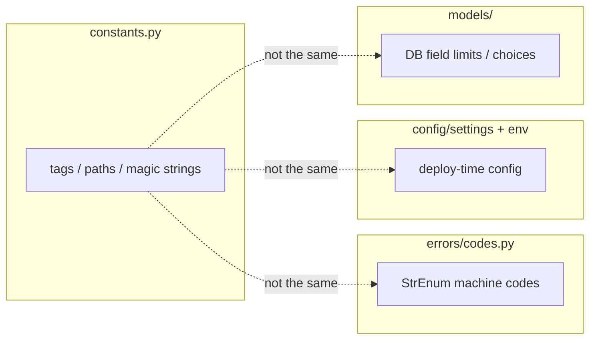

# 📌 Constants

> **One module per domain app** for shared literal values: OpenAPI tags, static paths, magic strings, and other app-wide constants.
>
> File: `<app>/constants.py` (created by `start_domain_app`).

Constants are **not** settings (those live in `config/settings/` + env), **not** error codes (those live in `errors/codes.py`), and **not** business rules (those live in services/validators).

---

## 🎯 Why a dedicated `constants.py`?

Without it, the same string tends to appear in five files:

```python
# ❌ scattered — easy to typo, hard to rename, Swagger tags drift apart
@extend_schema(tags=["users"])          # apis/profile/...
@extend_schema(tags=["Users"])          # apis/register/...  ← different tag in UI
url = static("users/default_avatar.png")  # selector
url = static("users/default-avatar.png")  # somewhere else ← broken path
```

With `constants.py`:

```python
# ✅ single source — change once, import everywhere
from {{cookiecutter.project_slug}}.users.constants import USERS_TAGS, DEFAULT_AVATAR_STATIC_PATH

@extend_schema(tags=USERS_TAGS, ...)
url = static(DEFAULT_AVATAR_STATIC_PATH)
```

| Benefit | Detail |
|---------|--------|
| 🔍 Grep-friendly | `USERS_TAGS` shows every consumer |
| 🧾 Swagger consistency | All endpoints in one OpenAPI tag group |
| 🖼️ Asset paths | One path for default avatar / icons |
| 🤖 Agent-friendly | Clear place to add new shared literals |

---

## 📂 Location & layout

```text
users/
├── constants.py          ← app-level constants (this doc)
├── errors/codes.py       ← machine error codes (different concern)
├── apis/...
└── selector/...
```

Use **section banners** when the file grows, same style as `users`:

```python
# ---------------------------------------------------------------------------- #
#                                     TAGS                                     #
# ---------------------------------------------------------------------------- #

USERS_TAGS = ["users"]
AUTH_TAGS = ["auth"]

# ---------------------------------------------------------------------------- #
#                                   PROFILE                                    #
# ---------------------------------------------------------------------------- #

DEFAULT_AVATAR_STATIC_PATH = "users/default_avatar.png"
```

For a new app (`blogs`):

```python
# blogs/constants.py
"""App-level constants for blogs."""

# ---------------------------------------------------------------------------- #
#                                     TAGS                                     #
# ---------------------------------------------------------------------------- #

BLOGS_TAGS = ["blogs"]

# ---------------------------------------------------------------------------- #
#                                   LIMITS                                     #
# ---------------------------------------------------------------------------- #

# Example: soft UX defaults (not DB constraints — those stay on the model)
POST_TITLE_PREVIEW_LENGTH = 80
```

---

## ✅ What belongs in `constants.py`

| Kind | Example | Why here |
|------|---------|----------|
| OpenAPI / Swagger tags | `USERS_TAGS = ["users"]` | Shared by every `@extend_schema` in the app |
| Static relative paths | `DEFAULT_AVATAR_STATIC_PATH = "users/default_avatar.png"` | Used by selectors / templates |
| App-wide magic strings | status labels used in APIs **and** services | Avoid drift |
| Simple numeric UX defaults | preview length, default page hint | Only if **not** env-configurable |

### Real usage in this project

**1. Tags on APIs**

```python
# users/apis/users/profile/users_profile_apis.py
from {{cookiecutter.project_slug}}.users.constants import USERS_TAGS

class UsersProfileApi(ApiAuthMixin, APIView):
    @extend_schema(
        tags=USERS_TAGS,
        summary="Current user",
        responses=UsersProfileOutputSerializer,
    )
    def get(self, request):
        ...
```

```python
# users/apis/auth/auth_password_apis.py
from {{cookiecutter.project_slug}}.users.constants import AUTH_TAGS

@extend_schema(tags=AUTH_TAGS, summary="Change password", ...)
```

In Swagger UI you then get clean groups: **users**, **auth**, **system** (health), instead of random ad-hoc strings.

**2. Static path in a selector**

```python
# users/selector/users_selectors.py
from django.templatetags.static import static

from {{cookiecutter.project_slug}}.users.constants import DEFAULT_AVATAR_STATIC_PATH

def get_avatar_url(*, profile: Profile, request: HttpRequest | None = None) -> str:
    if profile.avatar:
        url = profile.avatar.url
    else:
        url = static(DEFAULT_AVATAR_STATIC_PATH)

    if request is not None:
        return request.build_absolute_uri(url)
    return url
```

The file on disk is `users/static/users/default_avatar.png`. The constant is the path **passed to** `static()`, not a URL and not a filesystem absolute path.

---

## ❌ What does **not** belong in `constants.py`

| Put this instead in… | Examples |
|----------------------|----------|
| `config/settings/` + `.env` | `SECRET_KEY`, DB URL, JWT lifetimes, email backend, `DEBUG` |
| `<app>/errors/codes.py` | `UserErrorCode.PASSWORD_MISMATCH` — machine codes for the API envelope |
| Model / migration | Max length that the DB must enforce (`CharField(max_length=…)`) |
| Services | Workflow rules (“cannot publish draft without title”) |
| Validators | Password charset rules |
| Django `settings` for feature flags | Anything operators must change without a code edit |

```python
# ❌ wrong — this is an error code, not a constant blob
PASSWORD_MISMATCH = "password_mismatch"  # → users/errors/codes.py as StrEnum member

# ❌ wrong — this is configuration
JWT_ACCESS_SECONDS = 900  # → config/settings/jwt.py + env

# ❌ wrong — business rule
CAN_REGISTER = True  # → service / settings / feature flag system
```

---

## 🏷️ Naming conventions

| Pattern | Use for | Example |
|---------|---------|---------|
| `<APP>_TAGS` | OpenAPI tag list | `USERS_TAGS = ["users"]` |
| `<FEATURE>_TAGS` | Second group in same app | `AUTH_TAGS = ["auth"]` |
| `DEFAULT_*_PATH` / `*_STATIC_PATH` | Staticfiles-relative paths | `DEFAULT_AVATAR_STATIC_PATH` |
| `UPPER_SNAKE_CASE` | All module-level constants | `POST_TITLE_PREVIEW_LENGTH` |

Tags should be **lowercase**, short, and stable — they appear in Swagger and in client codegen. Prefer plural app names aligned with the app label (`users`, `blogs`).

```python
# ✅
USERS_TAGS = ["users"]

# ❌ — inconsistent / noisy
USERS_TAGS = ["Users", "user-api", "Users App"]
```

`extend_schema(tags=...)` expects a **list** (or iterable) of strings. Keep the constant as a list even when there is only one tag, so call sites stay identical:

```python
@extend_schema(tags=USERS_TAGS, ...)  # always unpacks the same way
```

---

## 🧪 How to add a new constant (checklist)

1. Decide it is **not** settings, **not** an error code, **not** a one-off local variable.
2. Add it under a section banner in `<app>/constants.py`.
3. Import it at every call site — do not leave old string literals behind.
4. If it is a static file path, confirm the file exists under `<app>/static/...` and matches the constant.
5. If it is a Swagger tag, use it on **every** `@extend_schema` for that feature group.

---

## 🆚 Related concepts (don’t mix them)



| Need | Doc |
|------|-----|
| Error machine codes | [Validation & errors](../http/validation-and-errors.md) |
| Env / deploy config | [Settings](../platform/settings.md) |
| Signal side effects | [Signals](signals.md) |
| Swagger tag usage on views | [APIs](apis.md), [Swagger](../http/swagger.md) |

---

## 📋 Copy-paste template for a new domain app

```python
# <app>/constants.py
"""App-level constants for <app>."""

# ---------------------------------------------------------------------------- #
#                                     TAGS                                     #
# ---------------------------------------------------------------------------- #

BLOGS_TAGS = ["blogs"]

# ---------------------------------------------------------------------------- #
#                              ADD SECTIONS BELOW                              #
# ---------------------------------------------------------------------------- #

# EXAMPLE_STATIC_PATH = "blogs/default_cover.png"
```

Then in APIs:

```python
from {{cookiecutter.project_slug}}.blogs.constants import BLOGS_TAGS

@extend_schema(tags=BLOGS_TAGS, summary="List posts", ...)
```
