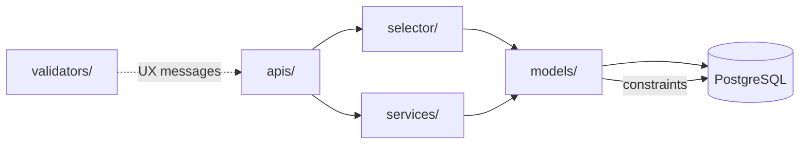
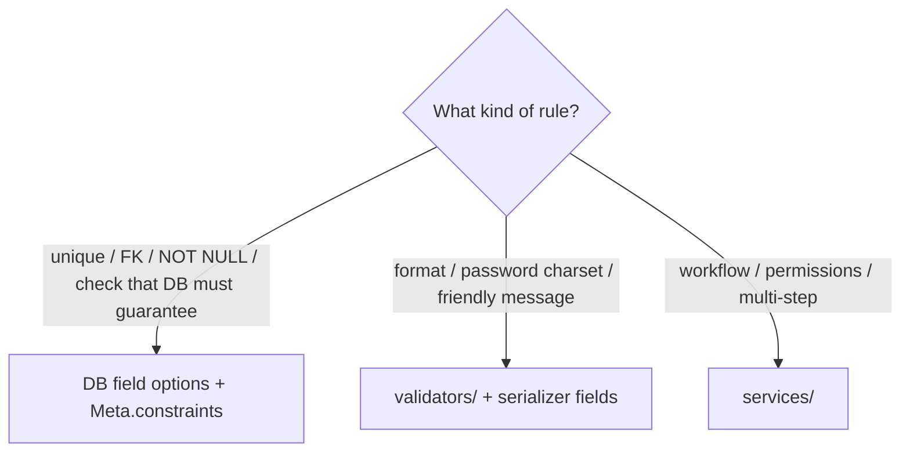

# 🗄️ Models

> How domain data is defined: **package layout**, `BaseModel`, **DB constraints**, managers, admin, and migrations.
>
> Models store shape and database invariants. They do **not** own HTTP, workflows, or “fat” business features — those live in [selectors](selectors.md) / [services](services.md).

---

## 🎯 Role in the architecture



| Layer | Owns |
|-------|------|
| `models/` | Fields, relations, indexes, **constraints** |
| `manager/` | Reusable create/query helpers attached to the model |
| `validators/` | Friendly field checks (not a substitute for DB rules) |
| `services/` | Multi-step writes and product rules |

---

## 📂 Package layout (one module per model)

Do **not** keep a single giant `models.py` once an app has more than one model. Use a package:

```text
users/models/
├── __init__.py       # public exports
├── base_user.py      # BaseUser
└── profile.py        # Profile
```

```python
# users/models/__init__.py
from .base_user import BaseUser
from .profile import Profile

__all__ = ["BaseUser", "Profile"]
```

### Import style

Always import from the package root elsewhere:

```python
# ✅
from {{cookiecutter.project_slug}}.users.models import BaseUser, Profile

# ❌ — couples callers to file names; breaks when you move modules
from {{cookiecutter.project_slug}}.users.models.base_user import BaseUser
```

Inside the package, relative imports between sibling modules are fine (`profile.py` imports `BaseUser` from `.base_user`).

### Naming files

| Model class | Module file |
|-------------|-------------|
| `BaseUser` | `base_user.py` |
| `Profile` | `profile.py` |
| `BlogPost` | `blog_post.py` |

One primary model per file. Related **field choice enums** (`TextChoices`) live in [`enums.py`](enums.md) — not nested on the model class. Tiny helpers that are not reused elsewhere can stay next to the model.

---

## 🏷️ Labels, help text, Meta, docstrings

Every concrete model should be labeled for **admin**, **integrity messages** (field `verbose_name` is reused when mapping DB errors), and **readers of the code**.

On every field you declare: set **`verbose_name`** and **`help_text`** together.

Use `gettext_lazy as _` for import-time strings on model attributes — see [Translations](../platform/translations.md).

### Full pattern

```python
from django.db import models
from django.utils.translation import gettext_lazy as _

from {{cookiecutter.project_slug}}.common.models import BaseModel


class Card(BaseModel):
    """
    Model to declare card
    """

    serial_number = models.CharField(
        max_length=64,
        unique=True,
        verbose_name=_("serial number"),
        help_text="Human-readable identifier printed on the card.",
    )
    owner = models.ForeignKey(
        "users.BaseUser",
        on_delete=models.CASCADE,
        related_name="cards",
        verbose_name=_("owner"),
        help_text="User who owns this card.",
    )

    class Meta:
        verbose_name = _("card")
        verbose_name_plural = _("cards")

    def __str__(self):
        return self.serial_number
```

### Field rules

| Attribute | Required? | Convention |
|-----------|-----------|------------|
| `verbose_name` | **Yes** on every field you declare | `_("words with spaces")` — human-readable lowercase (`_("serial number")`, `_("email")`) |
| `help_text` | **Yes** on every field you declare | Short English sentence for admin / operators / readers; plain string (not a gettext msgid) |
| `related_name` | **Yes** on every `ForeignKey` / `OneToOneField` | Plural / role-prefixed / singular (O2O), or `"+"` — see below |

Always pass **`verbose_name` and `help_text`**. On relations, also set **`related_name`** (see below). `verbose_name` is the short label (integrity messages, admin column headers). `help_text` explains what the field is for.

```python
# ✅
email = models.EmailField(
    unique=True,
    verbose_name=_("email"),
    help_text="Primary login identifier for the account.",
)

# ❌ — missing verbose_name and/or help_text; Title Case / underscore msgids
email = models.EmailField(unique=True)
email = models.EmailField(verbose_name=_("email"))  # help_text missing
email = models.EmailField(verbose_name=_("Email Address"), help_text="…")
email = models.EmailField(verbose_name=_("serial_number"), help_text="…")
```

Inherited Django fields (`AbstractBaseUser.password`, `PermissionsMixin` flags, …) keep upstream labels/`help_text` unless you intentionally override them.

### `related_name` (required on every FK / O2O)

Every `ForeignKey` and `OneToOneField` you declare **must** set `related_name` explicitly. Never rely on Django’s default `modelname_set`.

| Situation | `related_name` | Example |
|-----------|----------------|---------|
| One-to-many (default) | **Plural** noun for the child collection | `books`, `orders`, `cards` |
| Role / multiple FKs to the same model | **Role-prefixed** plural | `created_orders`, `assigned_tasks` |
| Ambiguous (two+ FKs to one target, or unclear reverse) | **Must be explicit** — never omit or reuse the same name | See dual-FK example below |
| One-to-one | **Singular** name of the related object from the parent | `profile` on `Profile.user` → `user.profile` |
| No reverse access wanted | `"+"` | Suppresses the reverse descriptor |

#### One-to-many — plural

```python
class Book(BaseModel):
    """
    Model to declare book
    """

    author = models.ForeignKey(
        "authors.Author",
        on_delete=models.CASCADE,
        related_name="books",  # author.books.all()
        verbose_name=_("author"),
        help_text="Author of this book.",
    )
```

#### Role-prefixed — when the same model is linked twice

```python
class Task(BaseModel):
    """
    Model to declare task
    """

    created_by = models.ForeignKey(
        settings.AUTH_USER_MODEL,
        on_delete=models.PROTECT,
        related_name="created_tasks",
        verbose_name=_("created by"),
        help_text="User who created this task.",
    )
    assignee = models.ForeignKey(
        settings.AUTH_USER_MODEL,
        on_delete=models.PROTECT,
        related_name="assigned_tasks",
        verbose_name=_("assignee"),
        help_text="User currently assigned to this task.",
    )
```

If both used `related_name="tasks"`, Django would reject the clash — and even with one FK, a bare `tasks` would hide *which* role you mean. Prefer `created_tasks` / `assigned_tasks`.

#### Ambiguous → always explicit

| ❌ Ambiguous | ✅ Explicit |
|--------------|-------------|
| Omit `related_name` → `book_set` | `related_name="books"` |
| Two FKs both `related_name="orders"` | `placed_orders` + `fulfilled_orders` |
| Vague `related_name="items"` on several models | Name after the child: `order_items`, `cart_items` |

#### Suppress reverse relation with `"+"`

`related_name="+"` (a single plus) tells Django: **do not create a reverse attribute** on the target model.

```python
class AuditEvent(BaseModel):
    """
    Model to declare audit event
    """

    actor = models.ForeignKey(
        settings.AUTH_USER_MODEL,
        on_delete=models.SET_NULL,
        null=True,
        related_name="+",  # no user.<something> reverse accessor
        verbose_name=_("actor"),
        help_text="User who triggered this event, if known.",
    )
```

| With `related_name="audit_events"` | With `related_name="+"` |
|------------------------------------|-------------------------|
| `user.audit_events.all()` works | There is **no** reverse manager on `User` |
| Ideal when you list children from the parent | Ideal for write-only / rare lookups you always start from the child (`AuditEvent.objects.filter(actor=…)`) |

Use `"+"` when the reverse collection would be useless, huge, or accidental API surface — not as a shortcut to skip naming. If you *do* need the reverse later, change to a real name and migrate.

Still set `verbose_name` and `help_text` on that FK; `"+"` only affects the reverse side.

#### One-to-one — singular

```python
# Profile.user → related_name="profile"
user.profile   # singular; not profiles
```

---

### `Meta` verbose names

Always set both, **singular / plural**, with lowercase gettext msgids:

```python
class Meta:
    verbose_name = _("card")
    verbose_name_plural = _("cards")
```

| ✅ | ❌ |
|----|----|
| `_("card")` / `_("cards")` | `_("Card")` / omitting `verbose_name_plural` |
| Match the domain noun | Clever marketing slogans as msgids |

### Class docstring

Put a short module-level intent comment on the **class** (one short sentence). Prefer the `Model to declare <noun>` shape so scanners and agents recognize it:

```python
class Card(BaseModel):
    """
    Model to declare card
    """
```

| ✅ | ❌ |
|----|----|
| `Model to declare profile` | Empty class with no docstring |
| One line of purpose | Essay on HTTP / services inside the model docstring |

Business workflows still belong in [services](services.md) — the docstring only says **what the table is**.

---

## 🧱 `BaseModel` (`common.models`)

Abstract base with timestamps — prefer it for domain entities that need audit fields:

```python
# common/models.py
class BaseModel(models.Model):
    """
    Model to declare shared timestamp fields
    """

    created_at = models.DateTimeField(
        db_index=True,
        default=timezone.now,
        verbose_name=_("created at"),
        help_text="When this row was first created.",
    )
    updated_at = models.DateTimeField(
        auto_now=True,
        verbose_name=_("updated at"),
        help_text="When this row was last updated.",
    )

    class Meta:
        abstract = True
```

```python
# blogs/models/post.py
from django.utils.translation import gettext_lazy as _

from {{cookiecutter.project_slug}}.blogs.enums import PostStatus
from {{cookiecutter.project_slug}}.common.models import BaseModel


class Post(BaseModel):
    """
    Model to declare post
    """

    title = models.CharField(
        max_length=200,
        verbose_name=_("title"),
        help_text="Public title shown in lists and detail views.",
    )
    status = models.CharField(
        max_length=20,
        choices=PostStatus.choices,
        default=PostStatus.DRAFT,
        verbose_name=_("status"),
        help_text="Publication state of the post.",
    )

    class Meta:
        verbose_name = _("post")
        verbose_name_plural = _("posts")
```

`PostStatus` is defined in `blogs/enums.py` — see [Enums](enums.md).
### Real usage: `BaseUser`

```python
# users/models/base_user.py
class BaseUser(BaseModel, AbstractBaseUser, PermissionsMixin):
    """
    Model to declare user
    """

    email = models.EmailField(
        unique=True,
        verbose_name=_("email"),
        help_text="Primary login identifier for the account.",
    )
    is_active = models.BooleanField(
        default=True,
        verbose_name=_("is active"),
        help_text="Designates whether this user can authenticate.",
    )
    is_admin = models.BooleanField(
        default=False,
        verbose_name=_("is admin"),
        help_text="Designates whether this user has admin/staff access.",
    )

    objects = BaseUserManager()
    USERNAME_FIELD = "email"

    class Meta:
        verbose_name = _("user")
        verbose_name_plural = _("users")
```

`Profile` in this template does **not** subclass `BaseModel` (it is a thin 1:1 extension). That is fine — use `BaseModel` when timestamps matter for the entity itself.

---

## 🔒 Constraints vs validators vs services

This is the most important modeling rule in the style guide.



| Kind of rule | Prefer | Example |
|--------------|--------|---------|
| Uniqueness | `unique=True` / `UniqueConstraint` | `email = EmailField(unique=True)` |
| FK integrity | `ForeignKey` / `OneToOneField` | `Profile.user` |
| NOT NULL | `null=False` (default) | required columns |
| Cross-field DB invariant | `CheckConstraint` | `start_date < end_date` |
| Password / format UX | `*Validator` on serializer/model field | `PASSWORD_VALIDATORS` |
| “User may publish only if …” | Service | state machine in `services/` |

**Validators improve API messages; they are not a substitute for constraints.**
Two concurrent requests can both pass a serializer “email unique” check and then one hits the DB — integrity mapping turns that into `messages.email` with code `unique`. See [Validation & errors](../http/validation-and-errors.md).

### Example: `CheckConstraint` (`common.models.RandomModel`)

```python
class RandomModel(BaseModel):
    """
    Model to declare random date range example
    """

    start_date = models.DateField(
        verbose_name=_("start date"),
        help_text="Inclusive start of the range.",
    )
    end_date = models.DateField(
        verbose_name=_("end date"),
        help_text="Exclusive-style end bound used by the check constraint.",
    )

    class Meta:
        verbose_name = _("random model")
        verbose_name_plural = _("random models")
        constraints = [
            models.CheckConstraint(
                name="start_date_before_end_date",
                condition=Q(start_date__lt=F("end_date")),
            )
        ]
```

Copy this pattern when the database must reject invalid combinations even if someone bypasses the API (admin, shell, buggy client).

---

## 🧰 Managers (`manager/`)

Custom managers live under `<app>/manager/` and are attached on the model with `objects = …`.

```text
users/manager/
├── __init__.py
└── user_manager.py
```

### Real example: `BaseUserManager`

```python
# users/manager/user_manager.py
class BaseUserManager(BUM):
    def create_user(self, email, is_active=True, is_admin=False, password=None):
        if not email:
            raise ValueError("Users must have an email address")

        user = self.model(
            email=self.normalize_email(email.lower()),
            is_active=is_active,
            is_admin=is_admin,
        )
        if password is not None:
            user.set_password(password)
        else:
            user.set_unusable_password()

        user.full_clean()
        user.save(using=self._db)
        return user
```

| ✅ Manager responsibilities | ❌ Leave to services |
|----------------------------|----------------------|
| Normalize email, hash password | “Register + update profile + send mail” as one product feature |
| `full_clean()` before save | Mapping `IntegrityError` to API field errors (service wraps this) |
| `create_superuser` helper | Permission checks for HTTP clients |

`create_user` still goes through a **service** (`create_user` / `register` in `user_services.py`) so the API boundary can call `map_integrity_error` consistently.

### QuerySet helpers

When you add reusable filters (`published()`, `for_user(user)`), prefer a custom `QuerySet` + `as_manager()` (or manager methods that return querysets). Call those from **selectors**, not from views.

---

## 🖼️ Related models & signals

`Profile` is a 1:1 extension of `BaseUser`:

```python
# users/models/profile.py
class Profile(models.Model):
    """
    Model to declare profile
    """

    user = models.OneToOneField(
        BaseUser,
        on_delete=models.CASCADE,
        related_name="profile",
        verbose_name=_("user"),
        help_text="Account this profile belongs to.",
    )
    bio = models.CharField(
        max_length=1000,
        null=True,
        blank=True,
        verbose_name=_("bio"),
        help_text="Optional short biography shown on the profile.",
    )
    avatar = models.ImageField(
        upload_to="profiles/avatars/",
        blank=True,
        null=True,
        verbose_name=_("avatar"),
        help_text="Optional profile image.",
    )

    class Meta:
        verbose_name = _("profile")
        verbose_name_plural = _("profiles")
```

Creating the related row for every new user is handled by a **signal** (mechanical invariant), while updating bio/avatar stays in a **service**. See [Signals](signals.md).

---

## 🖥️ Admin

Register models in `<app>/admin.py` for operator tooling.

| ✅ Do | ❌ Don’t |
|-------|---------|
| Make support/debug easy | Put the *only* copy of a business rule inside `save_model` |
| Use list filters / search | Bypass services for complex workflows without documenting why |

If admin must perform a product action (e.g. “force password reset”), call the same **service** the API uses.

---

## 🧾 Migrations

App label = plural package name (`users`, `blogs`, …).

```bash
python manage.py makemigrations users
python manage.py makemigrations blogs
python manage.py migrate
```

| Practice | Why |
|----------|-----|
| One logical change per migration when practical | Easier review / rollback |
| Never edit old migrations that already shipped | Create a new migration instead |
| Name constraints explicitly (`name="…"`) | Stable across databases and clearer integrity errors |

After adding `unique=True` or a constraint, ensure write paths use `model_*` helpers or `map_integrity_error` so API clients get field-keyed errors instead of 500s.

---

## ✅ Checklist: adding a new model

1. Create `<app>/models/<name>.py` with a short class docstring (`Model to declare …`)
2. Export it from `models/__init__.py`
3. Inherit `BaseModel` if timestamps are needed
4. On every declared field: both `verbose_name=_("serial number")`-style **and** `help_text="…"`  
5. On every `ForeignKey` / `OneToOneField`: explicit `related_name` (plural / role-prefixed / singular O2O, or `"+"`)  
6. Set `Meta.verbose_name` / `verbose_name_plural` with lowercase `_()`  
7. Put field choice enums in `<app>/enums.py` (not nested on the model)  
8. Add DB constraints for anything the database must guarantee  
9. Add a manager only if create/query helpers are real  
10. Register in admin if operators need it  
11. `makemigrations` + `migrate`  
12. Build selectors/services/APIs on top — not fat methods on the model class  

### ❌ Anti-patterns

| Anti-pattern | Prefer |
|--------------|--------|
| Giant `models.py` with many models | Package + one file per model |
| Nested `TextChoices` on the model class | `<app>/enums.py` — see [Enums](enums.md) |
| Fields without `verbose_name` | `_("field label")` with spaces, lowercase, on every declared field |
| Fields without `help_text` | Short English sentence on every declared field |
| FK/O2O without `related_name` | Plural / role name / singular O2O, or `"+"` |
| Two FKs to User both named `orders` | `created_orders` + `assigned_orders` (or similar roles) |
| `Meta` without singular/plural labels | `verbose_name` + `verbose_name_plural` |
| `Model.clean()` holding a whole workflow | Service function |
| Checking uniqueness only in serializers | DB unique + integrity mapping |
| Importing models via deep module paths from APIs | Package `__init__` exports |
| Business email/send logic on `save()` | Service + optional thin signal |

---

## 🔗 Related docs

| Doc | Why |
|-----|-----|
| [Selectors](selectors.md) | How to read models |
| [Services](services.md) | How to write models safely |
| [Enums](enums.md) | `TextChoices` / `IntegerChoices` for fields |
| [Validation & errors](../http/validation-and-errors.md) | Constraints ↔ API messages |
| [Signals](signals.md) | Related-row invariants |
| [Domain apps](../structure/domain-apps.md) | Where `models/` sits in the scaffold |
