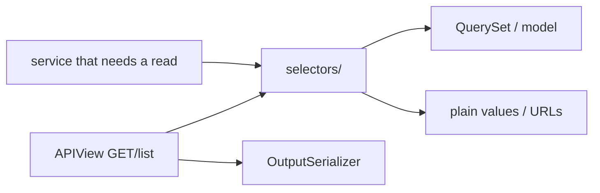

# 🔍 Selectors

> **Read-only** query functions: fetch rows, apply filters/annotations, and derive values for APIs and services.
>
> If a function creates, updates, or deletes as its main job → it belongs in [services](services.md), not here.

---

## 🎯 Why selectors exist

Without selectors, the same ORM spreads across views:

```python
# ❌ logic trapped in the view — hard to reuse / test / optimize
def get(self, request):
    profile = Profile.objects.select_related("user").get(user=request.user)
    ...
```

With selectors, reads have one home:

```python
# ✅
def get(self, request):
    profile = get_profile(user=request.user)
    return api_response(data=UsersProfileOutputSerializer(profile, context={"request": request}).data)
```

| Benefit | Detail |
|---------|--------|
| ♻️ Reuse | Same `get_profile` from GET profile, PATCH profile, and other features |
| 🧪 Testability | Unit-test queries without HTTP |
| ⚡ Performance | `select_related` / `prefetch_related` live next to the query, not forgotten in one view |
| 🤖 Consistency | Agents and humans know “list/filter → selector” |



---

## 📂 Location & naming

```text
blogs/selectors/
├── __init__.py
├── post_selectors.py          # entity module (preferred as the app grows)
├── comment_selectors.py
└── tests/
    ├── test_post_selectors.py
    └── test_comment_selectors.py
```

Small apps may keep a single `<app>_selectors.py` (e.g. `users_selectors.py`). When a second entity appears, **split by entity** — do not grow one mega-file.

### Module naming

| Pattern | Example | When |
|---------|---------|------|
| `<entity>_selectors.py` | `post_selectors.py`, `profile_selectors.py` | Default once you have clear entities |
| `<app>_selectors.py` | `users_selectors.py` | Tiny app / single aggregate |

List `FilterSet`s live under **`apis/`** as `*_search_filters.py` — not here. See [Pagination & filtering](../http/pagination-and-filtering.md).

Use **singular** entity names in the module (`post_`, not `posts_`).

### Function naming

| Pattern | Use for | Example |
|---------|---------|---------|
| `get_<entity>` | One row by the usual key | `get_profile`, `get_post` |
| `get_<entity>_by_<field>` | One row by alternate key | `get_post_by_slug` |
| `list_<entities>` | Collection / list API queryset (**plural**) | `list_posts`, `list_comments` |
| `list_<entities>_<purpose>` | Same entity, **different job** (not “with/without related”) | `list_post_ids`, `list_posts_for_sitemap` |
| `get_<thing>_<noun>` | Derived read-only value | `get_avatar_url` |
| `<thing>_exists` / `has_<thing>` | Boolean read | `email_exists` |

Prefer fetch verbs — not `handle_*` / `process_*` (those sound like writes).

### One list selector vs two

**Default: one `list_posts()`** optimized for the list API output (`select_related` / `prefetch_related` included). Reuse it everywhere — even callers that do not read related fields.

```python
# ✅ one selector for the list shape
def list_posts() -> QuerySet[Post]:
    return (
        Post.objects.filter(status="published")
        .select_related("author", "category")
        .prefetch_related("tags")
        .order_by("-created_at")
    )
```

**Do not** create `list_posts` + `list_posts_with_author` just because one caller skips author in the serializer.

**Write a second selector only when the job is different**, e.g. ids for a background job:

```python
def list_post_ids(*, status: str = "published") -> QuerySet[int]:
    return Post.objects.filter(status=status).order_by("id").values_list("id", flat=True)
```

| Situation | Selectors |
|-----------|-----------|
| List API (with or without reading related in one caller) | **One** `list_posts` |
| List API vs “only primary keys for Celery” | `list_posts` + `list_post_ids` |
| List API vs sitemap URLs | `list_posts` + `list_posts_for_sitemap` |

`select_related` / `prefetch` are for **output performance**, not for FilterSet FK filters. Related query filters use `field_name="author__email"` on the FilterSet — see [Pagination & filtering](../http/pagination-and-filtering.md).

---

## ✍️ Style rules

### 1. Keyword-only arguments

```python
def get_profile(*, user: BaseUser) -> Profile:
    ...
```

Call sites become self-documenting: `get_profile(user=request.user)` — not `get_profile(request.user)` where the meaning of positional args is unclear.

### 2. Return data, never HTTP

| ✅ Return | ❌ Return |
|----------|----------|
| Model instance | `Response` / `api_response` |
| `QuerySet` | DRF serializer instances |
| `str` / `dict` / `bool` / DTO-like structures | Raised permission errors meant for views (usually) |

Serialization stays in the API layer (`OutputSerializer`).

### 3. Put query optimization here (not FilterSets)

```python
def list_posts() -> QuerySet[Post]:
    return (
        Post.objects.filter(status="published")
        .select_related("author")
        .prefetch_related("tags")
        .order_by("-created_at")
    )
```

Do not leave N+1 fixes only inside one `APIView`.  
Do **not** take `request`. Client query-string FilterSets live under `apis/` (`*_search_filters.py`) — see [Pagination & filtering](../http/pagination-and-filtering.md).

### 4. Type hints

Annotate parameters and return types. Prefer concrete model types over `Any`.

---

## ✅ Real examples from `users`

### `get_profile`

```python
# users/selectors/users_selectors.py
def get_profile(*, user: BaseUser) -> Profile:
    profile, _ = Profile.objects.get_or_create(user=user)
    return profile
```

**Why `get_or_create` is allowed here (narrow exception):**
Every user *should* already have a profile via [signal](signals.md). This call is a **read-path safety net** for legacy/missing rows so `GET /profile/` does not 500. It is not a product “create profile” feature — that invariant still belongs to the signal / registration flow.

Document similar exceptions in a one-line docstring when you add them.

### `get_avatar_url`

```python
def get_avatar_url(*, profile: Profile, request: HttpRequest | None = None) -> str:
    if profile.avatar:
        url = profile.avatar.url
    else:
        url = static(DEFAULT_AVATAR_STATIC_PATH)

    if request is not None:
        return request.build_absolute_uri(url)
    return url
```

| Piece | Role |
|-------|------|
| `DEFAULT_AVATAR_STATIC_PATH` | From [constants](constants.md) — single path source |
| `static(...)` | Resolves staticfiles URL |
| `request.build_absolute_uri` | Absolute URL for API clients when request is present |

Used from output serializers:

```python
# users/apis/users/profile/users_profile_serializers.py
@extend_schema_field(serializers.URLField())
def get_avatar(self, profile: Profile) -> str:
    return get_avatar_url(profile=profile, request=self.context.get("request"))
```

### Called from an authenticated API

```python
# users/apis/users/profile/users_profile_apis.py
class UsersProfileApi(ApiAuthMixin, APIView):
    def get(self, request):
        profile = get_profile(user=request.user)
        return api_response(
            data=UsersProfileOutputSerializer(profile, context={"request": request}).data
        )
```

---

## 🔁 Selectors vs services vs managers

```text
┌──────────────┐
│  selectors/   │  READ  — get / list / derive
└──────────────┘
┌──────────────┐
│  services/   │  WRITE — create / update / delete / workflows
└──────────────┘
┌──────────────┐
│  manager/    │  ORM helpers attached to the model (create_user, custom QuerySet)
└──────────────┘
```

| Need | Use |
|------|-----|
| “Fetch profile for this user” | Selector |
| “Update bio/avatar” | Service (may *call* `get_profile`) |
| “Low-level create_user with hashed password” | Manager, wrapped by a service |
| “Paginated list for API” | Selector returns base queryset → API applies optional FilterSet → pagination helper |

Services **may call selectors** when a write needs a fresh read. Selectors must **not** call services that write (avoids hidden side effects in “read” code).

---

## 🧪 Testing

Place tests under `selectors/tests/`.

```python
@pytest.mark.django_db
def test_get_profile_returns_existing_profile(user):
    profile = get_profile(user=user)
    assert profile.user_id == user.id
```

| Assert | Skip |
|--------|------|
| Correct instance / queryset contents | Full HTTP status codes (that’s API tests) |
| Absolute URL shape when `request` is passed | Implementation details of unrelated layers |
| `select_related` behavior if performance-critical | — use `assertNumQueries` when it matters |

---

## 📋 List endpoints + filters

Selectors own the **base** optimized queryset. FilterSets live next to the list API:

```python
# blogs/selectors/post_selectors.py
def list_posts() -> QuerySet[Post]:
    return (
        Post.objects.filter(status="published")
        .select_related("author")
        .prefetch_related("tags")
        .order_by("-created_at")
    )
```

```python
# blogs/apis/posts/posts_apis.py
qs = list_posts()
qs = PostFilter(request.query_params, queryset=qs).qs
return get_paginated_response_context(...)
```

Full FilterSet examples (FK, dates, naming): [Pagination & filtering](../http/pagination-and-filtering.md).

---

## ❌ Anti-patterns

| Anti-pattern | Why it’s bad | Do this instead |
|--------------|--------------|-----------------|
| ORM list only inside `APIView.get` | Can’t reuse; N+1 appears in one place only | Selector for base QS |
| `selector` that calls `.create()` as its purpose | Hidden writes | Service |
| Returning `ModelSerializer(...).data` from a selector | Couples reads to DRF | Return model/QS; serialize in API |
| Positional bag of args | Unreadable call sites | Keyword-only `*` |
| Duplicating the same base QS in 4 views | Drift | One `list_*` selector |
| `list_posts` + `list_posts_with_related` | Noise | One optimized `list_posts` |
| Selector takes `request` / `query_params` for FilterSet | Couples reads to HTTP filter plumbing | Base QS in selector; FilterSet in `apis/` |
| FilterSet under `selectors/` + apply inside `list_*` | Mixes HTTP filter params into the read layer | `*_search_filters.py` under `apis/` + apply in the view |

---

## ✅ Checklist: adding a selector

1. Put it in `<entity>_selectors.py` (or `<app>_selectors.py` if tiny)  
2. Name it `get_*` / `list_<entities>` / `list_<entities>_<purpose>` with keyword-only args  
3. Add `select_related` / `prefetch_related` for the primary list/detail output  
4. Leave list FilterSets to `apis/<route…>/<entity>_search_filters.py`  
5. Export from `selectors/__init__.py` if it is part of the public app API  
6. Call it from APIs (and services if needed)  
7. Add `selectors/tests/…` 

---

## 🔗 Related docs

| Doc | Why |
|-----|-----|
| [Services](services.md) | Writes and when to call selectors |
| [Models](models.md) | What you are querying |
| [APIs](apis.md) | Where selectors are called |
| [Pagination & filtering](../http/pagination-and-filtering.md) | List endpoints |
| [Constants](constants.md) | Static paths used in derived values |
