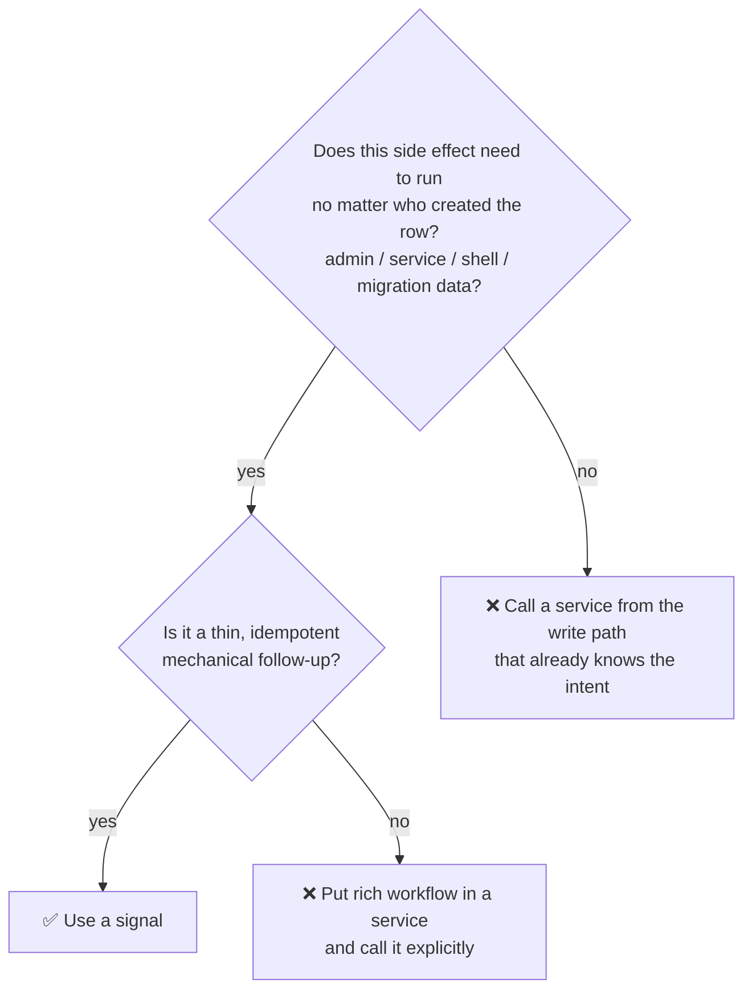
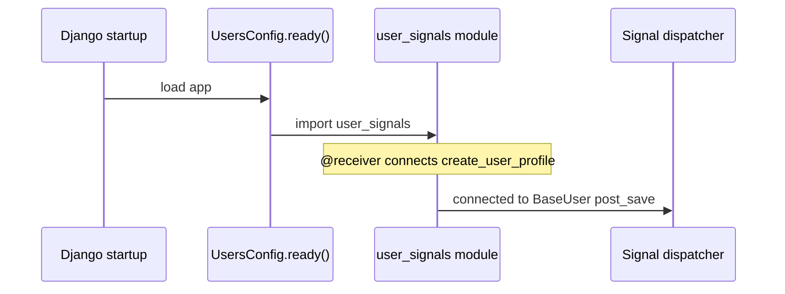
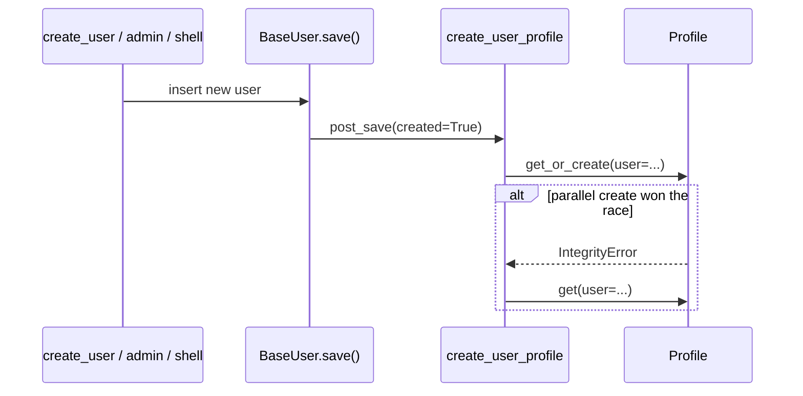

# 📡 Signals

> Django signals for **mechanical side effects** that must run when a model event happens, regardless of which code path created the row.
>
> Package: `<app>/signals/` — wired from `AppConfig.ready()`.

Signals are **not** a substitute for services, **not** an HTTP API boundary, and **not** the place for user-facing validation messages.

---

## 🎯 When to use a signal (and when not to)



| ✅ Good fit for signals | ❌ Bad fit — use a service instead |
|-------------------------|-------------------------------------|
| Create a related `Profile` whenever a `BaseUser` is created | “Send welcome email + grant trial + start onboarding” as one implicit chain |
| Touch a denormalized counter that must stay in sync from admin too | Permission checks / raising API validation errors |
| Invalidate a cache key on save (keep it tiny) | Multi-step business workflows that callers should see in the stack trace |

**Rule of thumb:** if a product manager would describe it as a **feature**, it is probably a **service**. If an engineer describes it as **“keep this related row/invariant true whenever X exists”**, it can be a **signal**.

---

## 📂 Location & wiring

### Files

```text
users/
├── apps.py                 # ready() imports signals
└── signals/
    ├── __init__.py         # import submodules so receivers register
    └── user_signals.py     # receivers for user/profile
```

`start_domain_app` creates an empty `signals/` package. Add modules as you need them (e.g. `post_signals.py`).

### Registration (required)

Receivers decorated with `@receiver` only connect if the module is **imported**. Import them from `AppConfig.ready()`:

```python
# users/apps.py
from django.apps import AppConfig


class UsersConfig(AppConfig):
    default_auto_field = "django.db.models.BigAutoField"
    name = "{{cookiecutter.project_slug}}.users"

    def ready(self):
        from {{cookiecutter.project_slug}}.users.signals import user_signals  # noqa: F401
```

Also import from `signals/__init__.py` if you want `import users.signals` to load everything:

```python
# users/signals/__init__.py
from . import user_signals  # noqa: F401
```

Without this wiring, the handler file exists but **never runs** — a common production bug.



---

## ✅ Canonical example: create `Profile` for every new user

This project guarantees every `BaseUser` has a `Profile` (bio/avatar), including users created from:

- `register()` / `create_user()` services  
- Django admin  
- shell / management commands  
- tests / factories  

So the side effect is wired on `post_save`, not only inside `register()`.

```python
# users/signals/user_signals.py
from django.db import IntegrityError
from django.db.models.signals import post_save
from django.dispatch import receiver

from {{cookiecutter.project_slug}}.users.models import BaseUser, Profile


@receiver(post_save, sender=BaseUser)
def create_user_profile(sender, instance, created, **kwargs):
    """Create Profile for new users. Not an API boundary — absorb create races."""
    if not created:
        return
    try:
        Profile.objects.get_or_create(user=instance)
    except IntegrityError:
        Profile.objects.get(user=instance)
```

### Why each line matters

| Piece | Purpose |
|-------|---------|
| `@receiver(post_save, sender=BaseUser)` | Run only for this model’s save events |
| `if not created: return` | Updates must not re-run “create profile” logic |
| `get_or_create` | Idempotent if something else already created the row |
| `except IntegrityError` | Race: two requests create the user/profile concurrently — absorb and load the winner |



### How the API still uses services

The signal only ensures the row exists. **Updating** bio/avatar stays in the service:

```python
# users/services/user_services.py (sketch)
@transaction.atomic
def register(*, email: str, password: str, bio: str | None = None, avatar=None) -> BaseUser:
    user = create_user(email=email, password=password)
    # Profile already exists thanks to the signal
    profile = Profile.objects.get(user=user)
    ...
    model_save(instance=profile, update_fields=...)
    return user
```

Selectors may also `get_or_create` defensively for reads (`get_profile`) — that is a safety net for legacy rows, not a replacement for the signal on create.

---

## 🧾 Handler style guidelines

### 1. Keep handlers small

A signal module should read like plumbing, not like a second service layer.

```python
# ✅ thin
@receiver(post_save, sender=BaseUser)
def create_user_profile(...):
    ...


# ❌ fat — move to services and call explicitly from register/admin actions
@receiver(post_save, sender=BaseUser)
def onboarding_suite(...):
    send_email(...)
    charge_card(...)
    create_team(...)
    start_trial(...)
```

### 2. Idempotent + race-safe

Assume the handler can run in parallel or more than once in weird paths. Prefer `get_or_create`, existence checks, and catching `IntegrityError` when a unique constraint protects you.

### 3. Not an API boundary

Do **not** raise DRF/`ValidationError` from signals expecting the JSON envelope to show a nice field error to the client. By the time `post_save` runs, the write is often already in progress; failures become 500s or surprising rollbacks.

If the user must see `messages.email = ...`, validate **before** save in the serializer/service.

### 4. Avoid infinite recursion

Updating the same instance inside its own `post_save` without a guard can loop. Prefer updating a **related** model, or use `update_fields` / `QuerySet.update` carefully when you must touch the same row.

### 5. Keyword clarity in tests

When testing, prefer calling the service/API that should trigger the side effect, or create the model and assert the related row exists — don’t rely on importing signals in a random order.

---

## 🧪 Adding a new signal (checklist)

1. Confirm a **service call on one path** is not enough (admin/shell must also get the effect).
2. Create `<app>/signals/<topic>_signals.py`.
3. Register with `@receiver(...)` and keep the body idempotent.
4. Import the module from `<app>/apps.py` → `ready()` (and optionally `signals/__init__.py`).
5. Add a test that creates the parent model **without** going through a single custom service (e.g. `BaseUser.objects.create_user(...)` or factory) and asserts the side effect.
6. Document in a one-line docstring that this is **not** an API boundary.

### Template

```python
# blogs/signals/post_signals.py
from django.db.models.signals import post_save
from django.dispatch import receiver

from {{cookiecutter.project_slug}}.blogs.models import Post


@receiver(post_save, sender=Post)
def ensure_something(sender, instance, created, **kwargs):
    """Mechanical follow-up for Post. Not an API boundary."""
    if not created:
        return
    ...
```

```python
# blogs/apps.py
def ready(self):
    from {{cookiecutter.project_slug}}.blogs.signals import post_signals  # noqa: F401
```

---

## 🆚 Signals vs services vs selectors

```text
┌─────────────────┐     explicit call      ┌─────────────────┐
│  API / admin    │ ─────────────────────► │  services/      │
│  “publish post” │                        │  business rules │
└─────────────────┘                        └────────┬────────┘
                                                    │
                                                    ▼
                                               models.save()
                                                    │
                                         post_save (optional)
                                                    │
                                                    ▼
                                           ┌─────────────────┐
                                           │  signals/       │
                                           │  keep invariants│
                                           └─────────────────┘

┌─────────────────┐
│  selectors/     │  ← reads only; do not “hide writes” here
└─────────────────┘
```

| Layer | Trigger | Owns |
|-------|---------|------|
| Service | Explicit Python call | Product behavior the caller requested |
| Signal | Model lifecycle event | Invariants / mechanical coupling |
| Selector | Explicit Python call | Reads / derived values |

---

## 🔗 Related docs

| Doc | Relation |
|-----|----------|
| [Constants](constants.md) | Shared literals (separate concern — do not mix into signal modules) |
| [Services](services.md) | Where real workflows belong |
| [Models](models.md) | What emits `post_save` |
| [Architecture](../structure/architecture.md) | Layer decision tree |
| [Domain apps](../structure/domain-apps.md) | Empty `signals/` package in scaffold |
