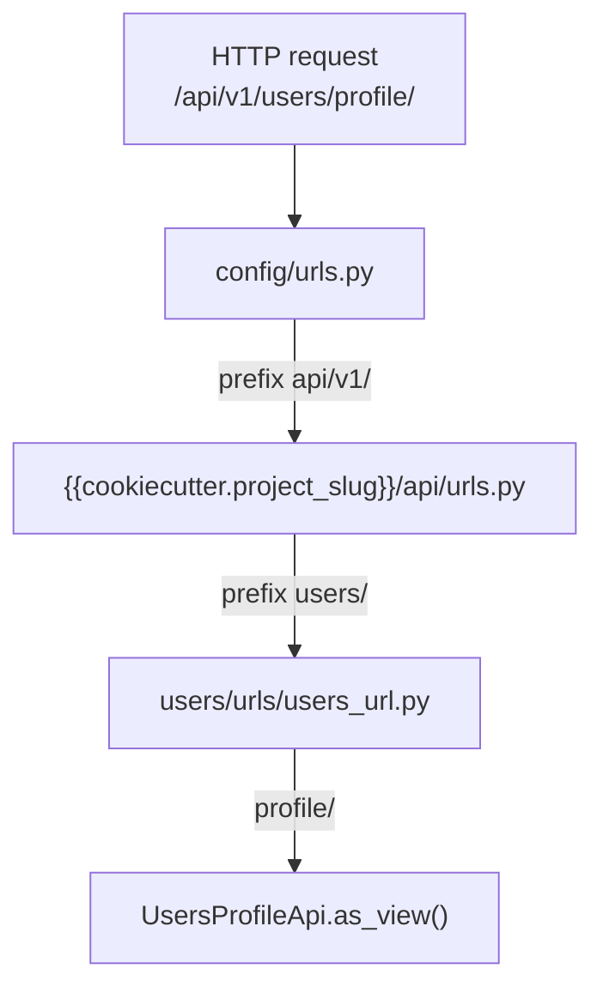
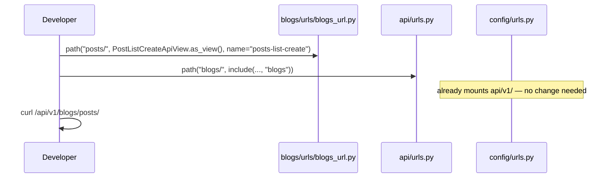

# 🛣️ URLs & routing

> How HTTP paths are mounted from `config/urls.py` down to each domain app’s `urls/` package.
>
> Goal: every public API lives under a **versioned prefix**, every route has a **stable name**, and new apps plug in with one `include(...)`.

---

## 🎯 Big picture



### Resolved path (example)

| Layer | `path(...)` piece | Accumulated URL |
|-------|-------------------|-----------------|
| Root | `api/v1/` | `/api/v1/` |
| API router | `users/` | `/api/v1/users/` |
| App urls | `profile/` | `/api/v1/users/profile/` |

Same idea for health: `/api/v1/` + `` (core include at `""`) + `health/` → `/api/v1/health/`.

---

## 🌳 Layer 1 — `config/urls.py` (project root)

This file is the Django `ROOT_URLCONF`. It mounts **admin**, the **versioned API**, and (only when `DEBUG=True`) the **OpenAPI / Swagger** UI.

| Path | Purpose | When available |
|------|---------|----------------|
| `/admin/` | Django admin | Always |
| `/api/v1/` | All product + system HTTP APIs | Always |
| `/` | Swagger UI | **DEBUG only** |
| `/redoc/` | ReDoc | **DEBUG only** |
| `/schema/` | Raw OpenAPI schema | **DEBUG only** |
| `/media/…` | Uploaded media via Django | DEBUG, or production when no reverse proxy was selected |

```python
# config/urls.py (shape)
urlpatterns = [
    path("admin/", admin.site.urls),
    path("api/v1/", include(("{{cookiecutter.project_slug}}.api.urls", "api"))),
]

if settings.DEBUG:
    urlpatterns = [
        path("schema/", SpectacularAPIView.as_view(api_version="v1"), name="schema"),
        path("", SpectacularSwaggerView.as_view(url_name="schema"), name="swagger-ui"),
        path("redoc/", SpectacularRedocView.as_view(url_name="schema"), name="redoc"),
        *urlpatterns,
    ]
    # + media serving in DEBUG
```

### Why Swagger is DEBUG-only

Exposing the full schema in production leaks endpoint inventory and often auth details. Locally you want it at http://localhost:8000/ — see [Swagger](../http/swagger.md).

### Media

In production with nginx/traefik, the reverse proxy should serve `/media/` and `/static/`. Django’s `serve()` fallback exists for DEBUG (and for the “no reverse proxy” generation choice). Details: [Docker & production](../platform/docker-and-production.md).

---

## 🌳 Layer 2 — `api/urls.py` (versioned router)

`{{cookiecutter.project_slug}}/api/urls.py` is the **only** place that composes domain URL modules into `/api/v1/`.

```python
# {{cookiecutter.project_slug}}/api/urls.py
from django.urls import include, path

urlpatterns = [
    path("", include(("{{cookiecutter.project_slug}}.core.urls", "core"))),
    path("auth/", include(("{{cookiecutter.project_slug}}.users.urls.auth_url", "auth"))),
    path("users/", include(("{{cookiecutter.project_slug}}.users.urls.users_url", "users"))),
    # path("blogs/", include(("{{cookiecutter.project_slug}}.blogs.urls.blogs_url", "blogs"))),
]
```

| Include | Final public prefix | Notes |
|---------|---------------------|-------|
| `core.urls` at `""` | `/api/v1/health/` | System endpoints |
| `users.urls.auth_url` at `auth/` | `/api/v1/auth/…` | Login, logout, password |
| `users.urls.users_url` at `users/` | `/api/v1/users/…` | Register, profile |
| future `blogs.urls.blogs_url` | `/api/v1/blogs/…` | Add one line when scaffolding |

### `include((module, namespace))` form

We use the tuple form so the URL **namespace** is explicit:

```python
include(("{{cookiecutter.project_slug}}.users.urls.users_url", "users"))
#                              ↑ module                         ↑ namespace
```

That namespace pairs with `app_name` inside the included module (see below) for `reverse("users:profile")`.

---

## 🌳 Layer 3 — per-app `urls/` package (**multiple `*_url.py` modules**)

Each domain app owns its routes under `<app>/urls/`. Prefer **one module per public mount** included from `api/urls.py`. Name modules `<prefix>_url.py`.

### Reference: `users` (two mounts → two modules)

```text
users/urls/
├── auth_url.py      # /api/v1/auth/…
└── users_url.py     # /api/v1/users/…
```

```python
# users/urls/users_url.py
from django.urls import path

from {{cookiecutter.project_slug}}.users.apis.users import UsersProfileApi, UsersRegisterApi

app_name = "users"

urlpatterns = [
    path("register/", UsersRegisterApi.as_view(), name="register"),
    path("profile/", UsersProfileApi.as_view(), name="profile"),
]
```

```python
# users/urls/auth_url.py (shape — JWT vs session depends on generation)
app_name = "auth"

urlpatterns = [

    path("jwt/login/", AuthJwtLoginApi.as_view(), name="login"),
    path("jwt/refresh/", AuthJwtRefreshApi.as_view(), name="refresh"),
    path("jwt/verify/", AuthJwtVerifyApi.as_view(), name="verify"),
    path("jwt/logout/", AuthLogoutApi.as_view(), name="logout"),

    path("session/login/", AuthSessionLoginApi.as_view(), name="login"),
    path("session/logout/", AuthSessionLogoutApi.as_view(), name="logout"),

    path("password/change/", AuthPasswordChangeApi.as_view(), name="password-change"),
    path("password/reset/", AuthPasswordResetRequestApi.as_view(), name="password-reset"),
    path(
        "password/reset/confirm/",
        AuthPasswordResetConfirmApi.as_view(),
        name="password-reset-confirm",
    ),
]
```

### Growing apps (POS-style)

As soon as you mount a second public prefix, add another `*_url.py` — do not grow one mega-file:

```text
pos/urls/
├── pos_url.py
└── pos_menu_url.py
```

```python
# api/urls.py
path("pos/", include(("….pos.urls.pos_url", "pos"))),
path("pos-menu/", include(("….pos.urls.pos_menu_url", "pos_menu"))),
```

### Reference: `core`

```python
# core/urls/__init__.py
app_name = "core"

urlpatterns = [
    path("health/", HealthApi.as_view(), name="health"),
]
```

### Scaffold default for a new app

```python
# blogs/urls/blogs_url.py
from django.urls import path

app_name = "blogs"

urlpatterns = [
    # path("posts/", PostListCreateApiView.as_view(), name="posts-list-create"),
    # path("posts/<int:post_id>/", PostRetrieveUpdateDestroyApiView.as_view(), name="posts-detail"),
]
```

When the app grows, **prefer more `*_url.py` modules** (like `users`: `auth_url.py` + `users_url.py`) and add matching `include`s in `api/urls.py`. Do not collapse every mount into one URLconf file.

---

## 🔢 API versioning

| Rule | Detail |
|------|--------|
| Current public prefix | `/api/v1/` |
| Breaking changes | Add `/api/v2/` (new include module), **keep v1 working** until clients migrate |
| Non-breaking additions | New paths / optional fields under v1 are fine |
| Removals / renames / type changes | Breaking → new version, or a documented deprecation window |
| Admin / schema | Stay outside `/api/v1/` (admin is `/admin/`; schema is DEBUG-only at `/schema/`) |

```python
# future sketch — do not remove v1 when adding v2
urlpatterns = [
    path("api/v1/", include(("…api.urls", "api"))),
    path("api/v2/", include(("…api.urls_v2", "api_v2"))),
]
```

### What counts as breaking?

| Breaking (needs v2 or long deprecation) | Non-breaking |
|-----------------------------------------|--------------|
| Remove a field or path | Add optional field / new path |
| Change field type or meaning | Add enum value clients can ignore |
| Tighten validation so previously valid bodies fail | Loosen validation |
| Change auth requirement from public → authenticated without notice | Document new optional headers |

**Deprecation habit:** mark the old path in OpenAPI `deprecated=True`, keep it working for an agreed window, then remove only after clients migrate. Do not silently change v1 contracts.

Clients should treat the version segment as part of the contract, not as optional.

---

## ✍️ Path naming conventions (explained)

These are not arbitrary style nits — they affect Django’s `APPEND_SLASH`, client SDKs, and `reverse()`.

### 1. Trailing slashes (Django default)

Django’s default `APPEND_SLASH=True` expects patterns to end with `/`. If a client calls `/api/v1/users/profile` (no slash) and the pattern is `profile/`, Django may issue a redirect to the slashed URL.

| ✅ Define | ❌ Avoid |
|----------|---------|
| `path("profile/", …)` | `path("profile", …)` unless you fully control clients and settings |

**Why we care for APIs:** redirects on `POST` are painful (some clients convert POST→GET). Always document and call the **slashed** form: `/api/v1/users/profile/`.

### 2. Kebab-case for multi-word path segments

Use lowercase kebab-case in the URL path; keep Python modules snake_case.

| ✅ URL path | ❌ Avoid in URLs |
|------------|------------------|
| `password/reset/confirm/` | `password/reset/confirm` (no slash) |
| `password/reset/confirm/` | `passwordResetConfirm/` |
| `jwt/login/` | `jwt_login/` (underscores in paths are uncommon for public HTTP APIs) |

Underscores inside **namespaces** and **route names** (`name="password-reset-confirm"`) are fine — those are Python/Django identifiers for `reverse()`, not the public path.

### 3. Stable `name=` on every route

Every `path(..., name="…")` should be unique within its `app_name` namespace.

```python
path("profile/", UsersProfileApi.as_view(), name="profile")
```

```python
from django.urls import reverse

reverse("users:profile")   # → /api/v1/users/profile/
reverse("core:health")     # → /api/v1/health/
reverse("auth:login")      # → /api/v1/auth/jwt/login/ or .../session/login/
```

| ✅ Good `name` | ❌ Brittle `name` |
|----------------|------------------|
| `profile`, `register`, `password-reset` | `view1`, `api`, changing names per refactor |
| Stable even if path string changes slightly | Encoding HTTP method into the name (`get-profile`) — optional, usually unnecessary with one view class per path |

### 4. Prefixes that mirror domains

| Prefix | Owns |
|--------|------|
| `/api/v1/auth/` | Authentication & password flows |
| `/api/v1/users/` | User resource (register, profile) |
| `/api/v1/health/` | System health (core) |
| `/api/v1/<app>/` | That domain app’s public surface |

Do not hang unrelated routes under `users/` just because the view imports a user model — put them under their own domain prefix.

### 5. Don’t put verbs in paths when the HTTP method is enough

| ✅ Prefer | ❌ Usually avoid |
|----------|-----------------|
| `GET/PATCH /users/profile/` | `GET /users/get-profile/`, `POST /users/update-profile/` |
| `POST /users/register/` | acceptable exception — “register” is the resource action name clients expect |

Auth routes often include a clear action (`login`, `logout`, `refresh`) because they are commands, not CRUD resources.

---

## 🔌 Adding routes for a new domain app



**Checklist**

1. Implement the `APIView` under `blogs/apis/…` in folders that mirror the URL
2. Add `path(...)` in `blogs/urls/blogs_url.py` with `name=`
3. Ensure `app_name = "blogs"`
4. `include` the module from `api/urls.py` under `blogs/`
5. Hit `/api/v1/blogs/…` and confirm it appears in Swagger (DEBUG)
6. In tests, prefer `reverse("blogs:posts-list")` over hard-coded strings

---

## 🧪 Reversing URLs in tests & services

Prefer names over hard-coded paths so refactors don’t break callers:

```python
from django.urls import reverse

url = reverse("users:register")
response = client.post(url, data={...}, format="json")
```

Hard-coded `"/api/v1/users/register/"` in tests is acceptable for smoke tests but names are safer for suites that grow.

Services and selectors generally **should not** need `reverse()` — building product deep-links for emails (password reset) may use `APP_DOMAIN` + a frontend path, as in `request_password_reset`, not necessarily Django route names.

---

## ❌ Common mistakes

| Mistake | What goes wrong | Fix |
|---------|-----------------|-----|
| Forgetting `include` in `api/urls.py` | App exists, always 404 | Add the `path("blogs/", include(...))` line |
| Missing trailing slash in clients | Redirect / method weirdness | Call `/…/profile/` |
| No `name=` | Can’t `reverse()`, fragile tests | Always set `name` |
| Defining routes only in `config/urls.py` | Unmaintainable root URLconf | Domain routes live in `<app>/urls/*_url.py` |
| One mega URL module for many public prefixes | Hard to navigate | Prefer multiple `<prefix>_url.py` modules + separate `include`s |
| Putting register under `/auth/` | Confuses “session/token” with “user resource” | Keep register under `/users/` (as this template does) |
| Shipping Swagger in production | Schema leakage | Keep schema views behind `DEBUG` |

---

## 📋 Quick map of shipping endpoints

| Method | Path | Namespace name |
|--------|------|----------------|
| `GET` | `/api/v1/health/` | `core:health` |

| `POST` | `/api/v1/auth/jwt/login/` | `auth:login` |
| `POST` | `/api/v1/auth/jwt/refresh/` | `auth:refresh` |
| `POST` | `/api/v1/auth/jwt/verify/` | `auth:verify` |
| `POST` | `/api/v1/auth/jwt/logout/` | `auth:logout` |

| `POST` | `/api/v1/auth/session/login/` | `auth:login` |
| `POST` | `/api/v1/auth/session/logout/` | `auth:logout` |

| `POST` | `/api/v1/auth/password/change/` | `auth:password-change` |
| `POST` | `/api/v1/auth/password/reset/` | `auth:password-reset` |
| `POST` | `/api/v1/auth/password/reset/confirm/` | `auth:password-reset-confirm` |
| `POST` | `/api/v1/users/register/` | `users:register` |
| `GET`/`PATCH` | `/api/v1/users/profile/` | `users:profile` |

Auth semantics: [Authentication](../http/authentication.md).

---

## 🔗 Related docs

| Doc | Why |
|-----|-----|
| [Domain apps](../structure/domain-apps.md) | Scaffold + where to add the include |
| [Project structure](../structure/project-structure.md) | Where `config/urls.py` and `api/` live |
| [APIs](apis.md) | What the view at the end of the path should do |
| [Swagger](../http/swagger.md) | How routes show up in OpenAPI |
| [Authentication](../http/authentication.md) | Auth path details |
