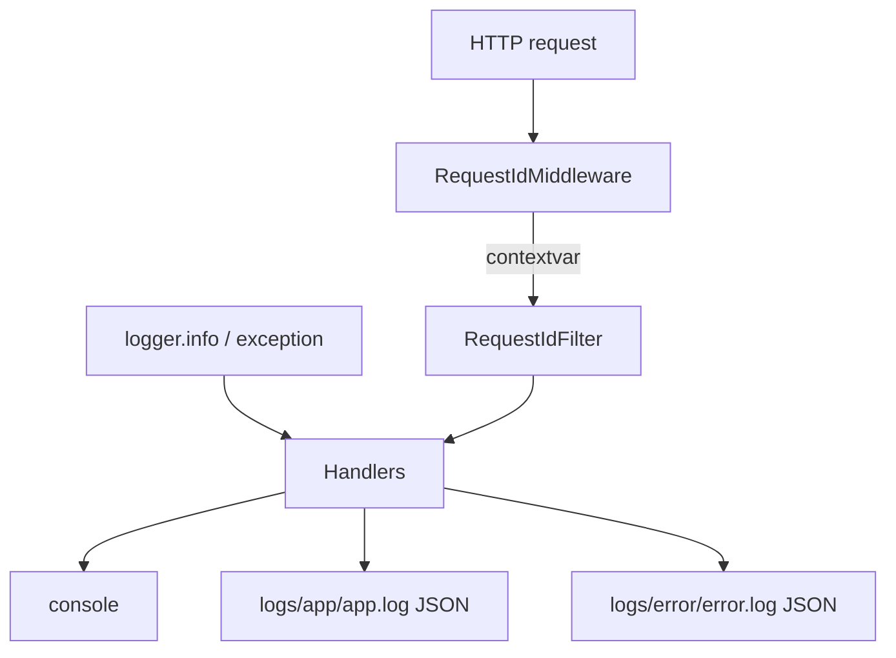

# 📋 Logging

> How logs are configured, where they go, how **request IDs** correlate traffic, and how to write log lines in application code.
>
> Config: `config/settings/logging.py` (+ `config/logging_formatters.py`, `config/request_id.py`).  
> This doc supersedes the old root `LOGGING.md` cheat sheet.

---

## 🎯 Goals

| Goal | How |
|------|-----|
| Readable local console | `asctime \| level \| logger \| message` |
| Machine-friendly files | JSON lines under `logs/` |
| Trace a single HTTP request | `X-Request-ID` → contextvar → JSON `request_id` |
| No secret leakage | Never log passwords, tokens, or full auth headers |



---

## ⚙️ Environment variables

| Env var | Default | Purpose |
|---------|---------|---------|
| `DJANGO_LOGGING_LEVEL` | `INFO` | Root / console level (uppercased; invalid values → `INFO` + warning) |
| `LOG_TO_FILE` | `true` | Write rotating JSON files under `logs/` |
| `LOG_WHEN` | `midnight` | `TimedRotatingFileHandler` rollover unit |
| `LOG_INTERVAL` | `1` | Rollover interval |
| `LOG_BACKUP_COUNT` | `14` | Rotated files to keep |
| `LOG_SQL` | `false` | Log SQL via `django.db.backends` to console |

---

## 📤 Handlers

| Handler | Destination | Levels |
|---------|-------------|--------|
| `console` | stdout | `DJANGO_LOGGING_LEVEL`+ (human-readable) |
| `app_file` | `logs/app/app.log` | `INFO`+ including **WARNING** (JSON lines) |
| `error_file` | `logs/error/error.log` | `ERROR`+ (JSON lines) |
| `sql_console` | stdout | only if `LOG_SQL=true` |

### Special loggers

| Logger | Behavior |
|--------|----------|
| `django` | Level INFO, propagates to root |
| `django.request` | ERROR+ → console + app_file + error_file (when files on); **`propagate: False`** to avoid duplicates |
| `django.db.backends` | SQL debug only when `LOG_SQL=true` |

`logs/.gitkeep` keeps the folder in git; real files under `logs/**` are gitignored. Directories for `app/` and `error/` are created at startup when `LOG_TO_FILE=true`.

---

## 🧾 Formats

### Console (example)

```text
2026-07-10 13:00:00 | WARNING | myapp.users.services | user 42 failed login
```

### File JSON line (example)

```json
{
  "timestamp": "2026-07-10T09:30:00+00:00",
  "level": "WARNING",
  "logger": "myapp.users.services",
  "message": "user 42 failed login",
  "pathname": ".../services.py",
  "lineno": 20,
  "funcName": "login",
  "request_id": "a1b2c3d4-…"
}
```

`request_id` appears when a request context is active (middleware set the contextvar).

---

## 🆔 Request ID

`config.request_id.RequestIdMiddleware`:

1. Reads inbound `X-Request-ID` if present (stripped), otherwise generates `uuid4`  
2. Sets `request.request_id`  
3. Stores ID in a `contextvars.ContextVar` for the request lifetime  
4. Echoes `X-Request-ID` on the **response**  

`RequestIdFilter` copies the contextvar onto log records so JSON formatters can emit `"request_id"`.

| Use | Detail |
|-----|--------|
| Clients / gateways | May send their own `X-Request-ID` for tracing across services |
| Support | Ask for response header `X-Request-ID` and grep JSON logs |
| Code | `from config.request_id import get_request_id` if you need the value explicitly |

Middleware must be enabled in `config/settings/middleware.py` (template wires it).

---

## ✍️ How to log in application code

```python
import logging

logger = logging.getLogger(__name__)

logger.info("user %s registered", user.id)           # ✅ lazy % formatting
logger.warning("profile update skipped for %s", user.id)

try:
    ...
except Exception:
    logger.exception("unexpected failure in register")  # ✅ includes traceback
```

| ✅ Do | ❌ Don’t |
|-------|---------|
| `logging.getLogger(__name__)` | One global logger name for the whole project |
| Lazy `%s` / `%d` args | `logger.info(f"user {user.id}")` (always formats; minor cost + habit) |
| `logger.exception` inside `except` | `logger.error(str(e))` without traceback for unexpected bugs |
| Log IDs / counts / outcomes | Log passwords, refresh tokens, `Authorization` headers, raw cards |

### Expected domain failures

Validation errors that become 400s for the client usually **do not** need `logger.exception`. Log at `info`/`warning` if product/security cares (e.g. repeated failed logins), otherwise let the API envelope speak.

Unexpected failures in the exception handler already call `logger.exception("Unhandled API exception", ...)` — see [API envelope](api-envelope.md).

---

## 🧪 Tests

`config/django/test.py` uses quieter, console-oriented logging so pytest output stays readable. Do not assert on production file paths in unit tests unless you are testing logging configuration itself.

---

## 📁 Files to know

| Path | Role |
|------|------|
| `config/settings/logging.py` | DictConfig, env knobs, handlers |
| `config/logging_formatters.py` | JSON / SQL formatters |
| `config/request_id.py` | Middleware + filter + `get_request_id` |
| `logs/app/app.log` | INFO+ JSON (when `LOG_TO_FILE`) |
| `logs/error/error.log` | ERROR+ JSON |

---

## ❌ Anti-patterns

| Anti-pattern | Fix |
|--------------|-----|
| `print(...)` for diagnostics | `logger.debug/info` |
| Logging `request.data` wholesale on auth views | Log field names / user id only |
| Disabling `django.request` handlers “to reduce noise” | Keep ERROR path; tune level instead |
| Committing rotated log files | Keep `logs/**` ignored |
| Inventing a second request-id middleware | Use `config.request_id` |

---

## ✅ Checklist: logging a new feature

1. Module logger via `__name__`  
2. Info/warning for important business events (no secrets)  
3. `logger.exception` only for unexpected errors  
4. Confirm request_id appears in JSON when hitting via HTTP  
5. If ops needs a new dedicated file/logger, extend `logging.py` deliberately — don’t scatter `FileHandler` in app code  

---

## 🔗 Related docs

| Doc | Why |
|-----|-----|
| [API envelope](api-envelope.md) | Unhandled errors are logged there |
| [Settings](settings.md) | Where logging slice lives |
| [Docker & production](docker-and-production.md) | How logs behave in containers |
| [Code quality](code-quality.md) | Hooks that may ban debug leftovers |
