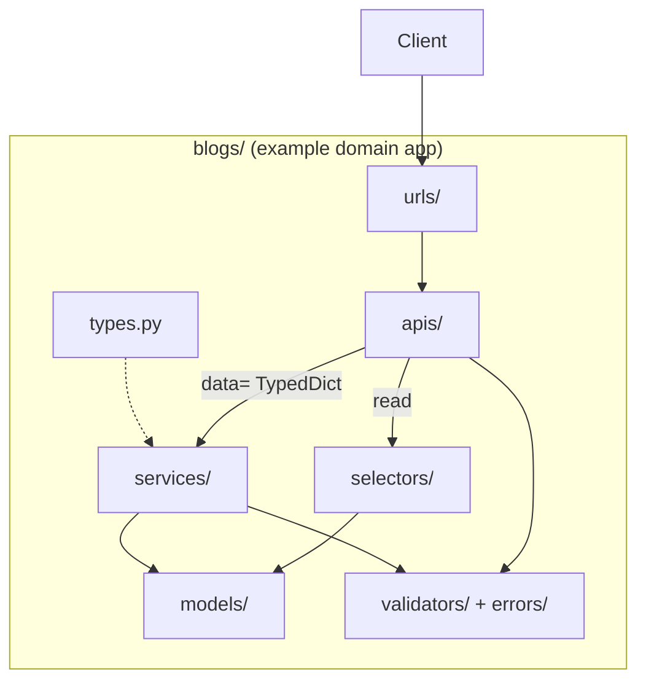
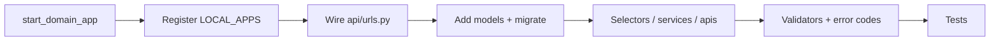

# 🧩 Domain apps

> How to create and grow a **product domain** package (`users`, `blogs`, `orders`, …) so it matches this style guide.
>
> **Never** use Django’s default `startapp` — its flat `models.py` / `views.py` layout fights every other doc in this folder.

---

## 🎯 What is a “domain app”?

A domain app owns one business area end-to-end:

```text
HTTP  →  apis/ + urls/
reads →  selectors/
writes → services/  (+ types.py TypedDicts for `data=`)
shape →  models/ + manager/
rules →  validators/ + errors/
glue  →  constants.py, enums.py, signals/, utils/
```



`users` is the **reference implementation**. Copy its patterns; do not invent a parallel layout.

---

## 🏷️ Naming rules

### Plural app labels

Match Django’s common style and this template’s `users` app:

| ✅ Prefer | ❌ Avoid |
|----------|---------|
| `blogs` | `blog` |
| `orders` | `order` |
| `products` | `product` |
| `order_items` | `OrderItems` / `order-items` |

### Technical constraints (`start_domain_app`)

| Rule | Detail |
|------|--------|
| Pattern | `^[a-z][a-z0-9_]*$` — lowercase Python identifier |
| Reserved | `api`, `common`, `commands`, `config`, `core`, `django`, `manage`, `test`, `tests` |
| Package path | `{{cookiecutter.project_slug}}.<name>` |
| AppConfig | `<PascalName>Config` (e.g. `blogs` → `BlogsConfig`) |
| Error enum | `<PascalName>ErrorCode` (e.g. `BlogsErrorCode`) |

```bash
# ✅
python manage.py start_domain_app blogs
python manage.py start_domain_app order_items

# ❌ rejected or discouraged
python manage.py start_domain_app Blog
python manage.py start_domain_app common    # reserved
python manage.py start_domain_app my-app    # invalid identifier
```

---

## 🚀 Scaffold with `start_domain_app`

```bash
python manage.py start_domain_app blogs
# create files AND append AppConfig to LOCAL_APPS:
python manage.py start_domain_app blogs --register
```

### Flags

| Flag | Meaning | When to use |
|------|---------|-------------|
| *(none)* | Write scaffold files; print next steps | Default — review files before registering |
| `--register` | Also append `"….BlogsConfig"` to `LOCAL_APPS` | When you are sure of the name |
| `--force` | Overwrite existing scaffold files in that directory | Re-scaffold after enabling tests, or recover a broken tree — **destructive** |
| `--no-tests` | Skip test stubs even if `pytest.ini` exists | Rare; prefer keeping stubs |


### Testing stubs

This project was generated **with testing** (`pytest.ini` present). The command also creates base stubs under:

- `tests/` (smoke + factory stub)
- `services/tests/`, `selectors/tests/`, `validators/tests/`
- API tests are **not** scaffolded at `apis/tests/` — add `apis/<route…>/tests/` when the first endpoint lands

They collect and pass out of the box; replace placeholders as you implement features.

```bash
pytest {{cookiecutter.project_slug}}/blogs -q
```

### Testing stubs

This project was generated **without testing**, so `start_domain_app` skips test stubs (no `pytest.ini`). If you add pytest later, re-run with `--force` after adding `pytest.ini`, or create tests manually.


---

## 📂 Scaffolded layout (every folder explained)

```text
blogs/
├── apps.py                 # BlogsConfig; ready() for signals later
├── admin.py                # Django admin registrations
├── constants.py            # tags / paths / literals → see constants.md
├── enums.py                # TextChoices / IntegerChoices → see enums.md
├── models/                 # one module per model; export from __init__.py
├── manager/                # custom managers / querysets
├── selectors/              # READ queries (+ tests/) — no FilterSets here
├── types.py                # Create*/Update* TypedDicts for service data= — see types.md
├── services/               # WRITE + business rules; modules = *_services.py; take data: SomeData (+ tests/)
├── apis/                   # DRF views + serializers + optional *_search_filters.py; folders mirror URL routes (+ tests per leaf)
├── urls/
│   └── blogs_url.py        # urlpatterns + app_name; split into more *_url.py modules as mounts grow
├── validators/             # is_* pures + *Validator raisers (+ tests/)
├── errors/
│   └── codes.py            # BlogsErrorCode StrEnum — codes ONLY
├── signals/                # mechanical side effects → see signals.md
├── utils/                  # leftovers that are neither selector nor service
├── migrations/
└── tests/                  # only if pytest.ini exists
    ├── test_app.py
    └── blogs_factories.py
```

### Responsibility cheat sheet

| Path | ✅ Does | ❌ Does not |
|------|--------|------------|
| `models/` | Fields, constraints, relations | HTTP, complex workflows, nested `TextChoices`, missing `related_name` |
| `enums.py` | `TextChoices` / `IntegerChoices` for fields | Error codes / OpenAPI tags |
| `manager/` | Reusable QuerySet/Manager methods | Call external APIs / send email as “business feature” |
| `selectors/` | Reads, annotations, derived URLs, auth/ownership scoping on QS | `.create()` / `.save()` as the main job; taking `request`; django-filter FilterSets |
| `types.py` | `TypedDict` for service `data=` | Runtime validation, dataclass DTOs |
| `services/` | Writes, transactions, domain rules; files named `*_services.py`; **TypedDict `data=`** | Parse `request.data` / return `Response`; singular `*_service.py`; untyped `dict` / dataclass DTOs |
| `apis/` | Auth, validate input, pass `validated_data`, optional `*_search_filters.py`, call selector/service, `api_response`; **folders mirror URL routes**; tests per leaf | Fat ORM blocks; root `apis/tests/`; `serializer.save()` |
| `urls/` | Path → view mapping; prefer **multiple** `<prefix>_url.py` modules | Business logic; one mega-`urls.py` for many mounts |
| `validators/` | Field-level pure + raising checks | Cross-aggregate workflows |
| `errors/codes.py` | Stable machine codes | `raise ValidationError` |
| `signals/` | Idempotent mechanical follow-ups | User-facing API validation |
| `constants.py` | Shared literals | Env settings / error codes / field choices |
| `enums.py` | Field choice enums | `StrEnum` API codes — that is `errors/codes.py` |
| `utils/` | Tiny pure helpers | Hidden second service layer |

Deep dives: [Models](../domain/models.md), [Enums](../domain/enums.md), [Selectors](../domain/selectors.md), [Types](../domain/types.md), [Services](../domain/services.md), [APIs](../domain/apis.md), [Validation](../domain/validation.md), [Errors](../domain/errors.md), [Constants](../domain/constants.md), [Signals](../domain/signals.md).

---

## ✅ After scaffolding — checklist



### 1. Register the app

Skip if you used `--register`.

```python
# config/settings/apps.py
LOCAL_APPS = [
    ...
    "{{cookiecutter.project_slug}}.blogs.apps.BlogsConfig",
]
```

### 2. Wire URLs into the versioned API

```python
# {{cookiecutter.project_slug}}/api/urls.py
from django.urls import include, path

urlpatterns = [
    path("", include(("{{cookiecutter.project_slug}}.core.urls", "core"))),
    path("auth/", include(("{{cookiecutter.project_slug}}.users.urls.auth_url", "auth"))),
    path("users/", include(("{{cookiecutter.project_slug}}.users.urls.users_url", "users"))),
    path("blogs/", include(("{{cookiecutter.project_slug}}.blogs.urls.blogs_url", "blogs"))),
]
```

Public base path becomes: `/api/v1/blogs/…` — details in [URLs](../domain/urls.md).

### 3. Add models and migrate

```bash
# create models under blogs/models/, export them in models/__init__.py
python manage.py makemigrations blogs
python manage.py migrate
```

### 4. Implement layers in order (recommended)

1. **Model + constraints** — DB is source of truth for uniqueness/FK/null  
2. **Field enums** in `enums.py` when the model has `choices=`  
3. **Error codes** in `errors/codes.py`  
4. **Validators** if field rules need friendly API messages  
5. **Services** for writes (**TypedDict `data=`**), **selectors** for reads  
6. **APIs + serializers** + `@extend_schema`  
7. **Tests** next to each layer

### 5. Validation & integrity on every write

Follow [Validation](../domain/validation.md) and [Errors](../domain/errors.md): domain codes, `is_*` / `*Validator`, and persistence via `model_create` / `model_update` / `model_save` (or `map_integrity_error` when bypassing).

Remember **deny-by-default**: public APIs need `permission_classes = [AllowAny]`; authenticated ones use `ApiAuthMixin` — see [Permissions](../http/permissions.md) / [Security](../http/security.md).

---

## 🗂️ `apis/` folders mirror URL routes

Folder names under `apis/` follow the **real path segments** (after the app mount). Nested actions and `/<id>/` segments become nested directories (`wallet/charge/init/`, `id/revoke/`). Full rules and POS-style tree: [APIs](../domain/apis.md).

### Reference: `users`

```text
users/apis/
├── auth/                      # /auth/…
│   ├── auth_jwt_apis.py
│   ├── auth_password_apis.py
│   ├── auth_serializers.py
│   └── tests/
└── users/                     # /users/…
    ├── register/              # /users/register/
    │   ├── users_register_apis.py
    │   ├── users_register_serializers.py
    │   └── tests/
    └── profile/               # /users/profile/
        ├── users_profile_apis.py
        ├── users_profile_serializers.py
        └── tests/
```

### Suggested layout for `blogs` (`/posts/`, `/posts/<id>/`)

```text
blogs/apis/
└── posts/
    ├── posts_apis.py              # PostListCreateApiView
    ├── posts_serializers.py
    ├── posts_search_filters.py    # optional — only if the list accepts filters
    ├── tests/
    └── id/
        ├── posts_id_apis.py       # PostRetrieveUpdateDestroyApiView
        ├── posts_id_serializers.py
        └── tests/
```

Each URL leaf typically contains:

| File | Role |
|------|------|
| `*_apis.py` | `APIView` classes |
| `*_serializers.py` | Input + output serializers |
| `*_search_filters.py` | List FilterSet (only when the leaf accepts filters) |
| `tests/` | HTTP / permission tests for that leaf |

Do **not** keep an empty root `apis/tests/`.

File prefixes follow the path (`users_register_…`, `pos_wallet_balance_…`) so grepping and imports stay obvious.

---

## 🔗 URLs inside the app — **prefer multiple `*_url.py` modules**

Every public mount that `api/urls.py` includes gets its own module named `<prefix>_url.py`:

```text
users/urls/
├── auth_url.py     # included at auth/
└── users_url.py    # included at users/

pos/urls/           # example shape as the app grows
├── pos_url.py
└── pos_menu_url.py
```

Scaffold creates one starter module:

```python
# blogs/urls/blogs_url.py
from django.urls import path

app_name = "blogs"

urlpatterns = [
    # path("posts/", PostListCreateApiView.as_view(), name="posts-list-create"),
]
```

**Default as the surface grows:** split by mounted prefix (not by stuffing everything into one file). Each split module is included separately from `api/urls.py` — same pattern as `auth_url` + `users_url`.

---

## 🧪 Errors package stub

Scaffold creates codes-only enum — fill as features land:

```python
# blogs/errors/codes.py
from enum import StrEnum


class BlogsErrorCode(StrEnum):
    """Domain machine codes for blogs. Add codes as features grow."""

    # POST_NOT_PUBLISHED = "post_not_published"
```

Never put raising validators in `errors/`.

---

## 📘 Worked mini-flow: first endpoint on a new app

Assume `blogs` is scaffolded and registered.

**1. Model** — `blogs/models/post.py` + export in `models/__init__.py`
**2. Selector** — `list_posts()` in `selectors/post_selectors.py` (base QS only)  
**3. API** — `PostListCreateApiView` in `apis/posts/posts_apis.py` (+ `posts_search_filters.py` only if the list accepts filters) + `PostRetrieveUpdateDestroyApiView` in `apis/posts/id/posts_id_apis.py`  
**4. URL** — routes in `urls/blogs_url.py` (`path("posts/", …)` + `path("posts/<int:post_id>/", …)`); split more `*_url.py` modules when you add new public mounts  
**5. Include** already under `/api/v1/blogs/`  
**6. Test** — `apis/posts/tests/…` and `apis/posts/id/tests/…` (never a root `apis/tests/`)  

Write path (`POST` create) adds `services/` + validators + integrity mapping before exposing the endpoint.

---

## ❌ Common mistakes

| Mistake | Fix |
|---------|-----|
| `django-admin startapp blogs` | `python manage.py start_domain_app blogs` |
| Singular `blog` app label | Plural `blogs` |
| Putting views in `views.py` at app root | Use `apis/` folders that mirror URL segments |
| Flat apis tree that disagrees with nested URLs | Nest `apis/` to match the route |
| One giant `serializers.py` for the whole app | Per-feature serializer modules |
| Business rules in `apis/` | Move to `services/` |
| Registering app but forgetting `api/urls.py` | No route → 404; wire the include |
| Domain error codes named `ErrorCode` | Use `BlogsErrorCode` — `ErrorCode` is platform-only in `common` |

---

## 🔗 Related docs

| Doc | Why |
|-----|-----|
| [Project structure](project-structure.md) | Where the package sits in the repo |
| [Architecture](architecture.md) | Layer decision tree |
| [URLs](../domain/urls.md) | How includes and versioning work |
| [APIs](../domain/apis.md) | View/serializer rules |
| Living example | The real `{{cookiecutter.project_slug}}/users/` tree in this repo |
