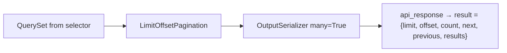

# 📄 Pagination & filtering

> How list endpoints return pages inside the [API envelope](api-envelope.md), and how filters stay in **selectors** (or explicit FilterSets) instead of fat views.
>
> Helpers live in `{{cookiecutter.project_slug}}/api/pagination.py`.

---

## 🎯 Why custom helpers?

DRF’s default pagination response is a bare object (`count`, `next`, `results`, …). This project wraps **everything** in `{ success, status, result, messages }`, so pagination subclasses `get_paginated_response` to put the page metadata **inside `result`**.



---

## 📦 Paginated success shape

```json
{
  "success": true,
  "status": 200,
  "result": {
    "limit": 10,
    "offset": 0,
    "count": 42,
    "next": "http://localhost:8000/api/v1/blogs/posts/?limit=10&offset=10",
    "previous": null,
    "results": [
      { "id": 1, "title": "…" }
    ]
  },
  "messages": {}
}
```

| Field | Meaning |
|-------|---------|
| `limit` | Page size used for this response |
| `offset` | Starting index |
| `count` | Total rows matching the queryset (before slice) |
| `next` / `previous` | Absolute URLs or `null` |
| `results` | Serialized page items |

Frontends can build their own pager from `limit` / `offset` / `count` without parsing Link headers.

---

## 🧱 `LimitOffsetPagination`

```python
# api/pagination.py
class LimitOffsetPagination(_LimitOffsetPagination):
    default_limit = 10
    max_limit = 50
```

| Setting | Default | Notes |
|---------|---------|-------|
| `default_limit` | `10` | Used when client omits `limit` |
| `max_limit` | `50` | Caps abusive `?limit=100000` |

Query params (DRF limit/offset style):

```http
GET /api/v1/blogs/posts/?limit=20&offset=40
```

### Per-view overrides

```python
class PostListApi(ApiAuthMixin, APIView):
    class Pagination(LimitOffsetPagination):
        default_limit = 20
        max_limit = 100
```

---

## 🛠️ Helper functions

| Helper | Serializer context | When to use |
|--------|-------------------|-------------|
| `get_paginated_response(...)` | none | Items need no `request` (no absolute media URLs) |
| `get_paginated_response_context(...)` | `{"request": request}` | Avatars, absolute links, anything using `request.build_absolute_uri` |

Both:

1. Instantiate your pagination class  
2. `paginate_queryset(...)`  
3. Serialize the page with `many=True`  
4. Return `paginator.get_paginated_response(...)` → envelope  

If pagination returns `None` (unusual with these settings), helpers fall back to `api_response(data=serializer.data)` for the full queryset.

### Full example

```python
from rest_framework.views import APIView

from {{cookiecutter.project_slug}}.api.mixins import ApiAuthMixin
from {{cookiecutter.project_slug}}.api.pagination import (
    LimitOffsetPagination,
    get_paginated_response_context,
)
from {{cookiecutter.project_slug}}.blogs.selector.blogs_selectors import list_published_posts


class PostsListApi(ApiAuthMixin, APIView):
    class Pagination(LimitOffsetPagination):
        default_limit = 20

    @extend_schema(tags=BLOGS_TAGS, summary="List published posts", responses=PostOutputSerializer)
    def get(self, request):
        qs = list_published_posts(author_id=request.query_params.get("author_id"))
        return get_paginated_response_context(
            pagination_class=self.Pagination,
            serializer_class=PostOutputSerializer,
            queryset=qs,
            request=request,
            view=self,
        )
```

**Selector returns the queryset; the API only paginates and serializes.** Do not build filters + `[:10]` slicing inside the view.

---

## 🔎 Filtering

`config/settings/drf.py` enables:

```python
"DEFAULT_FILTER_BACKENDS": ("django_filters.rest_framework.DjangoFilterBackend",),
```

That helps **generic views / viewsets** that declare `filterset_class`. With plain `APIView` (this template’s default style), you still own the wiring — prefer one of these patterns:

### Pattern A — selector kwargs (preferred for clarity)

```python
# selector
def list_published_posts(*, author_id: int | None = None) -> QuerySet[Post]:
    qs = Post.objects.filter(status="published").select_related("author")
    if author_id is not None:
        qs = qs.filter(author_id=author_id)
    return qs.order_by("-created_at")

# API
author_id = request.query_params.get("author_id")
qs = list_published_posts(author_id=int(author_id) if author_id else None)
```

Validate/coerce query params with a small input serializer if they get complex.

### Pattern B — `FilterSet` + selector base queryset

```python
class PostFilter(django_filters.FilterSet):
    author = django_filters.NumberFilter(field_name="author_id")

    class Meta:
        model = Post
        fields = ["author"]

# in the view
qs = list_published_posts()  # base QS from selector
qs = PostFilter(request.query_params, queryset=qs).qs
return get_paginated_response_context(...)
```

Keep the **base** queryset (and `select_related`) in the selector so FilterSet does not become a second ORM layer with N+1s.

### Ordering / search

Add per-view when needed:

```python
from rest_framework.filters import OrderingFilter, SearchFilter

class PostsListApi(ApiAuthMixin, APIView):
    filter_backends = [OrderingFilter, SearchFilter]
    ordering_fields = ["created_at", "title"]
    search_fields = ["title", "body"]
```

With `APIView`, you must invoke backends yourself or stick to selector kwargs. Document query params in `@extend_schema` (`parameters=...`) so Swagger stays honest — see [Swagger](swagger.md).

---

## ❌ Anti-patterns

| Anti-pattern | Fix |
|--------------|-----|
| `return Response(paginator.get_paginated_response(...).data)` without envelope | Use project `LimitOffsetPagination` / helpers |
| `Model.objects.all()[offset:offset+limit]` in the view | Selector + pagination helper |
| Loading all rows then slicing in Python | DB-level pagination via DRF paginator |
| Filter logic copied into 3 views | One selector / FilterSet |
| `max_limit` removed “so mobile can load everything” | Cap limits; offer export endpoints if needed |

---

## ✅ Checklist: list endpoint

1. Selector returns optimized `QuerySet`  
2. Optional filters via kwargs or FilterSet on that QS  
3. `get_paginated_response_context` (or non-context variant)  
4. Output serializer only — no input passwords on list  
5. `@extend_schema` documents response + query params  
6. API test: `result.results`, `result.count`, `limit`/`offset`  

---

## 🔗 Related docs

| Doc | Why |
|-----|-----|
| [API envelope](api-envelope.md) | Outer JSON shape |
| [Selectors](selectors.md) | Where querysets come from |
| [APIs](apis.md) | View patterns |
| [Swagger](swagger.md) | Documenting query params |
