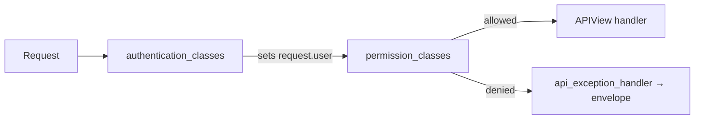

# 🔐 Permissions

> How endpoints decide **who may call them**: DRF authentication classes, permission classes, and the project’s `ApiAuthMixin`.
>
> Authentication answers “who is this?” — permissions answer “are they allowed?”. Keep both out of serializers and selectors.

---

## 🎯 Mental model



| Concept | Meaning in this project |
|---------|-------------------------|
| Authentication | JWT Bearer or session cookie → populate `request.user` |
| Permission | Usually `IsAuthenticated` via `ApiAuthMixin`; custom classes for roles/ownership |
| Public endpoint | No `ApiAuthMixin` — unauthenticated clients may call it (still throttled when needed) |

---

## ⚙️ Defaults in settings

`config/settings/drf.py` sets a **default authentication class**, but does **not** set a global `DEFAULT_PERMISSION_CLASSES = [IsAuthenticated]`.


```python
"DEFAULT_AUTHENTICATION_CLASSES": (
    "rest_framework_simplejwt.authentication.JWTAuthentication",
),
```

```python
"DEFAULT_AUTHENTICATION_CLASSES": (
    "rest_framework.authentication.SessionAuthentication",
),
```


That means:

| View style | Effect |
|------------|--------|
| Plain `APIView` (register, login, …) | Auth may run if credentials are present, but **anonymous access is allowed** (DRF default permission is `AllowAny`) |
| `ApiAuthMixin` + `APIView` | Must be authenticated (`IsAuthenticated`) |

**Every protected endpoint must opt in** with `ApiAuthMixin` (or explicit `permission_classes`). Do not assume “defaults make everything private”.

---

## 🧩 `ApiAuthMixin`

Defined in `{{cookiecutter.project_slug}}/api/mixins.py`:

```python
class ApiAuthMixin:

    authentication_classes = [JWTAuthentication]

    authentication_classes = [SessionAuthentication]

    permission_classes = (IsAuthenticated,)
```

### Usage

```python
from {{cookiecutter.project_slug}}.api.mixins import ApiAuthMixin
from rest_framework.views import APIView


class UsersProfileApi(ApiAuthMixin, APIView):
    def get(self, request):
        # request.user is a real BaseUser
        ...
```

Mixin order: put `ApiAuthMixin` **before** `APIView` (standard Python MRO for attribute lookup).

### What it guarantees

| Guarantee | Detail |
|-----------|--------|
| Anonymous denied | `IsAuthenticated` → 401/403 via DRF, then normalized by [API envelope](api-envelope.md) |
| Auth mechanism matches generation | JWT **or** session — same as project cookiecutter choice |
| `request.user` usable in handlers | Safe to pass into selectors/services |

### Public endpoints — do **not** use the mixin

| Endpoint type | Examples |
|---------------|----------|
| Login / refresh / verify | Auth token issuance |
| Register | Creating an account |
| Password reset request/confirm | Recovery without a session/token |
| Health | Liveness for probes |

Those classes inherit bare `APIView` and usually add [throttling](throttling.md).

---

## 🛠️ Custom permission classes

When `IsAuthenticated` is not enough (owner-only, staff-only, role flags):

1. Put the class in the domain app — e.g. `users/permissions.py` or next to the feature under `apis/`  
2. Compose on the view  
3. Keep logic out of serializers / selectors / services (services may still enforce domain invariants; permissions gate HTTP)

```python
# blogs/permissions.py
from rest_framework.permissions import BasePermission


class IsPostAuthor(BasePermission):
    def has_object_permission(self, request, view, obj):
        return obj.author_id == request.user.id
```

```python
class PostDetailApi(ApiAuthMixin, APIView):
    permission_classes = (*ApiAuthMixin.permission_classes, IsPostAuthor)

    def get(self, request, post_id):
        post = get_post(post_id=post_id)  # selector
        self.check_object_permissions(request, post)
        ...
```

For list endpoints, filter in a **selector** (`list_posts_for_user(user=...)`) instead of returning foreign rows and hoping the client ignores them.

### Object permissions require an explicit check

`has_object_permission` runs automatically for generic views that call `get_object()`. With plain `APIView`, call `self.check_object_permissions(request, obj)` after loading the object.

---

## 👤 Admin vs API

| Surface | Gate |
|---------|------|
| Django admin | `is_staff` / `is_superuser` (Django admin auth) |
| API | `ApiAuthMixin` + your permission classes |

`is_admin` / `is_staff` on `BaseUser` does **not** automatically unlock API routes. Add something like `IsAdminUser` if you need staff-only APIs.

---

## 🍪 CSRF notes


JWT clients send `Authorization: Bearer …` and are **not** subject to CSRF the way cookie session POSTs are.

If you later add browser cookie/session endpoints alongside JWT, unsafe methods (`POST` / `PATCH` / `PUT` / `DELETE`) need a valid CSRF token for those session views.

This project uses **session authentication**. Browser clients that send the session cookie must also send a valid **CSRF token** on unsafe methods (`POST` / `PATCH` / `PUT` / `DELETE`).

Typical flow:

1. Obtain CSRF cookie (Django `ensure_csrf_cookie` or a small bootstrap endpoint / login page)  
2. Send header `X-CSRFToken: <token>` (or form field) with the session cookie on mutating requests  

API tests using DRF’s `APIClient` often call `client.force_authenticate(user=...)` or `client.login(...)` plus CSRF handling helpers — mirror what your frontend does.


---

## 🧪 Testing permissions

| Case | Expectation |
|------|-------------|
| No credentials on `ApiAuthMixin` view | 401 or 403 (envelope `success=false`) |
| Valid credentials | Handler runs |
| Custom `IsPostAuthor` with other user’s object | Denied |
| Public register without auth | 201/400 from validation, not auth failure |

Prefer `reverse("users:profile")` in tests — see [URLs](urls.md).

---

## ❌ Anti-patterns

| Anti-pattern | Fix |
|--------------|-----|
| Checking `if not request.user.is_authenticated` deep inside a service as the only gate | Prefer permission classes at the HTTP boundary |
| Encoding “is owner?” only in serializer `validate()` | Permission class + selector filtering |
| Forgetting `ApiAuthMixin` on a sensitive view | Default is AllowAny — **opt in** |
| Assuming admin staff flags imply API access | Explicit permission class |
| Duplicating JWT/session setup on every view | Use `ApiAuthMixin` |

---

## ✅ Checklist: protecting a new endpoint

1. Inherit `ApiAuthMixin` (or set `authentication_classes` + `permission_classes`)  
2. Add object/role permissions if needed  
3. Load objects via selectors; call `check_object_permissions` when using `APIView`  
4. Document auth requirement in `@extend_schema` / team notes  
5. Add an unauthenticated API test that expects denial  

---

## 🔗 Related docs

| Doc | Why |
|-----|-----|
| [Authentication](authentication.md) | How tokens/sessions are issued |
| [APIs](apis.md) | Where to attach the mixin |
| [API envelope](api-envelope.md) | Shape of 401/403 responses |
| [Throttling](throttling.md) | Public endpoint abuse control |
| [Swagger](swagger.md) | Trying auth in Swagger UI |
