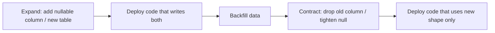

# 🗄️ Migrations

> How to evolve the schema safely in an enterprise / zero-downtime style.
>
> App label = plural package name (`users`, `blogs`, …). Commands: `make makemigrations` / `make migrate`.

---

## 🎯 Rules

| Rule | Why |
|------|-----|
| Never edit a migration that already shipped to shared envs | Breaks history for other developers/CI/prod |
| Prefer expand → migrate → contract | Avoids locking / breaking old app versions mid-deploy |
| Name constraints explicitly | Stable integrity mapping + clearer ops |
| DB constraints remain source of truth | See [Models](../layers/models.md) / [Validation](../http/validation-and-errors.md) |



---

## ✅ Safe patterns

### Adding a required field

1. Add column as **nullable** (or with DB default)
2. Deploy code that writes the new field
3. Backfill existing rows (management command / data migration)
4. Add `NOT NULL` / remove default in a **new** migration
5. Deploy code that assumes non-null

### Renaming / replacing a column

1. Add new column
2. Dual-write in the service layer
3. Backfill
4. Switch reads to the new column
5. Drop old column in a later release

### Removing a field

1. Stop writing in code (deploy)
2. Remove from models + migration that drops column (after old app versions are gone)

---

## ❌ Unsafe patterns

| Pattern | Risk |
|---------|------|
| Rewrite `0001_initial.py` after merge | Divergent DBs |
| Drop column in the same release that still reads it | 500s during rolling deploys |
| Huge table rewrite without lock strategy | Production outage |
| Relying only on serializer uniqueness without DB unique | Race conditions |

---

## 🧪 Local / CI

```bash
python manage.py makemigrations
python manage.py migrate
python manage.py makemigrations --check --dry-run   # CI-friendly: fail if models drifted
```

Tests use `config.django.test` (SQLite locally or Postgres in CI). Prefer Postgres in CI for constraint/`pgcode` fidelity — see [Testing](testing.md).

---

## 🔗 Related

| Doc | Why |
|-----|-----|
| [Models](../layers/models.md) | Constraints & `BaseModel` |
| [Services](../layers/services.md) | Integrity mapping on writes |
| [Docker & production](docker-and-production.md) | Migrate in deploy |
| [Enterprise extensions](../structure/enterprise-extensions.md) | Soft delete / audit extras |
