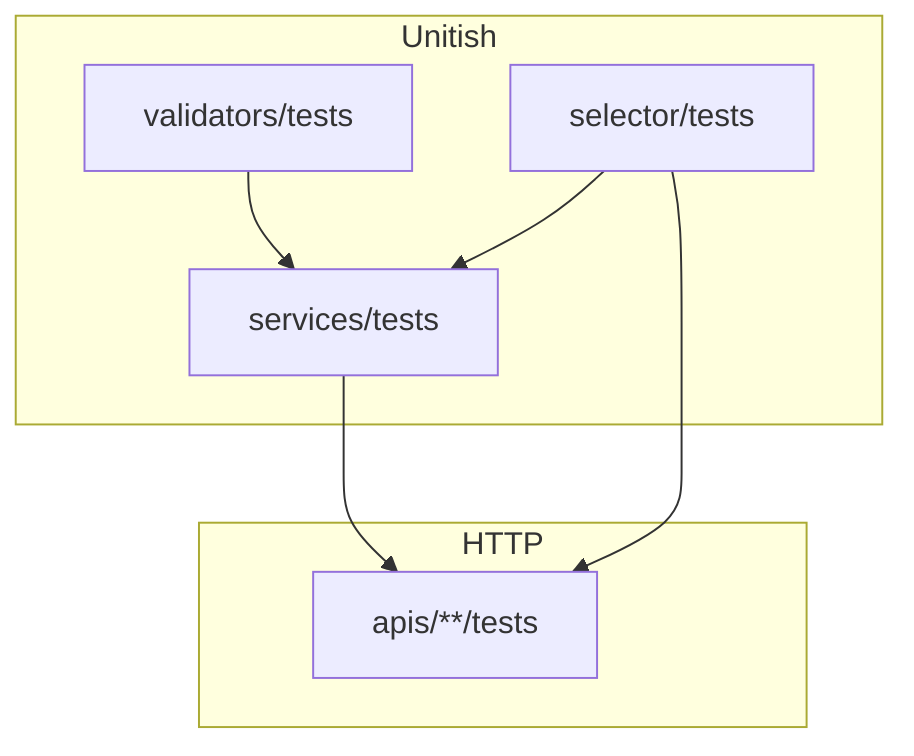

# 🧪 Testing


> This project was generated **with pytest**. Settings module: `config.django.test` (see `pytest.ini`).

> This project was generated **without** testing tooling. The layout below is still the style to follow if you add pytest later (`pytest.ini`, factories, layer tests).

>
> Test **next to the code they protect**: `services/tests/`, `selector/tests/`, `apis/.../tests/`, `validators/tests/`.

---

## 🎯 Principles

| Principle | Detail |
|-----------|--------|
| Mirror layers | Service tests don’t need HTTP; API tests don’t re-test every validator path in isolation |
| Use factories | Prefer `BaseUserFactory` over hand-built model graphs |
| Assert the envelope | API tests check `success`, `status`, `result`, `messages` — see [API envelope](../http/api-envelope.md) |
| Prefer `reverse()` | Stable names from [URLs](../layers/urls.md) |
| DB access | Mark with `@pytest.mark.django_db` (or fixtures that pull `db`) |



---


## ▶️ Running tests

```bash
pytest
pytest -q
pytest {{cookiecutter.project_slug}}/users -q
make test
```

### `pytest.ini`

```ini
[pytest]
DJANGO_SETTINGS_MODULE = config.django.test
python_files = tests.py test_*.py *_tests.py
addopts = --cov={{cookiecutter.project_slug}} --cov-report=term-missing --cov-fail-under=60
```

| Item | Meaning |
|------|---------|
| `config.django.test` | Fast hashers, quiet logs, eager Celery (if enabled), SQLite or Postgres |
| Coverage | Fails under 60% on the project package — raise the bar as the suite grows |

### Database in tests

From `config/django/test.py`:

- If `DATABASE_URL` is set → use that DB (**CI uses Postgres**)
- Else → SQLite file `db.sqlite3` for quick local runs

Integrity mapping is exercised more realistically on Postgres (pgcodes); SQLite still covers many paths via message fallback.

## ▶️ Running tests

Testing was not enabled at generation. To add it:

1. Add pytest + pytest-django (+ factory-boy, coverage as needed) to requirements
2. Add `pytest.ini` with `DJANGO_SETTINGS_MODULE = config.django.test`
3. Ensure `config/django/test.py` exists (ships with the template)
4. Re-scaffold apps with `start_domain_app … --force` or create test folders manually


---

## Fixtures

### Project root — `{{cookiecutter.project_slug}}/conftest.py`

```python
@pytest.fixture
def api_client() -> APIClient:
    return APIClient()
```

### Users app — `users/conftest.py`

```python
@pytest.fixture
def user(db):
    return BaseUserFactory()


@pytest.fixture
def auth_client(user) -> APIClient:
    client = APIClient()
    client.force_authenticate(user=user)
    return client
```

`force_authenticate` bypasses JWT/session plumbing for API tests — fine for permission/handler tests. Add a separate test that hits real login when you care about the auth integration path.

---

## 🏭 Factories

```python
# users/tests/user_factories.py
class BaseUserFactory(factory.django.DjangoModelFactory):
    class Meta:
        model = BaseUser
        skip_postgeneration_save = True

    email = factory.Sequence(lambda n: f"user{n}@example.com")

    @classmethod
    def _create(cls, model_class, *args, **kwargs):
        password = kwargs.pop("password", "Password1!x")
        return model_class.objects.create_user(password=password, **kwargs)
```

| Practice | Why |
|----------|-----|
| Use `create_user` | Same hashing / normalization as production |
| Default password meets validators | Avoid unrelated validation failures |
| Sequence emails | Unique constraint friendly |
| `start_domain_app` stubs | Commented factory template under `tests/<app>_factories.py` |

Profile rows appear via the [user signal](../layers/signals.md) when the user is created.

---

## 📂 Where to put tests

| Layer | Path | Assert |
|-------|------|--------|
| Validators | `validators/tests/` | Codes + messages for bad inputs |
| Selectors | `selector/tests/` | Returned instances / queryset contents / URL shapes |
| Services | `services/tests/` | Writes, domain `ValidationError`, integrity |
| APIs | `apis/<feature>/tests/` | HTTP status + envelope + auth/throttle behavior |
| App smoke | `tests/test_app.py` | AppConfig importable (scaffold) |
| Cross-cutting | e.g. `common/db/integrity/tests/` | Integrity mapping |
| Config | `config/tests/` | Request ID middleware, etc. |

`start_domain_app` creates placeholder tests when pytest is present — replace `assert True` stubs as features land.

---

## ✍️ Example styles

### Service

```python
@pytest.mark.django_db
def test_change_password_rejects_wrong_current(user):
    with pytest.raises(ValidationError) as exc:
        change_password(user=user, current_password="wrong", new_password="Password1!x")
    assert "current_password" in exc.value.message_dict
```

### API (envelope)

```python
@pytest.mark.django_db
def test_profile_requires_auth(api_client):
    url = reverse("users:profile")
    response = api_client.get(url)
    assert response.status_code in (401, 403)
    assert response.data["success"] is False


@pytest.mark.django_db
def test_profile_ok(auth_client):
    url = reverse("users:profile")
    response = auth_client.get(url)
    assert response.status_code == 200
    assert response.data["success"] is True
    assert "email" in response.data["result"]
```

### Validator

```python
def test_password_requires_number():
    with pytest.raises(ValidationError) as exc:
        validate_password_number("Password!")
    assert exc.value.code == UserErrorCode.PASSWORD_MISSING_NUMBER
```

---

## 🧰 Test settings reminders

| Behavior | Source |
|----------|--------|
| Fast password hashing | `PASSWORD_HASHERS = [MD5…]` in `test.py` |
| No log files | `LOG_TO_FILE = False` |

| Celery inline | `CELERY_TASK_ALWAYS_EAGER = True` |

| LocMem cache | Throttles are per-process in tests — don’t assert strict multi-worker limits |

---

## ❌ Anti-patterns

| Anti-pattern | Fix |
|--------------|-----|
| One mega-`tests.py` for the whole app | Layer/feature folders |
| Only testing serializers in isolation forever | Add service + API coverage for critical paths |
| Hard-coded `/api/v1/...` everywhere | `reverse("users:profile")` |
| Ignoring `messages` / `code` in API asserts | Clients depend on codes |
| Using production settings in pytest | Always `config.django.test` |
| Creating users with raw `BaseUser(...)` + `save()` | Factory / `create_user` |

---

## ✅ Checklist: new feature tests

1. Validator/unit tests for new rules
2. Service tests for writes + domain errors
3. API tests: authz, validation envelope, happy path
4. Factory updates if new models appear
5. Coverage still meets threshold locally / CI

---

## 🔗 Related docs

| Doc | Why |
|-----|-----|
| [Settings](settings.md) | `config.django.test` |
| [Domain apps](../structure/domain-apps.md) | Scaffolded test stubs |
| [API envelope](../http/api-envelope.md) | Assert shapes |
| [Services](../layers/services.md) / [APIs](../layers/apis.md) | What to cover |
| [Docker & production](docker-and-production.md) | CI/Compose runtime |
| [Commands](commands.md) | `make test` and related entrypoints |
