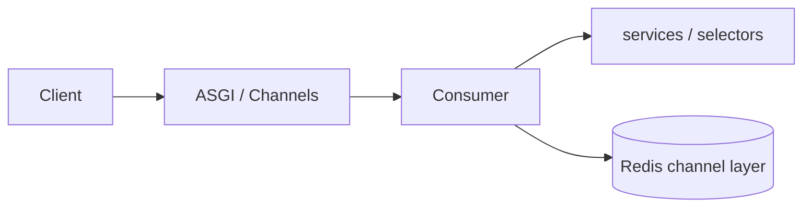

# 🔌 WebSockets (Django Channels)


> This project was generated **with Django Channels** (requires ASGI + Redis).

---

## 🎯 Layout

| Piece | Location |
|-------|----------|
| ASGI | `config/asgi.py` |
| Channel layer settings | `config/settings/channels.py` |
| WS URL routes | `{{cookiecutter.project_slug}}/core/routing.py` → `websocket_urlpatterns` |
| Consumers | Prefer `{{cookiecutter.project_slug}}/<app>/consumers/` or `core/` for system sockets |

```python
# core/routing.py
websocket_urlpatterns = [
    # path("ws/example/", ExampleConsumer.as_asgi()),
]
```

---

## ✅ Conventions

| Rule | Detail |
|------|--------|
| Auth | Authenticate the socket (session/JWT query or middleware) before joining groups |
| Authorization | Same as HTTP — don’t leak other users’ events |
| Business logic | Call **services** / **selectors**; keep consumers thin |
| Payloads | Prefer small JSON events; don’t invent a second envelope without documenting it |
| Scaling | Redis channel layer; sticky or shared layer required for multi-instance |



---

## ❌ Anti-patterns

| Anti-pattern | Fix |
|--------------|-----|
| Fat consumer with ORM writes | Service layer |
| Trusting client-supplied user id in the message | Bind to authenticated user |
| Blocking long CPU work in the consumer | Offload to [Celery](celery.md) |

---

## 🔗 Related

| Doc | Why |
|-----|-----|
| [Permissions](../http/permissions.md) / [Security](../http/security.md) | Authz mindset |
| [Services](../layers/services.md) | Writes |
| [Docker & production](docker-and-production.md) | ASGI deployment |


> WebSockets / Channels were **not** enabled at generation (`use_websockets=n`).
>
> Enabling later requires ASGI + Redis + `channels` settings and routes under `core/routing.py`. Prefer regenerating with `use_websockets=y` early if realtime is a core requirement.

