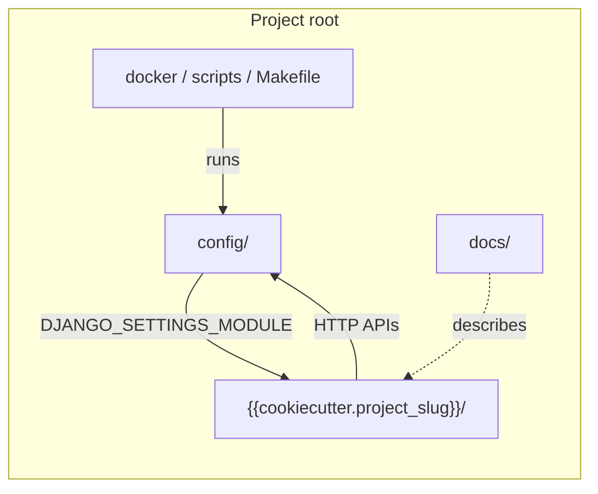
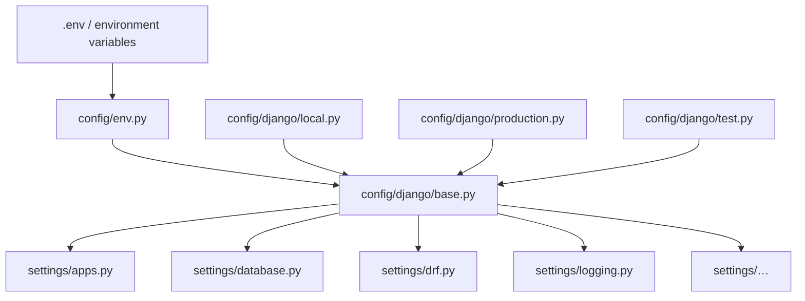

# 🗂️ Project structure

> **Source of truth** for what lives at the repository root, inside `config/`, and inside the Python package `{{cookiecutter.project_slug}}/`.
>
> If a file does not fit any box below, stop and decide whether it is **wiring**, **platform**, or **domain** — see [Architecture](architecture.md).

---

## 🎯 Mental model

```text
{{cookiecutter.project_name}}/          ← deployable project (Compose, docs, requirements)
├── config/                         ← Django project wiring (settings, root urls, ASGI/WSGI)
├── {{cookiecutter.project_slug}}/          ← Python package: platform apps + domain apps
├── docker/ + compose files         ← how it runs in containers
├── docs/                           ← human + agent reference (this style guide)
└── manage.py / Makefile / scripts  ← operator entrypoints
```



| Area | Question it answers |
|------|---------------------|
| `config/` | *How is Django configured and mounted?* |
| `{{cookiecutter.project_slug}}/` | *Where is product + platform code?* |
| `docker*` / `start-dev-services.sh` | *How do we run infra and production?* |
| `docs/style-guide/` | *How must new code be written?* |

---

## 📁 Full tree (annotated)

```text
{{cookiecutter.project_name}}/
├── config/
│   ├── django/                 # settings *entrypoints* (local / production / test)
│   │   ├── base.py             # imports all config/settings/* slices
│   │   ├── local.py
│   │   ├── production.py
│   │   └── test.py
│   ├── settings/               # modular settings *slices* (one concern per file)
│   │   ├── apps.py
│   │   ├── auth.py
│   │   ├── database.py
│   │   ├── drf.py
│   │   ├── swagger.py
│   │   ├── logging.py
│   │   └── …                   # cors, security, jwt, celery, …
│   ├── urls.py                 # admin + /api/v1/ + DEBUG Swagger
│   ├── env.py                  # env helpers (django-environ style)
│   ├── request_id.py           # X-Request-ID middleware + log filter
│   ├── logging_formatters.py
│   ├── asgi.py / wsgi.py
│   ├── celery.py               # Celery app factory (if enabled at generation)
│   └── tasks.py
│
├── {{cookiecutter.project_slug}}/          # installable Django apps live here
│   ├── api/                    # /api/v1/ router, ApiAuthMixin, pagination helpers
│   ├── core/                   # health, ApplicationError, channels routing hooks
│   ├── common/                 # platform: http envelope, integrity, BaseModel, helpers
│   ├── commands/               # management commands (devserver, start_domain_app)
│   ├── users/                  # identity domain (reference app)
│   ├── utils/                  # thin shared helpers / test bases (keep small)
│   └── conftest.py             # pytest root fixtures (if testing enabled)
│
├── docker/                     # Dockerfiles + nginx/traefik configs
├── docker-compose.yml          # production stack
├── docker-compose.dev.yml      # local Postgres / Redis / … only
├── start-dev-services.sh       # convenience wrapper for dev Compose
│
├── docs/
│   ├── README.md
│   └── style-guide/            # coding conventions (you are here)
│
├── logs/                       # runtime logs (.gitkeep kept; files gitignored)
├── scripts/                    # e.g. update_translations.sh
├── requirements/               # base.txt, local.txt, production.txt
├── requirements.txt            # prod-oriented meta file
├── requirements_dev.txt        # local + tools
├── manage.py
├── Makefile

├── pytest.ini


├── pyproject.toml              # Ruff / tool config
├── .pre-commit-config.yaml

└── .env.example                # copy to .env for local runs
```

---

## ⚙️ `config/` — project wiring

Django needs a settings module and a root URLconf. This template splits them so files stay reviewable.

### Settings composition



| Entrypoint | When to use |
|------------|-------------|
| `config.django.local` | Local `runserver` / `devserver` |
| `config.django.production` | Docker Compose production image |
| `config.django.test` | `pytest` and CI |

Set via `DJANGO_SETTINGS_MODULE` (see `.env.example`).

### What each settings slice usually owns

| Module | Owns |
|--------|------|
| `apps.py` | `LOCAL_APPS`, `THIRD_PARTY_APPS`, `INSTALLED_APPS` |
| `auth.py` | `AUTH_USER_MODEL`, `AUTH_PASSWORD_VALIDATORS` |
| `database.py` | Database from `DATABASE_URL` |
| `drf.py` | REST framework defaults, exception handler, throttle rates |
| `swagger.py` | `SPECTACULAR_SETTINGS` |
| `logging.py` | Logging dictConfig |
| `jwt.py` | SimpleJWT (only if JWT was selected at generation) |
| `security.py` / `cors.py` / `sessions.py` | Cookies, HTTPS flags, CORS |
| `celery.py` / `channels.py` / `sentry.py` | Optional stacks |

**Rule:** new deploy-time knobs go in a settings slice + `.env.example`, not in domain `constants.py`. See [Constants](constants.md) vs [Settings](settings.md).

### Other important `config/` modules

| File | Role |
|------|------|
| `urls.py` | Mounts admin, `/api/v1/`, DEBUG-only schema UI — see [URLs](urls.md) |
| `request_id.py` | Middleware that sets `X-Request-ID` and attaches it to logs |
| `celery.py` | Celery application object (imported early when Celery is enabled) |

---

## 📦 `{{cookiecutter.project_slug}}/` — code package

Everything importable as `{{cookiecutter.project_slug}}.*` lives here. Apps are registered with **full `AppConfig` paths**:

```python
# config/settings/apps.py
LOCAL_APPS = [
    "{{cookiecutter.project_slug}}.core.apps.CoreConfig",
    "{{cookiecutter.project_slug}}.common.apps.CommonConfig",
    "{{cookiecutter.project_slug}}.commands.apps.CommandsConfig",
    "{{cookiecutter.project_slug}}.users.apps.UsersConfig",
    # "{{cookiecutter.project_slug}}.blogs.apps.BlogsConfig",
]
```

### Built-in apps (do not reinvent)

| App | Kind | Responsibility |
|-----|------|----------------|
| `api` | Platform HTTP | Versioned include router, `ApiAuthMixin`, pagination helpers |
| `core` | Platform / system | Health endpoint, `ApplicationError`, optional Channels routing |
| `common` | Platform library | Envelope, integrity mapping, `model_*` helpers, `BaseModel`, generic validators |
| `commands` | Tooling | `devserver`, `start_domain_app` |
| `users` | **Domain** (reference) | Auth, register, profile, password policy |
| `utils` | Thin shared | Test bases / tiny helpers — prefer domain or `common` when something grows |

### Reserved names

`start_domain_app` rejects these labels (they collide with the template):

`api`, `common`, `commands`, `config`, `core`, `django`, `manage`, `test`, `tests`

Pick a **plural domain** name instead (`blogs`, `orders`, …) — see [Domain apps](domain-apps.md).

---

## 🐳 Ops & tooling at the root

| Path | Purpose |
|------|---------|
| `docker-compose.dev.yml` + `start-dev-services.sh` | Local Postgres / Redis / RabbitMQ / pgAdmin without running the app in Docker |
| `docker-compose.yml` + `docker/` | Production-like full stack |
| `requirements/` | Split deps: base / local / production |
| `Makefile` | Shortcuts: `make up`, `make test`, `make lint`, … |
| `scripts/` | Non-Django shell helpers (translations, …) |
| `logs/` | File logs when `LOG_TO_FILE=true` |

Details: [Docker & production](docker-and-production.md), [Commands](commands.md), [Logging](logging.md).

---

## 📚 Documentation layout

| Path | Audience | Contents |
|------|----------|----------|
| Root `README.md` | Anyone cloning the generated project | Quick start, stack, links into docs |
| `docs/README.md` | Docs index | Pointer to the style guide |
| `docs/style-guide/` | Devs + agents | **How to write code** in this repo |

Keep long conventions out of the root README — link here instead.

---

## ✅ Where should a new file go?

| You are adding… | Put it in… |
|-----------------|------------|
| A product feature (posts, orders) | New domain app under `{{cookiecutter.project_slug}}/<plural>/` via `start_domain_app` |
| A reusable HTTP helper used by many apps | `api/` (pagination-style) or `common/http/` |
| A generic pure validator / integrity concern | `common/` |
| A setting read from the environment | `config/settings/<slice>.py` + `.env.example` |
| A management command | `commands/management/commands/` |
| Operator docs for running the stack | Root README (short) or `docs/` (long) |
| Style / coding rules | `docs/style-guide/` |

---

## 🔗 Related docs

| Doc | Why |
|-----|-----|
| [Architecture](architecture.md) | Layer responsibilities |
| [Domain apps](domain-apps.md) | Per-app folder layout + scaffold |
| [URLs](urls.md) | How HTTP paths are wired |
| [Settings](settings.md) | Settings slices in depth |
