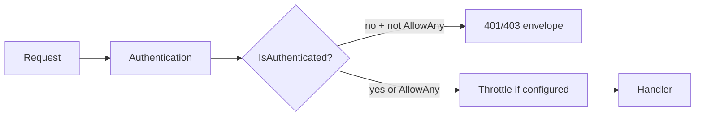

# 🔒 Security

> Security baseline for this blueprint: **deny-by-default APIs**, secrets handling, DEBUG boundaries, auth/CSRF, throttling, and safe health checks.
>
> Pair with [Permissions](permissions.md), [Authentication](authentication.md), [Throttling](throttling.md), and [Docker & production](docker-and-production.md).

---

## 🎯 Principles

| Principle | In this project |
|-----------|-----------------|
| Deny by default | `DEFAULT_PERMISSION_CLASSES = [IsAuthenticated]` — public routes set `AllowAny` explicitly |
| No secrets in git | `.env` local only; strong `SECRET_KEY` in production |
| Least disclosure | Swagger/schema **DEBUG only**; health payload has no hosts/credentials |
| Abuse resistance | Scoped throttles on login/register/password reset |
| Transport security | HTTPS flags + secure cookies in production |



---

## 🔐 API permissions (deny by default)

Configured in `config/settings/drf.py`:

```python
"DEFAULT_PERMISSION_CLASSES": ("rest_framework.permissions.IsAuthenticated",),
```

| Endpoint type | Required |
|---------------|----------|
| Protected | Inherit `ApiAuthMixin` (or keep default `IsAuthenticated`) |
| Public | **Must** set `permission_classes = [AllowAny]` |

Public today: health, register, login/refresh/verify, JWT logout (refresh body), password reset request/confirm.

Forgetting `AllowAny` on a public route → **401** for anonymous clients. That is intentional.

Details: [Permissions](permissions.md).

---

## 🔑 Secrets & settings

| Do | Don’t |
|----|-------|
| Copy `.env.example` → `.env` locally | Commit real `.env` |
| Rotate `SECRET_KEY` per environment | Reuse cookiecutter defaults in production |
| Set `ALLOWED_HOSTS`, `CSRF_TRUSTED_ORIGINS` | Leave `*` in production |
| Use env for DB/Redis/JWT lifetimes | Hard-code production passwords in settings |

---

## 🐛 DEBUG & schema

| Surface | When available |
|---------|----------------|
| Swagger / ReDoc / `/schema/` | `DEBUG=True` only |
| Detailed error internals in API body | Never — handler returns `server_error` |

Do not mount schema UI in production URLconf.

---

## 🍪 Auth-specific notes


- Prefer short **access** lifetime; rotate/blacklist **refresh** (already configured).
- Never log Bearer tokens or put them in query strings.
- Logout blacklists refresh only — access remains valid until expiry (keep access short).

- Session cookie + **CSRF** on unsafe methods for browser clients.
- `SESSION_COOKIE_SECURE` / `CSRF_COOKIE_SECURE` when serving HTTPS.


Password policy is shared between API validators and `AUTH_PASSWORD_VALIDATORS` — see [Validation](validation-and-errors.md).

---

## ⏱️ Throttling

Public auth surfaces must keep scoped rates. Multi-worker production needs a **shared cache** (Redis) so limits are global — see [Throttling](throttling.md).

---

## 🩺 Health endpoint

`GET /api/v1/health/` is **public** (`AllowAny`) for probes. It returns status + latency only — never DEBUG, secret env, or internal hostnames. If you add richer diagnostics, put them behind auth or a private network.

---

## 🐳 Production checklist

1. `DJANGO_SETTINGS_MODULE=config.django.production`  
2. Strong `SECRET_KEY`, tight `ALLOWED_HOSTS`  
3. HTTPS redirect / HSTS / secure cookies  
4. DB not published publicly  
5. Reverse proxy for static/media when selected  
6. No Swagger in prod  
7. Shared Redis for cache/throttles when multi-worker  

Full deploy notes: [Docker & production](docker-and-production.md).

---

## 🔗 Related

| Doc | Why |
|-----|-----|
| [Permissions](permissions.md) | AllowAny vs mixin |
| [Authentication](authentication.md) | Token/session flows |
| [Swagger](swagger.md) | DEBUG-only docs |
| [Enterprise extensions](enterprise-extensions.md) | RBAC, multi-tenant, etc. (not shipped) |
