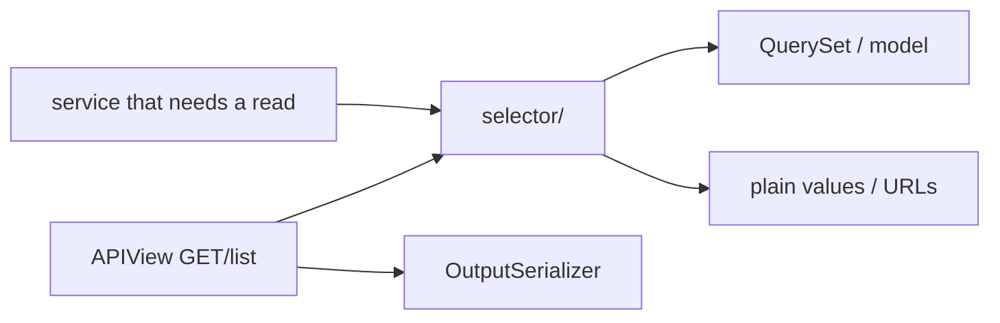

# 🔍 Selectors

> **Read-only** query functions: fetch rows, apply filters/annotations, and derive values for APIs and services.
>
> If a function creates, updates, or deletes as its main job → it belongs in [services](services.md), not here.

---

## 🎯 Why selectors exist

Without selectors, the same ORM spreads across views:

```python
# ❌ logic trapped in the view — hard to reuse / test / optimize
def get(self, request):
    profile = Profile.objects.select_related("user").get(user=request.user)
    ...
```

With selectors, reads have one home:

```python
# ✅
def get(self, request):
    profile = get_profile(user=request.user)
    return api_response(data=UsersProfileOutputSerializer(profile, context={"request": request}).data)
```

| Benefit | Detail |
|---------|--------|
| ♻️ Reuse | Same `get_profile` from GET profile, PATCH profile, and other features |
| 🧪 Testability | Unit-test queries without HTTP |
| ⚡ Performance | `select_related` / `prefetch_related` live next to the query, not forgotten in one view |
| 🤖 Consistency | Agents and humans know “list/filter → selector” |



---

## 📂 Location & naming

```text
users/selector/
├── __init__.py
├── users_selectors.py
└── tests/
    └── test_users_selectors.py
```

`start_domain_app` creates `selector/` with a commented import stub. Add `<app>_selectors.py` (or split by topic when the file grows: `post_selectors.py`, `comment_selectors.py`).

### Function naming

| Pattern | Use for | Example |
|---------|---------|---------|
| `get_*` | One row / one derived value | `get_profile`, `get_avatar_url` |
| `list_*` | Multiple rows / queryset for lists | `list_published_posts` |
| `*_exists` / `has_*` | Boolean checks | `email_exists` (prefer DB unique for enforcement) |

Prefer verbs that read as questions or fetches — not `handle_*` or `process_*` (those sound like writes).

---

## ✍️ Style rules

### 1. Keyword-only arguments

```python
def get_profile(*, user: BaseUser) -> Profile:
    ...
```

Call sites become self-documenting: `get_profile(user=request.user)` — not `get_profile(request.user)` where the meaning of positional args is unclear.

### 2. Return data, never HTTP

| ✅ Return | ❌ Return |
|----------|----------|
| Model instance | `Response` / `api_response` |
| `QuerySet` | DRF serializer instances |
| `str` / `dict` / `bool` / DTO-like structures | Raised permission errors meant for views (usually) |

Serialization stays in the API layer (`OutputSerializer`).

### 3. Put query optimization here

```python
def list_posts_for_feed(*, viewer: BaseUser) -> QuerySet[Post]:
    return (
        Post.objects.filter(status="published")
        .select_related("author")
        .prefetch_related("tags")
        .order_by("-created_at")
    )
```

Do not leave N+1 fixes only inside one `APIView`.

### 4. Type hints

Annotate parameters and return types. Prefer concrete model types over `Any`.

---

## ✅ Real examples from `users`

### `get_profile`

```python
# users/selector/users_selectors.py
def get_profile(*, user: BaseUser) -> Profile:
    profile, _ = Profile.objects.get_or_create(user=user)
    return profile
```

**Why `get_or_create` is allowed here (narrow exception):**  
Every user *should* already have a profile via [signal](signals.md). This call is a **read-path safety net** for legacy/missing rows so `GET /profile/` does not 500. It is not a product “create profile” feature — that invariant still belongs to the signal / registration flow.

Document similar exceptions in a one-line docstring when you add them.

### `get_avatar_url`

```python
def get_avatar_url(*, profile: Profile, request: HttpRequest | None = None) -> str:
    if profile.avatar:
        url = profile.avatar.url
    else:
        url = static(DEFAULT_AVATAR_STATIC_PATH)

    if request is not None:
        return request.build_absolute_uri(url)
    return url
```

| Piece | Role |
|-------|------|
| `DEFAULT_AVATAR_STATIC_PATH` | From [constants](constants.md) — single path source |
| `static(...)` | Resolves staticfiles URL |
| `request.build_absolute_uri` | Absolute URL for API clients when request is present |

Used from output serializers:

```python
# users/apis/users/profile/users_profile_serializers.py
@extend_schema_field(serializers.URLField())
def get_avatar(self, profile: Profile) -> str:
    return get_avatar_url(profile=profile, request=self.context.get("request"))
```

### Called from an authenticated API

```python
# users/apis/users/profile/users_profile_apis.py
class UsersProfileApi(ApiAuthMixin, APIView):
    def get(self, request):
        profile = get_profile(user=request.user)
        return api_response(
            data=UsersProfileOutputSerializer(profile, context={"request": request}).data
        )
```

---

## 🔁 Selectors vs services vs managers

```text
┌──────────────┐
│  selector/   │  READ  — get / list / derive
└──────────────┘
┌──────────────┐
│  services/   │  WRITE — create / update / delete / workflows
└──────────────┘
┌──────────────┐
│  manager/    │  ORM helpers attached to the model (create_user, custom QuerySet)
└──────────────┘
```

| Need | Use |
|------|-----|
| “Fetch profile for this user” | Selector |
| “Update bio/avatar” | Service (may *call* `get_profile`) |
| “Low-level create_user with hashed password” | Manager, wrapped by a service |
| “Paginated list for API” | Selector returns queryset → API pagination helper |

Services **may call selectors** when a write needs a fresh read. Selectors must **not** call services that write (avoids hidden side effects in “read” code).

---

## 🧪 Testing

Place tests under `selector/tests/`.

```python
@pytest.mark.django_db
def test_get_profile_returns_existing_profile(user):
    profile = get_profile(user=user)
    assert profile.user_id == user.id
```

| Assert | Skip |
|--------|------|
| Correct instance / queryset contents | Full HTTP status codes (that’s API tests) |
| Absolute URL shape when `request` is passed | Implementation details of unrelated layers |
| `select_related` behavior if performance-critical | — use `assertNumQueries` when it matters |

---

## 📋 Suggested patterns for list endpoints

```python
# blogs/selector/blogs_selectors.py
def list_published_posts(*, author_id: int | None = None) -> QuerySet[Post]:
    qs = Post.objects.filter(status="published").select_related("author")
    if author_id is not None:
        qs = qs.filter(author_id=author_id)
    return qs.order_by("-created_at")
```

```python
# blogs/apis/posts/posts_apis.py
def get(self, request):
    qs = list_published_posts(author_id=request.query_params.get("author_id"))
    return get_paginated_response(
        pagination_class=LimitOffsetPagination,
        serializer_class=PostOutputSerializer,
        queryset=qs,
        request=request,
        view=self,
    )
```

Filtering that needs `django-filter` can still start from a selector queryset — see [Pagination & filtering](pagination-and-filtering.md).

---

## ❌ Anti-patterns

| Anti-pattern | Why it’s bad | Do this instead |
|--------------|--------------|-----------------|
| ORM list/filter only inside `APIView.get` | Can’t reuse; N+1 appears in one place only | Selector |
| `selector` that calls `.create()` as its purpose | Hidden writes | Service |
| Returning `ModelSerializer(...).data` from a selector | Couples reads to DRF | Return model/QS; serialize in API |
| Positional bag of args | Unreadable call sites | Keyword-only `*` |
| Duplicating the same `filter(...)` in 4 views | Drift | One `list_*` selector |

---

## ✅ Checklist: adding a selector

1. Create or extend `<app>/selector/<app>_selectors.py`  
2. Name it `get_*` / `list_*` with keyword-only args  
3. Add `select_related` / `prefetch_related` as needed  
4. Export from `selector/__init__.py` if it is part of the public app API  
5. Call it from APIs (and services if needed)  
6. Add `selector/tests/…`  

---

## 🔗 Related docs

| Doc | Why |
|-----|-----|
| [Services](services.md) | Writes and when to call selectors |
| [Models](models.md) | What you are querying |
| [APIs](apis.md) | Where selectors are called |
| [Pagination & filtering](pagination-and-filtering.md) | List endpoints |
| [Constants](constants.md) | Static paths used in derived values |
