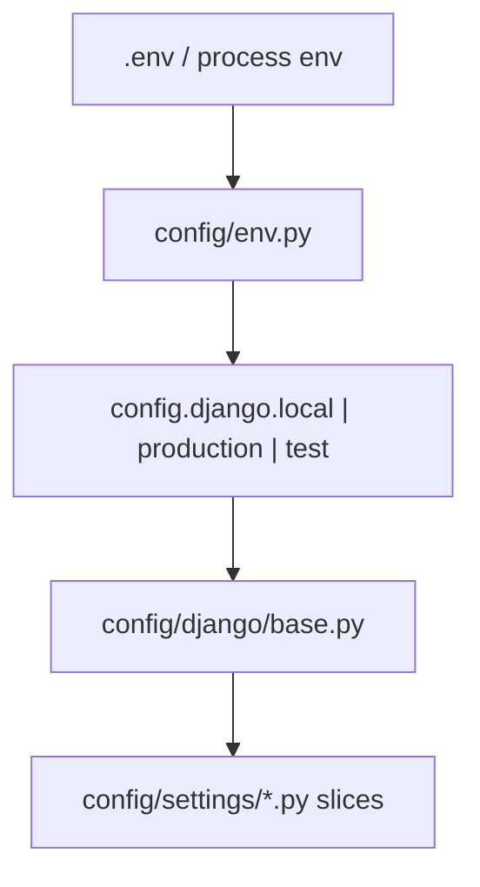
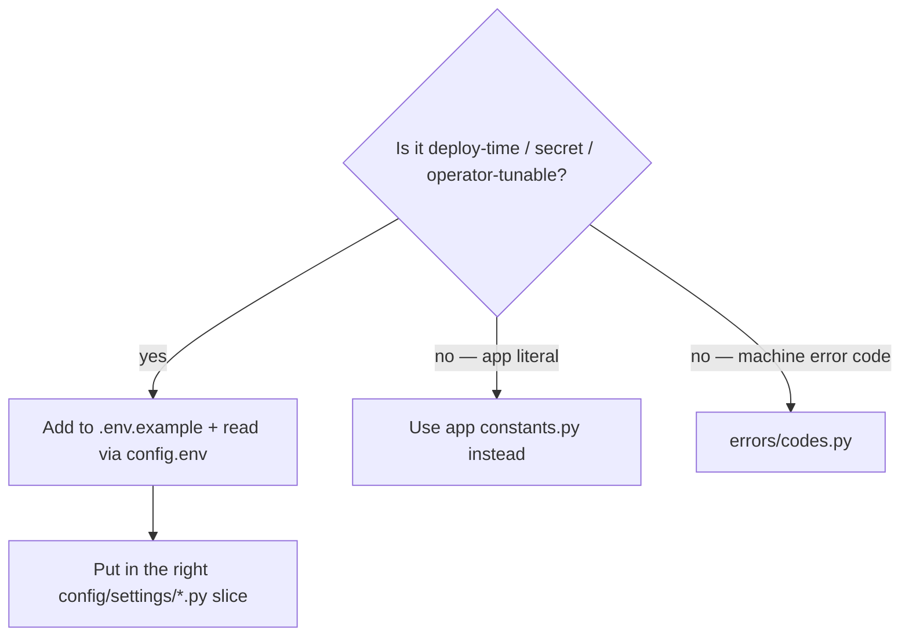

# ⚙️ Settings

> How Django configuration is split, composed, and selected per environment.
>
> There is **no** giant `settings.py`. Slices live in `config/settings/`; entrypoints live in `config/django/`.

---

## 🎯 Mental model



| Layer | Path | Job |
|-------|------|-----|
| Env loader | `config/env.py` | `environ.Env`, `BASE_DIR`, reads `.env` |
| Entrypoint | `config/django/{local,production,test}.py` | Env-specific overrides (`DEBUG`, DB, logging, Celery eager, …) |
| Aggregator | `config/django/base.py` | Imports every settings slice |
| Slices | `config/settings/*.py` | One concern per file |

Set the active module with:

```bash
export DJANGO_SETTINGS_MODULE=config.django.local
# production image / Compose:
export DJANGO_SETTINGS_MODULE=config.django.production
# pytest.ini:
DJANGO_SETTINGS_MODULE = config.django.test
```

Copy `.env.example` → `.env` for local values.

---

## 📂 Settings slices (what goes where)

| Module | Owns |
|--------|------|
| `apps.py` | `LOCAL_APPS`, `THIRD_PARTY_APPS`, `INSTALLED_APPS` |
| `auth.py` | `AUTH_USER_MODEL`, `AUTH_PASSWORD_VALIDATORS`, optional `LOGIN_URL` |
| `database.py` | Database from `DATABASE_URL` (non-test) |
| `cache.py` | `CACHES` (LocMem / Redis depending on generation) |
| `drf.py` | REST framework, exception handler, throttle rates, default auth/permissions (no auto filter backends — see pagination docs) |
| `swagger.py` | `SPECTACULAR_SETTINGS` |
| `logging.py` | Logging dictConfig + log env vars — see [Logging](logging.md) |
| `i18n.py` | `LANGUAGE_CODE`, `TIME_ZONE`, `LOCALE_PATHS` — see [Translations](translations.md) |
| `email.py` | Email backend / from address |
| `security.py` | HTTPS / HSTS / secure cookies (esp. production) |
| `cors.py` | CORS allowed origins |
| `sessions.py` | Session engine / cookie flags |
| `middleware.py` | `MIDDLEWARE` list (includes request ID) |
| `static_media.py` | `STATIC_*`, `MEDIA_*` |
| `templates.py` | Template engines |
| `core.py` | `ROOT_URLCONF`, `WSGI/ASGI_APPLICATION`, `DEFAULT_AUTO_FIELD` |
| `extra.py` | Small project extras (`APP_DOMAIN`, …) |

| `jwt.py` | `SIMPLE_JWT` + lifetime env vars — see [Authentication](authentication.md) |


| `celery.py` | Celery broker / result backend |


| `channels.py` | Channels / Redis channel layer |


| `sentry.py` | Sentry SDK (activates when `SENTRY_DSN` is set) |


`base.py` imports slices with star-imports (`from config.settings.drf import *`). Optional slices are gated by cookiecutter (`jwt`, `celery`, `channels`, `sentry`).

---

## 🌍 Entrypoints

### `config.django.local`

Day-to-day development: `DEBUG` on, friendly defaults, Swagger mounted via `DEBUG` in `config/urls.py`.

### `config.django.production`

Hardened for Compose/production: `DEBUG` off, security flags from env, no schema UI. Used by the production Docker image.

### `config.django.test`

Optimized for pytest / CI:

| Override | Why |
|----------|-----|
| `DEBUG = False` | Closer to prod behavior |
| `MD5PasswordHasher` | Faster tests |
| Quiet console logging, no file handlers | Readable pytest output |
| LocMem cache | No Redis required for unit tests |

| Eager Celery (`CELERY_TASK_ALWAYS_EAGER`) | Tasks run inline |

| Postgres if `DATABASE_URL` set, else SQLite | CI uses Postgres; local can be fast SQLite |

Do **not** point a long-running server at `config.django.test`.

---

## ➕ Adding a new setting



| Step | Action |
|------|--------|
| 1 | Prefer an existing slice (`security`, `email`, …) over a new file |
| 2 | Read with `env(...)` / `env.bool` / `env.int` from `config.env` |
| 3 | Document in `.env.example` with a safe default comment |
| 4 | If optional stack, gate with cookiecutter or feature detection carefully |
| 5 | Never commit real secrets |

### ❌ Don’t put these in settings

| Concern | Put in |
|---------|--------|
| OpenAPI tag `"users"` | [Constants](constants.md) |
| `password_mismatch` code | [Validation & errors](validation-and-errors.md) |
| Business “can publish?” rule | [Services](services.md) |

---

## 📋 Registering a new Django app

Apps are listed in `config/settings/apps.py`:

```python
LOCAL_APPS = [
    "{{cookiecutter.project_slug}}.core.apps.CoreConfig",
    "{{cookiecutter.project_slug}}.common.apps.CommonConfig",
    "{{cookiecutter.project_slug}}.commands.apps.CommandsConfig",
    "{{cookiecutter.project_slug}}.users.apps.UsersConfig",
    # "{{cookiecutter.project_slug}}.blogs.apps.BlogsConfig",
]
```

Prefer full `AppConfig` paths. `start_domain_app --register` appends for you — see [Domain apps](domain-apps.md).

---

## 🔧 `config/env.py` helpers

```python
env = environ.Env()
BASE_DIR = environ.Path(__file__) - 2
env.read_env(os.path.join(BASE_DIR, ".env"))
```

Use `env("NAME", default=...)`, `env.bool`, `env.int`, `env.db("DATABASE_URL")` as elsewhere in the template. `env_to_enum` maps string env values onto Python enums when needed.

---

## ✅ Checklist

1. Right entrypoint for the process (`local` / `production` / `test`)  
2. New knobs in a slice + `.env.example`  
3. Secrets only via env  
4. App registration via `LOCAL_APPS`  
5. No domain literals living in settings  

---

## 🔗 Related docs

| Doc | Why |
|-----|-----|
| [Project structure](project-structure.md) | Where `config/` sits |
| [Logging](logging.md) | Logging slice details |
| [Authentication](authentication.md) | JWT/session settings |
| [Docker & production](docker-and-production.md) | Production env expectations |
| [Testing](testing.md) | `config.django.test` |
