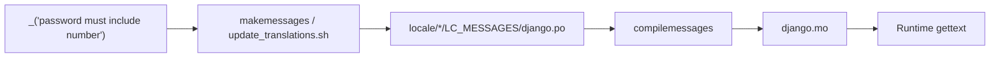

# 🌍 Translations (i18n)

> User-facing strings use Django gettext. Msgids are **lowercase**. Locale files live under `locale/` and are refreshed with `scripts/update_translations.sh`.

---

## 🎯 Goals

| Goal | How |
|------|-----|
| Translatable API / validation messages | `_()` / `gettext_lazy` on messages |
| Stable msgids | Lowercase English source strings |
| Parameterized text | `params=` on `ValidationError` — not pre-interpolated msgids |
| Operator workflow | One script for `makemessages` (+ optional compile) |



---

## ⚙️ Settings

From `config/settings/i18n.py`:

```python
LANGUAGE_CODE = "en-us"
TIME_ZONE = "UTC"
USE_I18N = True
USE_L10N = True
USE_TZ = True
LOCALE_PATHS = [os.path.join(BASE_DIR, "locale")]
```

Default language is US English. Add languages to Django’s `LANGUAGES` (and middleware / Accept-Language handling) when you productize multi-language responses.

---

## ✍️ Writing strings in code

### Lazy vs eager

| API | When |
|-----|------|
| `gettext_lazy as _` | Model/serializer/validator attributes evaluated at import time |
| `gettext` / `_` eager | Inside functions when the string is used immediately (e.g. some Django password validator `get_help_text`) |

Password validators in this repo use lazy `_` for `message` attributes and eager gettext in Django adapter `get_help_text()` — see `users/validators/password.py`.

### Lowercase msgids (required convention)

```python
# ✅
_("password must include number")
_("confirm password is not equal to password")

# ❌ — rejected by django-translation-lint when code-style hooks are on
_("Password must include number")
```

Why: consistent catalogs, simpler reviews, and a project hook that enforces lowercase gettext strings — see [Code quality](code-quality.md).

### Parameterized messages

```python
# ✅
message = _("password must be at least %(limit_value)d characters")
raise ValidationError(self.message, code=self.code, params={"limit_value": self.limit_value})

# ❌ — freezes the number into the msgid; hard to reuse / translate
_("password must be at least 10 characters")
```

Same pattern for integrity messages using `%(field)s` — see [Validation & errors](validation-and-errors.md).

### What to translate

| Translate | Usually don’t |
|-----------|----------------|
| Validation / API user messages | Machine `code` values (`password_mismatch`) |
| Email subjects/bodies shown to users | Log lines for operators (optional) |
| Rare admin-facing strings you care about | Internal exception class names |

Clients should key off **`messages.*.code`**, not English text — translations will change the `message` field.

---

## 🧰 Updating catalogs

```bash
./scripts/update_translations.sh
./scripts/update_translations.sh --compile-messages
```

| Step | What the script does |
|------|----------------------|
| Bootstrap | If no locale exists, creates one from `LANGUAGE_CODE` via `makemessages` |
| Update | Runs `makemessages` ignoring `venv`, `node_modules`, `staticfiles`, `media`, … |
| Cleanup | Uses gettext tools (`msgattrib`, `msgcat`) — install gettext (`brew install gettext` on macOS) |
| Compile | With `--compile-messages`, runs `compilemessages` for `.mo` files |

Manual equivalent (simplified):

```bash
python manage.py makemessages -l en --no-location --no-wrap
python manage.py compilemessages
```

Commit `.po` files with string changes. Prefer committing compiled `.mo` only if your deploy pipeline does not run `compilemessages` (many teams compile in Docker build).

---

## 🧪 Checking conventions


Pre-commit includes **django-translation-lint** (when enabled in generation) to keep `_()` msgids lowercase. Run:

```bash
pre-commit run --all-files
```

When adding code-style tooling, enable a gettext lowercase check so msgid casing does not drift.


Also spot-check new validators/services for missing `_()` on user-facing strings.

---

## ➕ Adding a new language (sketch)

1. `python manage.py makemessages -l fa` (or your locale)  
2. Translate `locale/fa/LC_MESSAGES/django.po`  
3. `compilemessages`  
4. Configure `LANGUAGES` + locale middleware / DRF language negotiation as your product requires  
5. Document how API clients send `Accept-Language`  

The template ships oriented around `en-us`; multi-language activation is a product decision.

---

## ❌ Anti-patterns

| Anti-pattern | Fix |
|--------------|-----|
| Uppercase / title-case msgids | Lowercase source English |
| f-strings inside `_()` | `_("hello %(name)s") % {"name": …}` or `params=` / `format` after gettext |
| Translating error **codes** | Keep codes stable English snake_case |
| Editing `.mo` by hand | Edit `.po`, then compile |
| Scattering raw English in APIs without `_()` | Wrap user-visible strings |

---

## ✅ Checklist: new user-facing string

1. Wrap with `_()` / `gettext_lazy`  
2. Lowercase msgid  
3. Use `params=` for dynamic values  
4. Run `./scripts/update_translations.sh`  
5. Ensure API also sets a machine `code=` where applicable  

---

## 🔗 Related docs

| Doc | Why |
|-----|-----|
| [Validation & errors](validation-and-errors.md) | Where most API messages live |
| [Code quality](code-quality.md) | Translation lint hook |
| [Settings](settings.md) | `i18n.py` |
| [Commands](commands.md) | Script entrypoints |
